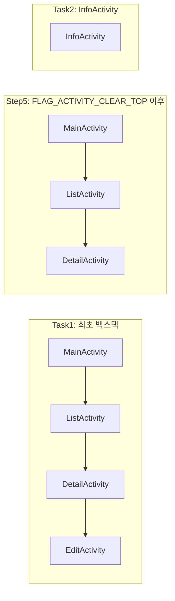

### ✅ Q16. 태스크(tasks)와 백 스택(back stack)이란 무엇인가요?

---

#### 🗂️ 개념 요약

- **Task(태스크):**
  - 사용자가 앱을 실행할 때 생성되는 **작업의 집합**.
  - 보통 하나의 태스크는 앱의 **Activity 들의 집합**으로, 사용자가 최근 앱 화면(Recents)에서 볼 수 있는 단위.
  - 태스크는 여러 액티비티(화면)로 구성되며, **사용자가 한 작업 흐름에서 실행한 액티비티들의 스택**.

- **Back Stack(백 스택):**
  - 각 태스크 내에서 **Activity 들이 쌓이는 스택 구조**.
  - **가장 마지막에 실행된 Activity**가 스택의 top에 쌓임(LIFO, 후입선출).
  - 사용자가 **뒤로 가기(Back)** 버튼을 누르면, 백 스택의 최상단 Activity가 사라지고 바로 아래 Activity가 화면에 표시됨.
  - 각 태스크는 독립적인 백 스택을 가진다.

-** 🏷️ 런치 모드 (Launch Modes) - AndroidManifest에서 정의
#### 1. standard (디폴트)
- 매번 **새 인스턴스** 생성.  
- 항상 백 스택에 추가됨.
- (ex: 여러 번 같은 화면 진입 가능)

#### 2. singleTop
- **백 스택 top에 이미 존재**하면 재사용 (onNewIntent 호출)
- top에 없으면 새로 생성해서 스택에 추가.

#### 3. singleTask
- **태스크 내에 단 하나의 인스턴스만 존재**.
- 이미 태스크에 있으면 그 위의 액티비티를 모두 제거 후, 해당 인스턴스에 onNewIntent 호출.
- 진입점/홈 화면 등에서 자주 사용.

#### 4. singleInstance
- **별도의 태스크**를 생성, 오직 자기 자신만 들어갈 수 있음.
- 항상 독립적인 태스크로 동작(멀티윈도우/팝업, 전화 등)

```xml
<activity
    android:name=".MyActivity"
    android:launchMode="singleTask" />
```

---

## 🏷️ 인텐트 플래그 (Intent Flags) - Intent에서 동적으로 제어

#### 주요 플래그

- `FLAG_ACTIVITY_NEW_TASK`
  - 새로운 태스크를 생성해서 액티비티 실행(혹은 이미 있으면 그 태스크로 이동)

- `FLAG_ACTIVITY_CLEAR_TOP`
  - 백 스택에 동일 액티비티가 있으면 그 위의 모든 액티비티를 제거, 기존 인스턴스에 onNewIntent 호출

- `FLAG_ACTIVITY_SINGLE_TOP`
  - singleTop과 동일한 동작(백 스택 최상단이면 재사용, 아니면 새 인스턴스)

- `FLAG_ACTIVITY_NO_HISTORY`
  - 백 스택에 남기지 않고, 종료시 스택에서 바로 삭제

```kotlin
val intent = Intent(this, MainActivity::class.java).apply {
    flags = Intent.FLAG_ACTIVITY_NEW_TASK or Intent.FLAG_ACTIVITY_CLEAR_TOP
}
startActivity(intent)
```

---

## 💡 사용 사례

| 시나리오                                 | 추천 launchMode     | 플래그 사용 예시                   |
|------------------------------------------|---------------------|------------------------------------|
| 로그인 이후 홈 화면으로 모두 초기화      | singleTask/standard | FLAG_ACTIVITY_NEW_TASK or FLAG_ACTIVITY_CLEAR_TASK |
| 딥링크 진입 시 기존 스택 날리고 새 태스크| singleTask          | FLAG_ACTIVITY_NEW_TASK or FLAG_ACTIVITY_CLEAR_TOP |
| 같은 액티비티 반복 진입 가능(FAQ 등)     | standard            | X                                  |
| 푸시 클릭 시 항상 동일 인스턴스로 이동   | singleTask          | FLAG_ACTIVITY_CLEAR_TOP            |
| 팝업/전화/화상통화 등 별도 태스크 필요   | singleInstance      | X                                  |
| 상세 → 공유 → 공유상세(중복 허용)        | standard            | X                                  |
| 상세 → 공유 → 공유상세(중복 X)           | singleTop           | FLAG_ACTIVITY_SINGLE_TOP           |

---

## 🧩 복잡한 Activity 이동 구조 예시 & 백 스택 변화

**시나리오 예시**

1. MainActivity(standard)
2. → ListActivity(standard)
3. → DetailActivity(standard)
4. → EditActivity(standard)
5. → Notification 클릭: DetailActivity(singleTask, FLAG_ACTIVITY_CLEAR_TOP)
6. → InfoActivity(singleInstance)

---

### 📚 1~4단계까지 이동 시 백 스택
```text
[MainActivity] → [ListActivity] → [DetailActivity] → [EditActivity]
```

---

### 📚 5단계 - Notification 클릭(DetailActivity, singleTask + FLAG_ACTIVITY_CLEAR_TOP)
- 기존 백스택에서 **DetailActivity 아래의 액티비티(EditActivity)**가 모두 제거됨.
- 기존 DetailActivity가 onNewIntent로 재사용됨.

```text
[MainActivity] → [ListActivity] → [DetailActivity]
```

---

### 📚 6단계 - InfoActivity(singleInstance)
- **새로운 별도의 태스크**로 InfoActivity가 실행됨(기존 백스택과 분리)
- 최근 앱(Recents)에서 InfoActivity만 따로 보임

```text
[InfoActivity] (단독 태스크)
[MainActivity] → [ListActivity] → [DetailActivity] (원래 태스크)
```

---

## 📊 백 스택 변화 시각화




---

#### 🏗️ 동작 방식 예시

- 앱을 실행 → `MainActivity` 시작
- `MainActivity`에서 `DetailActivity`로 이동
- 그 다음, `EditActivity`로 이동

이때 백 스택의 구조는 다음과 같음:

```text
[MainActivity] → [DetailActivity] → [EditActivity]
```

- 사용자가 **뒤로 가기**를 누르면 `EditActivity` → `DetailActivity` 순서로 Activity가 종료됨.

---

#### 📄 태스크와 백 스택 관련 속성

- **AndroidManifest.xml**에서 `launchMode`, `taskAffinity`, `allowTaskReparenting` 등 속성으로 태스크 동작 방식 제어

```xml
<activity
    android:name=".MyActivity"
    android:launchMode="singleTask"
    android:taskAffinity="com.example.myapp.unique"
    android:allowTaskReparenting="true"/>
```

- **Intent 플래그**로도 제어 가능 (예: 새로운 태스크 생성, 백 스택 초기화 등)

```kotlin
val intent = Intent(this, MainActivity::class.java)
intent.flags = Intent.FLAG_ACTIVITY_NEW_TASK or Intent.FLAG_ACTIVITY_CLEAR_TASK
startActivity(intent)
```

---

#### 🚦 실전 질문 & 면접 포인트

- Q) 태스크와 백 스택의 차이점은?
  - 태스크는 **작업의 단위** (여러 액티비티 묶음), 백 스택은 **액티비티가 쌓이는 구조**(스택)
- Q) 태스크 분리는 언제 필요한가?
  - 서로 다른 사용 시나리오(예: 딥링크, 공유 등)에서 기존 앱과 **별개의 작업 흐름**을 제공하고자 할 때
- Q) launchMode, intent flag 등 백스택/태스크에 영향을 주는 속성의 실제 활용 사례는?
  - 로그인 후 메인화면으로 이동할 때, 기존 액티비티 모두 종료하고 메인만 남기기 등

---

#### 📦 버전별 분기 및 주요 변화

- **Android 5.0 (Lollipop, API 21)부터**는 **Recents 화면에 여러 Task를 별도로 표시**할 수 있음.
- **multi-window, split-screen(분할 화면, API 24+)** 등 등장 이후 태스크와 백스택의 개념이 더 명확히 분리됨.
- 최근에는 **앱 링크/딥링크** 등으로 인해 태스크 관리의 중요성이 더 커짐.

---

#### 💡 면접 실전 코멘트

- "실무에서는 태스크와 백 스택 구조를 활용해 복잡한 화면 전환 시나리오, 싱글탑/싱글태스크 launchMode로 로그인 이후 히스토리 클리어, 혹은 딥링크로 새 태스크 생성 등 다양한 케이스를 경험했습니다."
- "특히 버전별로 Recents UI나 멀티윈도우 지원 등 태스크/백스택의 동작이 달라짐을 숙지하고, Intent 플래그와 Manifest 설정을 병행해 버그 없는 전환 경험을 설계한 경험이 있습니다."

