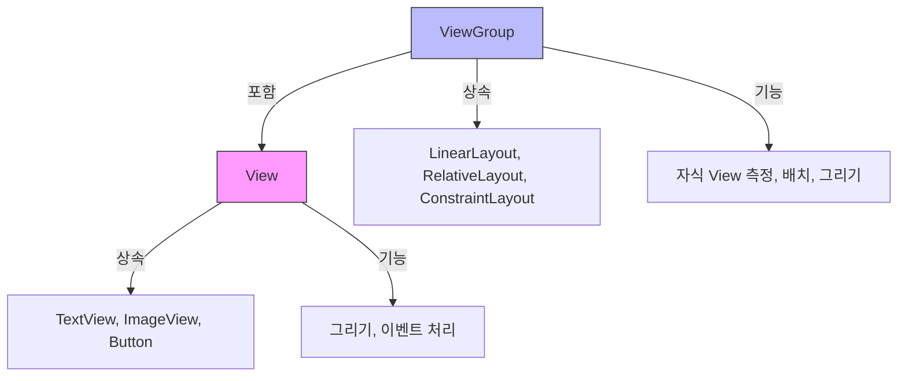
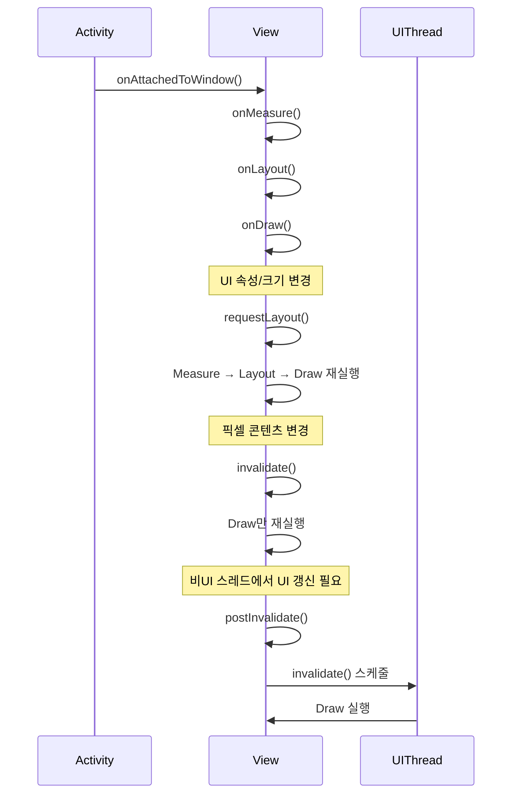

## ❓ Q) 34. View와 ViewGroup의 차이점은 무엇인가요?

---

### 📌 개념
- **View**
  - 안드로이드 UI의 기본 구성 요소로, 화면에 나타나는 단일 UI 요소를 의미함.
  - 예: `TextView`, `ImageView`, `Button` 등.
  - 사용자의 입력(터치, 키 입력 등)을 처리하고 화면에 내용을 그림.

- **ViewGroup**
  - 다른 View(또는 ViewGroup)를 포함할 수 있는 **컨테이너 역할**의 뷰.
  - 레이아웃을 정의하고, 자식 View의 배치와 크기를 결정함.
  - 예: `LinearLayout`, `RelativeLayout`, `ConstraintLayout` 등.

---

### 🛠️ 주요 차이점

| 구분 | View | ViewGroup |
|------|------|-----------|
| 역할 | 단일 UI 요소 표시 및 이벤트 처리 | 여러 View를 포함, 배치 및 크기 조정 |
| 상속 | `android.view.View` 직접 상속 | `android.view.ViewGroup` 상속 (View의 하위 클래스) |
| 자식 View 보유 | 불가능 | 가능 |
| 예시 | `Button`, `ImageView` | `LinearLayout`, `FrameLayout` |

---

### 💡 동작 방식
- View는 **그리기**(`Draw`)와 **이벤트 처리**가 주 역할.
- ViewGroup은 **자식 View 측정**(`Measure`) → **배치**(`Layout`) → **그리기**(`Draw`) 순서로 동작.
- ViewGroup 자체도 View이므로, **자신을 그리는 과정**과 **자식 뷰를 관리하는 과정**을 모두 수행.

---

### 🧩 코드 예시

```kotlin
// View 예시
val textView = TextView(context).apply {
    text = "Hello World"
}

// ViewGroup 예시
val linearLayout = LinearLayout(context).apply {
    orientation = LinearLayout.VERTICAL
    addView(textView)
}
```

---

### 🚀 실전 팁
- View와 ViewGroup의 차이를 이해하면 **레이아웃 최적화**와 **렌더링 성능 향상**에 도움.
- 불필요한 중첩 ViewGroup은 제거하여 **UI 성능 개선** 가능.
- 커스텀 View 작성 시, 단일 요소라면 View를, 복합 UI라면 ViewGroup을 상속하는 것이 적절.

---

### 📎 Additional Tips
1. **중첩 레이아웃 최소화**  
   - 중첩된 ViewGroup이 많을수록 측정과 배치 과정이 복잡해져 성능이 저하됨.  
   - ConstraintLayout 같은 **Flat Layout** 구조를 활용해 깊이를 줄이는 것이 좋음.

2. **onDraw() 최적화**  
   - View는 onDraw()가 자주 호출될 수 있으므로, 불필요한 연산을 피하고 캐싱을 활용.

3. **터치 이벤트 전파 이해**  
   - ViewGroup은 자식 View로 터치 이벤트를 분배할 수 있음(`onInterceptTouchEvent()`).  
   - 터치 충돌을 방지하려면 적절히 이벤트를 가로채거나 전달해야 함.

4. **View 재활용**  
   - RecyclerView나 ListView처럼 많은 View를 사용하는 경우, View 재활용 패턴을 활용해 메모리 절약.

5. **맞는 상속 클래스 선택**  
   - 복합 UI를 그리는데 ViewGroup이 필요 없는데도 ViewGroup을 쓰면 불필요한 측정/배치 비용 발생.  
   - 목적에 맞는 최소한의 상속 구조 선택이 중요.

---

### 💬 실전 질문 1
Q1)
 View
생명주기에서 requestLayout(), invalidate(),
 postInvalidate()가 어떻게 작동하는지 설명하고 각각 언제
사용해야 하나요?

A1) **requestLayout / invalidate / postInvalidate 작동 원리와 사용 시점**  
- **requestLayout()**
  - 효과: 해당 View(및 상위 ViewGroup)에 **레이아웃 패스(Measure → Layout → Draw)** 를 다시 요청.  
  - 트리거 조건: 크기나 위치에 영향을 주는 속성 변경(패딩, 레이아웃 파라미터, 텍스트 크기에 따른 측정 변경 등).  
  - 사용 시점: “배치가 달라져야 하는” 변화가 있을 때.
- **invalidate()**
  - 효과: 현재 크기/위치는 유지하고 **Draw만 다시 수행**(onDraw 재호출).  
  - 트리거 조건: 픽셀 콘텐츠만 바뀌는 경우(그래프 수치, 프로그레스, 색상/그라데이션 등).  
  - 사용 시점: “그림만 다시 칠하면 되는” 변화가 있을 때.
- **postInvalidate()**
  - 효과: UI 스레드가 아닌 스레드에서 안전하게 invalidate를 **스케줄**.  
  - 사용 시점: 워커 스레드(코루틴/스레드)에서 계산 후 UI 업데이트 필요 시.

```kotlin
// 예시: 크기/배치가 바뀌면 requestLayout, 내용만 바뀌면 invalidate
class GaugeView(context: Context, attrs: AttributeSet?) : View(context, attrs) {
    var value: Int = 0
        set(v) {
            field = v.coerceIn(0, 100)
            invalidate() // 픽셀만 갱신
        }

    var barHeight: Int = dp(8)
        set(h) {
            field = h
            requestLayout() // 측정/배치가 바뀜
        }

    fun updateFromWorkerThread(v: Int) {
        // 워커 스레드에서 호출될 수 있음
        postInvalidate() // UI 스레드에 안전하게 그리기 요청
    }
}
```
---

Q2) View 생명주기는 Activity 생명주기와 어떻게 다르며, 효율적인
UI 렌더링을 위해 둘 다 이해하는 것이 왜 중요한가요

A2) **View 생명주기 vs Activity 생명주기 & 왜 둘 다 중요한가**  
- **Activity 생명주기**: 화면 단위 컨테이너의 상태 전이 관리  
  - 콜백: `onCreate → onStart → onResume → onPause → onStop → onDestroy`  
  - 책임: 화면 전환/권한/리소스 소유(카메라·센서)/네비게이션 관리, 전역적 초기화·해제
- **View 생명주기**: 개별 UI 요소의 **부착/측정/배치/그리기** 흐름  
  - 콜백: `onAttachedToWindow → onMeasure → onLayout → onDraw → onDetachedFromWindow`  
  - 책임: 자체 크기 계산, 자식 배치(ViewGroup), 픽셀 렌더링, 입력 처리
- **둘 다 이해해야 하는 이유**  
  - 올바른 **초기화/해제 타이밍**: Activity의 리소스는 Activity 콜백에서, 뷰 관련 리소스는 View의 attach/detach에서.  
  - **성능 최적화**: 불필요한 `requestLayout()` 남발은 전체 트리 재측정 유발, `invalidate()`는 국소적 갱신에 사용.  
  - **버그 예방**: Activity는 살아있지만 View가 이미 `onDetachedFromWindow` 된 상태에서 UI 접근 시 크래시/누수 발생.

---

### 🎨 View vs ViewGroup 비교 다이어그램



---

### 📊 View 생명주기 & requestLayout/invalidate 호출 흐름 다이어그램


