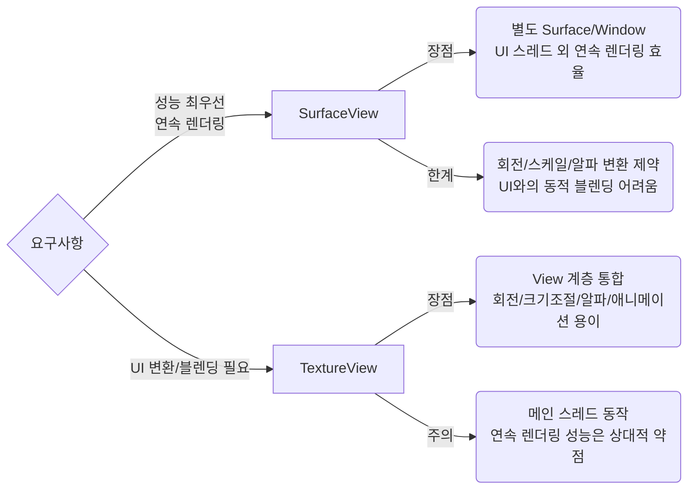

## ❓ Q) 40. SurfaceView 대신 TextureView는 언제 사용해야 하나요

- **SurfaceView**는 별도의 윈도우를 만들어 화면을 그리는 뷰로, 하드웨어 가속 및 독립된 렌더링에 유리합니다. 하지만 **Z-order 제어(겹침 처리)**, 회전/스케일 변환, 애니메이션 적용이 어렵습니다.
- **TextureView**는 일반 뷰처럼 동작하여 **View 계층구조 내에서 자유롭게 변형(transform)** 가능하고, 알파값, 회전, 스케일 등의 애니메이션을 지원합니다.
- 따라서 **SurfaceView의 제약을 벗어나야 하는 경우** 즉, **뷰 트리 내에서 다른 뷰와 자연스럽게 섞이고 변형/애니메이션 효과가 필요한 경우** TextureView를 선택합니다.
- 단점으로는 **퍼포먼스가 SurfaceView보다 떨어질 수 있으며**, **하드웨어 가속이 필수**라는 점이 있습니다 (하드웨어 가속이 비활성화된 환경에서는 동작하지 않음).

---
### ✅ 사용 시나리오
- **SurfaceView**는 **비디오 플레이어, 게임** 등 **퍼포먼스가 최우선**인 경우 유리합니다.  
- **TextureView**는 다음과 같은 경우에 고려해야 합니다:
  1. 뷰 트리(View hierarchy) 내에서 다른 뷰와 **겹치거나 투명도**를 적용해야 할 때  
  2. 영상이나 카메라 프리뷰를 **회전·스케일링·애니메이션** 처리해야 할 때  
  3. `View` 기반 UI와 **자연스럽게 통합**되어야 할 때 (예: RecyclerView 안에서 영상 썸네일 미리보기)  
- 단, `TextureView`는 **하드웨어 가속**에 의존하므로 **저사양 기기에서는 성능 이슈**를 반드시 테스트해야 합니다.

---

### 💻 기본 코드 스니펫

**SurfaceView** 생명주기 콜백(핵심 지점만 발췌)  
```kotlin
class CustomSurfaceView(context: Context) : SurfaceView(context), SurfaceHolder.Callback {
    init { holder.addCallback(this) }

    override fun surfaceCreated(holder: SurfaceHolder) {
        // 렌더링 시작 (스레드/디코더/플레이어 시작)
    }

    override fun surfaceChanged(holder: SurfaceHolder, format: Int, width: Int, height: Int) {
        // 크기/포맷 변화 대응
    }

    override fun surfaceDestroyed(holder: SurfaceHolder) {
        // 렌더링 중지 및 리소스 해제
    }
}
```


**TextureView** 변환/애니메이션 친화  
```kotlin
class CustomTextureView(context: Context, attrs: AttributeSet? = null)
  : TextureView(context, attrs), TextureView.SurfaceTextureListener {

    init { surfaceTextureListener = this }

    override fun onSurfaceTextureAvailable(surface: SurfaceTexture, w: Int, h: Int) {
        // SurfaceTexture로 렌더링 시작
    }
    override fun onSurfaceTextureSizeChanged(surface: SurfaceTexture, w: Int, h: Int) {}
    override fun onSurfaceTextureDestroyed(surface: SurfaceTexture): Boolean = true
    override fun onSurfaceTextureUpdated(surface: SurfaceTexture) {}
}
```
### 🖼️ 비교 다이어그램


### 💬 실전 질문 & 답변

**Q) 효율적인 리소스 관리 및 메모리 누수 방지를 위해 **SurfaceView**의 생명주기를 어떻게 적절하게 관리해야 하나요?**

**A)**  
- `surfaceCreated()`에서만 렌더링 시작 (표면 확보 보장).  
- `surfaceChanged()`에서는 사이즈/포맷 변화 시에만 재설정.  
- `surfaceDestroyed()`에서는 루프 종료, 핸들/버퍼/스레드 해제.  
👉 **표면 수명 이후 참조를 방지**하면 메모리 누수 가능성을 줄일 수 있습니다.

**Q) 카메라 미리보기를 **회전 및 크기 조절과 같은 UI 변환**과 함께 표시해야 하는 요구 사항이 주어졌을 때, **SurfaceView**와 **TextureView** 중 어떤 컴포넌트를 선택하는 것이 적합한가요?**

**A)** `TextureView` 선택.  
- **View 계층 통합 + 실시간 변환 지원** 덕분에 카메라 프리뷰 회전·스케일링 요구에 적합합니다.  
- SurfaceView는 성능은 우수하나, UI 변환에 제약이 있어 해당 시나리오에는 적절하지 않습니다.
