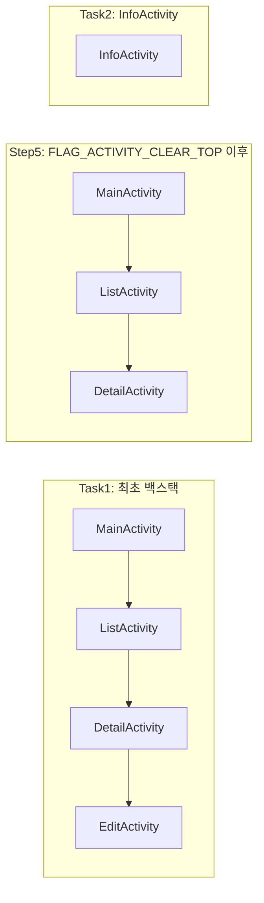

## ✅ Q10. BroadcastReceiver란 무엇인가요?

### 📌 개요
`BroadcastReceiver`는 시스템 또는 앱에서 발생한 **브로드캐스트 메시지**(`Intent`)를 수신해 처리하는 컴포넌트입니다. 이벤트 중심 구조로, 사용자나 시스템의 변화에 반응할 수 있게 해줍니다.

---

### 🎯 목적
- 시스템 이벤트 수신: 부팅 완료, 네트워크 변경, 배터리 부족 등
- 앱 간 이벤트 통신: 특정 이벤트를 다른 앱/컴포넌트에 전달

---

### 🧩 유형

| 유형         | 설명                           | 등록 위치               |
|--------------|--------------------------------|--------------------------|
| 정적 등록     | 앱이 실행 중이지 않아도 수신 가능  | `AndroidManifest.xml`    |
| 동적 등록     | 앱 실행 중일 때만 유효            | `registerReceiver()` 코드 |

---

### 📝 선언 (정적)
```xml
<receiver android:name=".MyBroadcastReceiver" android:exported="false">
    <intent-filter>
        <action android:name="android.intent.action.BATTERY_LOW" />
    </intent-filter>
</receiver>
```

---

### ⚙️ 등록 (동적)
**Dynamic Registration in Activity**  
Android 13(Tiramisu) 이상 대응

```kotlin
val receiver = MyBroadcastReceiver()
val intentFilter = IntentFilter(Intent.ACTION_BATTERY_LOW)

// Android Tiramisu (API 33) 이상에서는 RECEIVER_EXPORTED 또는 RECEIVER_NOT_EXPORTED 플래그 필요
val flags = if (Build.VERSION.SDK_INT >= Build.VERSION_CODES.TIRAMISU) {
    Context.RECEIVER_NOT_EXPORTED
} else {
    0 // 플래그 없음
}
registerReceiver(receiver, intentFilter, flags)

// Activity나 컴포넌트가 소멸될 때 등록 해제 필수
override fun onDestroy() {
    unregisterReceiver(receiver)
    super.onDestroy()
}
```

---

### ⚠️ 유의사항

#### 🔄 생명주기 관리
- 동적 등록 시 생명주기를 고려해 **`unregisterReceiver()`**를 적절히 호출해야 메모리 누수를 방지할 수 있습니다.

#### 🚫 백그라운드 실행 제한 (API 26+)
- Android 8.0 이상에서는 대부분의 **암시적 브로드캐스트가 제한**됩니다.
- 이 경우에는 `Context.registerReceiver()` 외에 `JobScheduler` 또는 `WorkManager`와 함께 사용해야 합니다.

#### 🔐 보안
- 민감한 정보가 포함된 브로드캐스트는 권한으로 보호해야 하며, `android:permission` 또는 `registerReceiver()`의 권한 인자를 사용해 무단 접근을 방지해야 합니다.

---

### 💡 사용 사례 (코드 포함)

#### 1. 네트워크 연결 변경 감지
```kotlin
class NetworkReceiver : BroadcastReceiver() {
    override fun onReceive(context: Context, intent: Intent) {
        if (ConnectivityManager.CONNECTIVITY_ACTION == intent.action) {
            Log.d("NetworkReceiver", "네트워크 상태가 변경되었습니다.")
        }
    }
}
```

#### 2. SMS 수신 감지
```kotlin
class SmsReceiver : BroadcastReceiver() {
    override fun onReceive(context: Context, intent: Intent) {
        val bundle = intent.extras
        val pdus = bundle?.get("pdus") as? Array<*>
        pdus?.forEach {
            val sms = SmsMessage.createFromPdu(it as ByteArray)
            Log.d("SmsReceiver", "SMS 내용: ${sms.displayMessageBody}")
        }
    }
}
```

#### 3. 충전 상태 감지
```kotlin
class PowerReceiver : BroadcastReceiver() {
    override fun onReceive(context: Context, intent: Intent) {
        when (intent.action) {
            Intent.ACTION_POWER_CONNECTED -> Log.d("PowerReceiver", "충전기 연결됨")
            Intent.ACTION_POWER_DISCONNECTED -> Log.d("PowerReceiver", "충전기 분리됨")
        }
    }
}
```

#### 4. 커스텀 브로드캐스트 전송 및 수신
```kotlin
// 송신
val intent = Intent("com.example.ACTION_CUSTOM")
intent.putExtra("data", "커스텀 메시지입니다.")
sendBroadcast(intent)

// 수신
class CustomReceiver : BroadcastReceiver() {
    override fun onReceive(context: Context, intent: Intent) {
        val message = intent.getStringExtra("data")
        Log.d("CustomReceiver", "수신한 메시지: $message")
    }
}
```

---

### 📚 요약

| 항목       | 요약 설명                                  |
|------------|---------------------------------------------|
| 정의       | 시스템/앱 이벤트에 반응하는 컴포넌트         |
| 용도       | 네트워크, 배터리, 커스텀 이벤트 수신용       |
| 등록       | 정적: Manifest / 동적: 코드 내 등록          |
| 제한       | Android 8+에서 암시적 브로드캐스트 제한 존재  |
| 주의사항   | 생명주기 해제 필수, 보안 설정 권장           |

---

### 💬 실전질문
### Q) 브로드캐스트의 유형에는 어떤 것이 있으며, 기능 및 사용 측면에서 시스템 브로드캐스트와 커스텀 브로드캐스트는 어떤 차이가 있나요?

#### 📌 1. 브로드캐스트의 분류

브로드캐스트는 **발신 주체**와 **등록 방식**에 따라 다음과 같이 나뉩니다:

| 분류 기준 | 유형 | 설명 |
|-----------|------|------|
| 발신 주체 기준 | **① 시스템 브로드캐스트** | OS 또는 시스템 앱에서 발생시킴 |
|               | **② 커스텀 브로드캐스트** | 개발자가 명시적으로 전송 |
| 등록 방식 기준 | **③ 정적 등록** | Manifest에 등록, 앱 꺼져 있어도 수신 가능 (제한 있음) |
|               | **④ 동적 등록** | 코드로 등록, 앱 실행 중에만 수신 가능 |

> 본 질문은 **① 시스템 브로드캐스트 vs ② 커스텀 브로드캐스트** 비교를 중심으로 설명합니다.

---

#### 📊 2. 시스템 vs 커스텀 브로드캐스트 비교

| 항목 | 시스템 브로드캐스트 | 커스텀 브로드캐스트 |
|------|----------------------|----------------------|
| **정의** | OS에서 자동 발생하는 이벤트 | 앱 내부/간 커뮤니케이션을 위한 개발자 정의 이벤트 |
| **예시** | `BOOT_COMPLETED`, `BATTERY_LOW`, `SMS_RECEIVED` | `"com.example.ACTION_CUSTOM"` |
| **등록 방식** | 주로 정적/동적 모두 가능 (단, API 26+는 제한) | 주로 동적 등록 |
| **보안 제어** | 일부는 시스템 권한 필요 | `android:permission` 등으로 보호 가능 |
| **수신 범위** | 모든 앱 또는 권한 허용된 앱 | 명시적으로 범위 제어 가능 |
| **제한 사항** | Android 8.0 이상에서 일부 브로드캐스트는 Manifest 등록 불가 | 시스템 제약 없음 (단, 퍼포먼스 주의) |
| **사용 목적** | 시스템 상태 감지 → 앱 대응 | 앱 내 이벤트 전파, 모듈 간 decoupling |

---

#### 🧠 3. 핵심 차이 설명

- **전송 주체의 차이**  
  시스템 브로드캐스트는 Android OS 또는 시스템 서비스가 전송합니다. 반면, 커스텀 브로드캐스트는 개발자가 앱 내부 로직에서 직접 `sendBroadcast()`로 전송합니다.

- **보안/권한 측면**  
  시스템 브로드캐스트는 일부 브로드캐스트 수신 시 시스템 권한 요구(`RECEIVE_SMS`, `READ_PHONE_STATE` 등), 커스텀 브로드캐스트는 `intent-filter`나 권한 선언을 통해 직접 제어 가능합니다.

- **사용 목적**  
  시스템: 외부 이벤트(네트워크, 충전 등)에 대응  
  커스텀: 앱 내부/모듈 간 decoupled 구조를 위한 이벤트 분산

---

#### 💡 4. 코드 예시

##### ✅ 시스템 브로드캐스트 수신 (예: 충전기 연결 감지)

```kotlin
class PowerReceiver : BroadcastReceiver() {
    override fun onReceive(context: Context, intent: Intent) {
        when (intent.action) {
            Intent.ACTION_POWER_CONNECTED -> Log.d("Receiver", "충전기 연결됨")
        }
    }
}

// 등록
val filter = IntentFilter(Intent.ACTION_POWER_CONNECTED)
registerReceiver(PowerReceiver(), filter)
```

---

##### ✅ 커스텀 브로드캐스트 송신 및 수신

**1) 전송**
```kotlin
val intent = Intent("com.example.ACTION_CUSTOM")
intent.putExtra("key", "value")
sendBroadcast(intent)
```

**2) 수신**
```kotlin
class CustomReceiver : BroadcastReceiver() {
    override fun onReceive(context: Context, intent: Intent) {
        val value = intent.getStringExtra("key")
        Log.d("CustomReceiver", "수신된 값: $value")
    }
}
val filter = IntentFilter("com.example.ACTION_CUSTOM")
registerReceiver(CustomReceiver(), filter)
```

---

#### 📝 요약

- **시스템 브로드캐스트**는 **OS에서 발생**하는 이벤트로, 앱은 이를 감지하여 동작합니다.
- **커스텀 브로드캐스트**는 **앱 내부나 앱 간 통신**을 위해 개발자가 정의하고 전송합니다.
- Android 8.0 이상에서는 **정적 브로드캐스트 등록이 제한**되므로, `registerReceiver()`와 백그라운드 제약을 함께 고려한 설계가 필요합니다.
  <br />
  <br />
  <br />
  <br />
  <br />
## ✅ Q11. ContentProvider의 목적은 무엇이며, 애플리케이션 간의 안전한 데이터 공유를 어떻게 용이하게 하나요?

---

### 📌 개요
`ContentProvider`는 안드로이드의 **4대 컴포넌트 중 하나**로, 앱 간 구조화된 데이터를 **안전하고 일관성 있게 공유**할 수 있도록 도와주는 **중앙 집중형 인터페이스**입니다.

---

### 🎯 목적

- 다양한 데이터 소스(SQLite, 파일, 네트워크 등)를 **추상화**하여 앱 간 또는 앱 내부 모듈 간 **데이터 공유를 안전하게 캡슐화**함
- 데이터를 URI 기반으로 접근할 수 있는 **표준화된 통합 인터페이스**를 제공함
- Android 시스템 기능(예: 연락처, 캘린더, 사진 선택 등)과 **자연스럽게 연동되는 데이터 브리지 역할** 수행
---

### 🧩 구성 요소

| 구성 요소 | 설명 |
|-----------|------|
| Authority | Provider를 고유하게 식별하는 이름 (`com.example.myapp.provider`) |
| Path      | 데이터 테이블 또는 컬렉션 이름 (`/users`, `/products`) |
| ID        | 단일 데이터 식별자 (`/users/1`) |

---

### 🏗️ 구조 및 주요 메서드

`ContentProvider`를 상속하여 다음 메서드를 구현합니다:

- `onCreate()` – 초기화
- `query()` – 데이터 조회
- `insert()` – 데이터 삽입
- `update()` – 데이터 수정
- `delete()` – 데이터 삭제
- `getType()` – MIME 타입 반환

---

### 💻 구현 예시

**MyContentProvider.kt**
```kotlin
class MyContentProvider : ContentProvider() {

    private lateinit var database: SQLiteDatabase

    override fun onCreate(): Boolean {
        database = MyDatabaseHelper(context!!).writableDatabase
        return true
    }

    override fun query(
        uri: Uri,
        projection: Array<String>?,
        selection: String?,
        selectionArgs: Array<String>?,
        sortOrder: String?
    ): Cursor? {
        // URI 파싱 및 테이블/조건 결정 필요
        return database.query("users", projection, selection, selectionArgs, null, null, sortOrder)
    }

    override fun insert(uri: Uri, values: ContentValues?): Uri? {
        val id = database.insert("users", null, values)
        // context?.contentResolver?.notifyChange(uri, null) // 데이터 변경 알림 (필요시)
        return ContentUris.withAppendedId(uri, id)
    }

    override fun update(uri: Uri, values: ContentValues?, selection: String?, selectionArgs: Array<String>?): Int {
        val count = database.update("users", values, selection, selectionArgs)
        // if (count > 0) context?.contentResolver?.notifyChange(uri, null) // 데이터 변경 알림 (필요시)
        return count
    }

    override fun delete(uri: Uri, selection: String?, selectionArgs: Array<String>?): Int {
        val count = database.delete("users", selection, selectionArgs)
        // if (count > 0) context?.contentResolver?.notifyChange(uri, null) // 데이터 변경 알림 (필요시)
        return count
    }

    override fun getType(uri: Uri): String? {
        // URI에 따른 MIME 타입 반환 로직 필요
        return "vnd.android.cursor.dir/vnd.com.example.myapp.users"
    }
}
```

---

**AndroidManifest.xml 등록**
```xml
<provider
    android:name=".MyContentProvider"
    android:authorities="com.example.myapp.provider"
    android:exported="true"
    android:grantUriPermissions="true" />
```

---

**데이터 접근 예시**
```kotlin
val contentResolver = context.contentResolver

// 데이터 쿼리
val cursor = contentResolver.query(
    Uri.parse("content://com.example.myapp.provider/users"),
    null, null, null, null
)

// 데이터 삽입
val values = ContentValues().apply {
    put("name", "John Doe")
    put("email", "johndoe@example.com")
}
contentResolver.insert(Uri.parse("content://com.example.myapp.provider/users"), values)
```

---

### 🛡️ 보안 고려 사항

- `exported="false"` 또는 `android:permission`을 통해 외부 접근 제어
- URI 접근 권한은 명시적으로 `grantUriPermissions="true"` 설정 후 Intent에서 `FLAG_GRANT_READ_URI_PERMISSION` 설정 필요
- Android 7.0 이후 파일 공유는 FileProvider 권장

---

### 💡 대표 사용 사례
---

#### ✅ 1. 앱 간 데이터 공유  
> 다른 앱에서 연락처, 사진, 사용자 데이터 등에 접근할 수 있도록 ContentProvider로 노출

**A앱 - Provider 등록**
```xml
<provider
    android:name=".UserProvider"
    android:authorities="com.example.appa.provider"
    android:exported="true"
    android:grantUriPermissions="true" />
```

**B앱 - ContentResolver로 사용자 목록 가져오기**
```kotlin
val uri = Uri.parse("content://com.example.appa.provider/users")
val cursor = contentResolver.query(uri, null, null, null, null)
cursor?.use {
    while (it.moveToNext()) {
        val name = it.getString(it.getColumnIndexOrThrow("name"))
        Log.d("B앱", "사용자 이름: $name")
    }
}
```

---

#### ✅ 2. 시스템 기능 연동  
> 파일 선택기, 이미지 공유 등 시스템 Intent에서 ContentProvider URI를 활용

**FileProvider 등록**
```xml
<provider
    android:name="androidx.core.content.FileProvider"
    android:authorities="com.example.appa.fileprovider"
    android:exported="false"
    android:grantUriPermissions="true">
    <meta-data
        android:name="android.support.FILE_PROVIDER_PATHS"
        android:resource="@xml/file_paths" />
</provider>
```

**이미지 공유용 URI 생성**
```kotlin
val file = File(context.cacheDir, "share.jpg")
val uri = FileProvider.getUriForFile(context, "com.example.appa.fileprovider", file)

val intent = Intent(Intent.ACTION_SEND).apply {
    type = "image/jpeg"
    putExtra(Intent.EXTRA_STREAM, uri)
    addFlags(Intent.FLAG_GRANT_READ_URI_PERMISSION)
}
startActivity(Intent.createChooser(intent, "이미지 공유"))
```

---

#### ✅ 3. 앱 초기화 목적  
> Firebase SDK, analytics 등에서 앱 실행 전 ContentProvider의 `onCreate()`를 이용한 초기화

**라이브러리 Provider 예시**
```kotlin
class FirebaseInitProvider : ContentProvider() {
    override fun onCreate(): Boolean {
        Log.d("Firebase", "앱 실행 전 초기화 완료")
        FirebaseApp.initializeApp(context!!)
        return true
    }

    override fun query(...) = null
    override fun insert(...) = null
    override fun delete(...) = 0
    override fun update(...) = 0
    override fun getType(...) = null
}
```

**Manifest 등록**
```xml
<provider
    android:name="com.google.firebase.provider.FirebaseInitProvider"
    android:authorities="com.google.firebase.initprovider"
    android:exported="false"
    android:initOrder="100" />
```

---

#### ✅ 4. 보안 데이터 분리  
> 민감한 정보를 별도 Provider로 격리하고, 접근 권한을 제한

**Manifest 설정 (권한 제한)**
```xml
<provider
    android:name=".SecureProvider"
    android:authorities="com.example.appa.secureprovider"
    android:exported="true"
    android:readPermission="com.example.appa.PERMISSION_READ_SECURE"
    android:writePermission="com.example.appa.PERMISSION_WRITE_SECURE" />
```

**권한 정의**
```xml
<permission android:name="com.example.appa.PERMISSION_READ_SECURE"
    android:protectionLevel="signature" />
<permission android:name="com.example.appa.PERMISSION_WRITE_SECURE"
    android:protectionLevel="signature" />
```

**B앱에서 권한 요청**
```xml
<uses-permission android:name="com.example.appa.PERMISSION_READ_SECURE" />
```

**보안 데이터 접근 예시**
```kotlin
val uri = Uri.parse("content://com.example.appa.secureprovider/sensitive")
val cursor = contentResolver.query(uri, null, null, null, null)
```


---

### 📝 요약
- ContentProvider는 앱 간 **데이터 공유를 표준화**하고, **보안 통제 및 접근 캡슐화**에 강점을 지닌 컴포넌트입니다.
- SQLite/파일 시스템 등 다양한 소스를 하나의 URI 인터페이스로 추상화하며, `ContentResolver`를 통해 데이터에 접근합니다.
- Android 시스템과 자연스럽게 통합되며, 특히 보안과 초기화 타이밍 제어 등에서 유용하게 사용됩니다.

---

### 💬 실전 질문

## Q) ContentProvider URI의 주요 구성 요소는 무엇이며, ContentResolver는 데이터를 쿼리하거나 수정하기 위해 ContentProvider와 어떻게 상호 작용하나요?

---

### 📌 1. ContentProvider URI의 주요 구성 요소

ContentProvider는 `content://`로 시작하는 URI를 통해 데이터를 식별합니다. 이 URI는 다음과 같은 구성 요소로 이루어집니다:

#### ✅ URI 구성 형식

```
content://authority/path/id
```

| 구성 요소 | 설명 | 예시 |
|-----------|------|------|
| `content://` | ContentProvider의 URI 스킴 | `content://` |
| `authority` | ContentProvider를 식별하는 고유 이름 (AndroidManifest에 선언됨) | `com.example.myapp.provider` |
| `path` | 테이블 또는 데이터 유형 (1개 이상의 경로 세그먼트) | `users`, `products` |
| `id` | 특정 레코드 식별자 (선택적) | `1`, `42` |

#### ✅ 예시 URI

```plaintext
content://com.example.myapp.provider/users       // users 테이블 전체
content://com.example.myapp.provider/users/1     // ID가 1인 사용자
```

---

### 🧩 2. ContentResolver와 ContentProvider의 상호작용

`ContentResolver`는 앱이 ContentProvider에 접근할 수 있도록 해주는 시스템 API입니다. 내부적으로 다음과 같은 방식으로 동작합니다:

1. 앱이 `ContentResolver`를 통해 특정 URI에 접근
2. Android 시스템이 해당 URI의 `authority`를 기준으로 ContentProvider를 찾아냄
3. ContentResolver는 `query()`, `insert()`, `update()`, `delete()` 중 하나의 메서드를 호출
4. ContentProvider가 적절한 데이터를 반환 (`Cursor`, `Uri`, Int 등)

---

### 🔍 3. 실전 코드 예시: A앱과 B앱 간 ContentProvider 연동

---

#### 📦 A앱 (제공자)

##### ✅ 1. AndroidManifest.xml에 ContentProvider 등록

```xml
<provider
    android:name=".MyUserProvider"
    android:authorities="com.example.appa.provider"
    android:exported="true"
    android:grantUriPermissions="true" />
```

---

##### ✅ 2. ContentProvider 클래스 정의

```kotlin
class MyUserProvider : ContentProvider() {

    companion object {
        const val AUTHORITY = "com.example.appa.provider"
        val CONTENT_URI: Uri = Uri.parse("content://$AUTHORITY/users")
    }

    private lateinit var db: SQLiteDatabase

    override fun onCreate(): Boolean {
        db = context?.openOrCreateDatabase("user.db", Context.MODE_PRIVATE, null)!!
        db.execSQL(
            "CREATE TABLE IF NOT EXISTS users (" +
                    "id INTEGER PRIMARY KEY AUTOINCREMENT, " +
                    "name TEXT, email TEXT)"
        )
        return true
    }

    override fun query(
        uri: Uri, projection: Array<out String>?, selection: String?,
        selectionArgs: Array<out String>?, sortOrder: String?
    ): Cursor {
        return db.query("users", projection, selection, selectionArgs, null, null, sortOrder)
    }

    override fun insert(uri: Uri, values: ContentValues?): Uri? {
        val id = db.insert("users", null, values)
        return ContentUris.withAppendedId(CONTENT_URI, id)
    }

    .
    .
    .
}
```

---

#### 📱 B앱 (소비자)

##### ✅ 1. A앱의 ContentProvider로부터 데이터 조회

```kotlin
val uri = Uri.parse("content://com.example.appa.provider/users")
val cursor = contentResolver.query(uri, null, null, null, null)

cursor?.use {
    while (it.moveToNext()) {
        val name = it.getString(it.getColumnIndexOrThrow("name"))
        val email = it.getString(it.getColumnIndexOrThrow("email"))
        Log.d("B앱", "사용자: $name, $email")
    }
}
```

---

##### ✅ 2. A앱의 ContentProvider로 데이터 삽입

```kotlin
val uri = Uri.parse("content://com.example.appa.provider/users")
val values = ContentValues().apply {
    put("name", "김철수")
    put("email", "kim@example.com")
}
val resultUri = contentResolver.insert(uri, values)
Log.d("B앱", "삽입된 URI: $resultUri")
```

---

#### 🔐 보안 팁

- A앱이 민감한 데이터를 공유할 경우 `android:permission` 속성을 통해 특정 권한을 가진 앱만 접근하도록 제한할 수 있습니다.
- B앱에서는 A앱의 `authority`를 정확히 알아야 하고, 필요 시 A앱의 권한을 `uses-permission`으로 선언해야 할 수 있습니다.

---

### ✅ 요약 정리

| 항목 | 설명 |
|------|------|
| URI 구조 | `content://authority/path/id` 형식 |
| `authority` | ContentProvider 식별자 (Manifest에 등록) |
| `ContentResolver` | ContentProvider에 접근하는 표준 API |
| 주요 메서드 | `query()`, `insert()`, `update()`, `delete()` |
| 결과 반환 | `Cursor`, `Uri`, `Int` 등 |

---

### 🧠 Protips for Mastery: ContentProvider 마스터를 위한 실전 팁

| 💡 팁 | 📝 설명 |
|-------|---------|
| **앱 초기화 트리거로 사용** | `ContentProvider`는 `Application`보다 먼저 실행되므로, Firebase SDK나 Analytics 초기화에 적합한 **라이브러리 초기 진입 지점**으로 활용할 수 있습니다. |
| **LiveData + ContentObserver 연계** | `ContentObserver`를 `LiveData`와 함께 사용하면, ContentProvider 데이터 변경을 감지하여 **UI를 실시간으로 반응형으로 구성**할 수 있습니다. |
| **기존 DB 구조 재활용** | 기존 SQLite 구조를 그대로 활용하면서도 ContentProvider를 구현하면, **내부 DB를 유지하면서도 외부 앱에 공유 가능한 URI 인터페이스**를 제공할 수 있습니다. |
| **권한 기반 접근 제어** | `android:permission`과 `protectionLevel="signature"`를 조합하면, 같은 서명을 가진 앱만 접근할 수 있어 **강력한 보안 수준을 구현**할 수 있습니다. |
| **FileProvider 확장 활용** | 이미지, 파일 공유 시 `FileProvider`를 사용하면 **file:// 보안 이슈를 회피**하면서 `Intent.ACTION_SEND`, 파일 선택기, 카메라 등과 **자연스럽게 연동**할 수 있습니다. |

---

💬 예시 응답 템플릿 (면접 대비):

> “ContentProvider는 단순히 데이터를 공유하는 컴포넌트가 아니라, 앱 초기화의 진입점이나 실시간 UI 업데이트에 활용될 만큼 확장성이 높습니다. 특히 LiveData + ContentObserver 연계나 FileProvider와의 조합은 실무에서 자주 활용됩니다.”


## 🔄 추가로 생각해볼 점: Room과 ContentProvider의 연계성

Room은 일반적으로 앱 내부에서 안전하고 편리하게 SQLite DB를 사용할 수 있도록 추상화된 ORM 라이브러리입니다. 하지만 **외부 앱과 데이터 공유가 필요할 경우**에는 `ContentProvider`와 함께 사용해야 합니다.

---

### ✅ 연계 방법 요약

| 항목 | 설명 |
|------|------|
| **Room 내부 DB → ContentProvider 래핑** | `RoomDatabase` 인스턴스를 ContentProvider 내부에서 사용하여, `query()`, `insert()` 등에 직접 연결 가능 |
| **ContentProvider를 통해 외부 앱에 Room 데이터 제공** | Room의 DAO를 직접 호출하거나 Room DB에 연결된 Cursor를 반환함으로써 **외부 앱도 접근 가능하도록 중개** 가능 |
| **LiveData 활용 시 외부 앱 연계 주의** | `LiveData`는 내부 UI 목적이므로 외부 앱에는 사용 불가 → `Cursor` 기반의 응답 유지 필요 |
| **Multi-thread 고려** | Room은 메인스레드 작업을 제한하므로, ContentProvider 내 작업은 `runBlocking`, `suspend`, 또는 `Executors`로 안전하게 분리 필요 |

---

### 💡 연계 예시 구조 (개념도)

```plaintext
[ 외부 앱 (B) ]
        ↓
 ContentResolver.query()
        ↓
[ A앱의 ContentProvider ]
        ↓
 Room DAO 또는 SQLiteQuery
        ↓
 Cursor 결과 반환
```

---

### 🚧 주의 사항

- Room DAO는 일반적으로 `Cursor`를 반환하지 않기 때문에, ContentProvider 내부에서는 `SupportSQLiteDatabase` 또는 `query("SELECT ...")`를 직접 사용하는 방식이 필요할 수 있음
- Room + LiveData 구조는 ContentProvider 외부 공개와는 **직접 호환되지 않음**
- 외부 접근을 고려한다면 **Room의 편의성 + ContentProvider의 표준 인터페이스를 동시에 만족시키는 구조 설계**가 중요

---

📌 결론:  
Room은 내부 앱 개발에는 강력하지만, 외부 앱과의 안전한 데이터 공유에는 ContentProvider가 필수입니다. 따라서 **"Room은 앱 내부, ContentProvider는 앱 외부와의 계약"** 이라는 관점으로 역할을 구분하는 것이 좋습니다.
<br />
<br />
<br />
<br />
<br />
# ✅ Q12. 구성 변경(configuration changes)을 어떻게 처리하나요?

## 📌 구성 변경이란?
시스템 환경이 변경되어 Activity가 **자동 재생성**되는 상황을 의미합니다.  
예시:
- 화면 회전
- 언어 변경
- 글꼴 크기 변경
- 다크/라이트 모드 전환

---

## 🔧 구성 변경 처리 전략

### 1. `onSaveInstanceState()` & `onRestoreInstanceState()`
- 일시적인 UI 상태 저장/복원 (예: EditText, 스크롤 위치 등)

```
override fun onSaveInstanceState(outState: Bundle) {
    outState.putString("text", editText.text.toString())
}

override fun onRestoreInstanceState(savedInstanceState: Bundle) {
    editText.setText(savedInstanceState.getString("text"))
}
```

---

### 2. ViewModel 사용
- 구성 변경 시에도 데이터 유지
- 네트워크 응답 결과나 UI 상태 보존에 유리

```
val viewModel: MyViewModel by viewModels()
```

---

### 3. `android:configChanges` + `onConfigurationChanged()`
- Activity 재생성 방지, 수동으로 구성 변경을 직접 처리
- 유지보수 어렵고 복잡도 높음 → 꼭 필요한 경우에만 사용

**Manifest:**
```
<activity
    android:name=".MainActivity"
    android:configChanges="orientation|screenSize" />
```

**Activity 내부:**
```
override fun onConfigurationChanged(newConfig: Configuration) {
    super.onConfigurationChanged(newConfig)
    if (newConfig.orientation == Configuration.ORIENTATION_LANDSCAPE) {
        // 가로 모드 처리
    }
}
```

---

### 4. Jetpack Compose: `rememberSaveable`
- 상태 기억과 저장을 동시에 수행 (구성 변경에도 데이터 유지)

```
var name by rememberSaveable { mutableStateOf("") }
```

---

## 🧠 요약

| 전략                  | 설명                         | 특징                    |
|---------------------|----------------------------|-----------------------|
| `onSaveInstanceState` | UI 상태 임시 저장               | 일시적 UI 상태         |
| `ViewModel`           | 재생성 간 데이터 유지            | 중장기 데이터           |
| `configChanges`       | 직접 구성 변경 처리              | 재생성 방지 (예외적 사용) |
| `rememberSaveable`    | Compose 전용 상태 보존           | 선언적 UI에 적합        |

---

## 💬 실전 질문

### Q) 구성 변경(Configuration Change)을 처리하기 위한 전략에는 무엇이 있으며, ViewModel은 구성 변경으로부터 손실될 수 있는 UI 관련 데이터를 어떻게 보존하나요?

**🗣 A.** 구성 변경 시 Activity는 기본적으로 재시작되며, 이에 따라 UI 상태가 초기화될 수 있습니다. 이를 방지하거나 복원하기 위한 전략은 다음과 같습니다:

| 전략 | 설명 | 특징 |
|------|------|------|
| `onSaveInstanceState` / `onRestoreInstanceState` | UI의 일시적 상태 저장 및 복원 | 간단한 문자열, 스크롤 위치 등에 적합 |
| ViewModel | 구성 변경에도 유지되는 상태 저장소 | 네트워크 응답, 사용자 데이터 등 중장기 상태 유지 |
| `android:configChanges` + `onConfigurationChanged()` | Activity 재시작을 막고 수동 처리 | 복잡한 앱에서는 유지보수 어려움 |
| Jetpack Compose의 `rememberSaveable` | 상태 저장과 복원을 선언적으로 처리 | Compose 전용, 간결하고 직관적 |

**ViewModel의 경우**, 구성 변경 시에도 `ViewModelStore`를 통해 인스턴스가 유지되므로, UI 관련 데이터를 Activity 재생성 이후에도 복원 없이 그대로 사용할 수 있습니다. 단, `ViewModel`은 기본적으로 UI 상태(UI components)는 저장하지 않으며, 데이터 계층에 해당하는 부분을 관리합니다.

---

### Q) AndroidManifest 파일에서 android:configChanges 속성은 Activity 생명주기와 동작에 어떤 영향을 미치며, Activity 재시작에 의존하는 것이 아니라 onConfigurationChanged() 메서드로 처리하는 경우의 장단점은 무엇인가요?

**🗣 A.** `android:configChanges` 속성을 사용하면, 지정된 구성 변경 이벤트가 발생해도 시스템이 Activity를 재시작하지 않고 `onConfigurationChanged()` 메서드가 대신 호출됩니다.

**예시 Manifest 설정:**
```
<activity
    android:name=".MainActivity"
    android:configChanges="orientation|screenSize|keyboardHidden" />
```

**장점:**

| 항목 | 내용 |
|------|------|
| 성능 | Activity 재생성이 없기 때문에 리소스 낭비가 줄어듦 |
| 상태 유지 | View나 데이터 상태를 수동으로 보존할 필요가 없음 |
| 빠른 처리 | 회전 등 UI만 바뀌는 상황에서 빠르게 반응 가능 |

**단점:**

| 항목 | 내용 |
|------|------|
| 유지보수 | 각 구성 변경에 맞는 수동 처리 코드가 필요 |
| 예외 상황 대응 어려움 | 다국어, 다크모드, 글꼴 크기 등 다양한 구성 요소를 모두 수동으로 처리해야 함 |
| 시스템 권장 방식 아님 | Android는 구성 변경 시 Activity 재생성을 기본 동작으로 권장함 |

**결론적으로**, `android:configChanges`는 단순한 구성 변경에서만 예외적으로 사용하는 것이 좋으며, 일반적인 구성 변경 대응은 ViewModel이나 SavedState를 사용하는 것이 더 안정적입니다.


---

## 🔍 참고: `onRestart()`나 내부 함수 호출과의 차이

| 처리 방식               | 설명                                         | 특징 / 한계                         |
|----------------------|--------------------------------------------|------------------------------------|
| `onRestart()` 활용      | 앱이 포그라운드로 돌아올 때 호출됨                         | 구성 변경에는 직접적 대응이 아님            |
| 내부 함수 호출         | 언어 변경 등에서 특정 함수 호출로 UI 갱신                   | 사용자가 명시적으로 설정을 변경한 경우만 해당 |
| 구성 변경 대응 공식 전략 | 시스템이 Activity를 강제 재생성할 때 상태를 유지하는 전략 적용 | 화면 회전, 시스템 언어/글꼴 변경 대응 가능      |
<br />
<br />
<br />
<br />
<br />
## ✅ Q13. 안드로이드에서 메모리를 어떻게 효율적으로 관리하며, 메모리 누수(memory leaks)를 어떻게 방지하는지 설명해주세요?

---

### 📌 개요

안드로이드는 제한된 리소스 환경에서 동작하므로 **효율적인 메모리 관리**가 필수입니다. GC(Garbage Collector)가 메모리 회수를 자동으로 처리하지만, **개발자의 부주의로 인한 참조 보관**은 메모리 누수로 이어질 수 있습니다.

---

### 🔧 주요 메모리 관리 기법

| 항목                     | 설명                                                                 |
|------------------------|----------------------------------------------------------------------|
| GC (Garbage Collector) | 사용되지 않는 객체를 감지하여 자동 회수함. Dalvik/ART의 GC가 대표적         |
| LRU 캐시                | 이미지 등 리소스를 메모리 상황에 따라 자동 제거하는 전략 (`LruCache` 등)     |
| 메모리 프로파일링 도구   | Android Studio의 Memory Profiler를 통해 메모리 사용량 및 누수 추적 가능     |
| context 사용 주의       | Activity context의 오랜 보관은 누수 위험. `applicationContext` 활용 추천     |
| 콜백 및 리스너 해제     | View나 Activity가 소멸될 때 `removeCallbacks()` 또는 `null` 처리 필요         |

---

### 💣 메모리 누수 주요 원인

- **정적(static) 객체에 Activity나 View 저장**
- **Handler/Thread가 외부 클래스 참조**
- **리소스 해제 누락 (ex. BroadcastReceiver, SensorManager 등)**
- **RxJava, Coroutine 등에서 scope/lifecycle 미처리**

---
## ✅ 메모리 누수를 피하기 위한 8가지 모범 사례

---

### 1. ❌ Activity/Fragment/View를 정적으로 참조하지 말 것

```kotlin
// ❌ 메모리 누수 발생 예
object AppManager {
    var currentActivity: Activity? = null
}

// ✅ 해결: WeakReference로 변경
object AppManager {
    private var activityRef: WeakReference<Activity>? = null

    fun setActivity(activity: Activity) {
        activityRef = WeakReference(activity)
    }

    fun getActivity(): Activity? = activityRef?.get()
}
```

---

### 2. ❌ Activity Context를 static이나 장기 생존 객체에 저장하지 말 것

```kotlin
// ❌ View나 Context를 static 변수에 보관
object ImageCache {
    var context: Context? = null
}

// ✅ 해결: applicationContext 사용
class ImageLoader(context: Context) {
    private val appContext = context.applicationContext
}
```

---

### 3. ✅ 생명주기 인식 컴포넌트 사용 (LifecycleObserver, ViewModel, CoroutineScope 등)

```kotlin
// ✅ ViewModel + viewModelScope 활용 (메모리 누수 최소화)
class MyViewModel : ViewModel() {
    fun start() {
        viewModelScope.launch {
            // 자동으로 onCleared() 시 cancel
        }
    }
}
```

---

### 4. ✅ 콜백, 리스너 등록 시 반드시 해제

```kotlin
// ❌ 등록만 하고 해제하지 않음
override fun onStart() {
    super.onStart()
    sensorManager.registerListener(this, sensor, SensorManager.SENSOR_DELAY_UI)
}

// ✅ 해결: 적절한 타이밍에 해제
override fun onStop() {
    super.onStop()
    sensorManager.unregisterListener(this)
}
```

---

### 5. ✅ Handler는 정적 내부 클래스 + WeakReference 사용

```kotlin
// ✅ Handler 사용 시 메모리 누수 방지
class MyHandler(activity: Activity) : Handler(Looper.getMainLooper()) {
    private val ref = WeakReference(activity)
    override fun handleMessage(msg: Message) {
        ref.get()?.let {
            // 안전하게 작업 수행
        }
    }
}
```

---

### 6. ✅ Glide, Picasso 등 외부 라이브러리 context 주의

```kotlin
// ❌ Glide.with(activity) 사용 후, 액티비티가 종료되어도 GC되지 않음
Glide.with(activity).load(url).into(imageView)

// ✅ 해결: applicationContext 사용
Glide.with(applicationContext).load(url).into(imageView)
```

---

### 7. ✅ ViewBinding, Adapter, Dialog 등의 참조 해제

```kotlin
// ✅ Fragment에서 ViewBinding 해제
private var _binding: FragmentHomeBinding? = null
private val binding get() = _binding!!

override fun onDestroyView() {
    super.onDestroyView()
    _binding = null
}
```

```kotlin
// ✅ Dialog 사용 시 dismiss 후 null 처리
private var dialog: AlertDialog? = null

override fun onDestroy() {
    dialog?.dismiss()
    dialog = null
    super.onDestroy()
}
```

---

### 8. ✅ LeakCanary 등 도구로 누수 감지

```kotlin
// build.gradle에 추가
debugImplementation "com.squareup.leakcanary:leakcanary-android:2.12"

// LeakCanary는 자동으로 Activity 누수 감지
// 별도 코드 필요 없음
```

---

### 💡 정리

| 항목 | 설명 |
|------|------|
| 정적 참조 방지 | Activity/View를 static에 저장하지 않기 |
| context 주의 | Activity context 대신 applicationContext 사용 |
| 생명주기 컴포넌트 활용 | ViewModel, LifecycleScope 등 |
| 콜백/리스너 해제 | unregister 또는 removeCallbacks 필수 |
| Handler 처리 | static inner class + WeakReference 사용 |
| 외부 라이브러리 | context 종류 확인 필수 |
| ViewBinding/Dialog 해제 | `onDestroyView()` 또는 `dismiss()` 처리 |
| LeakCanary 도입 | 메모리 누수 조기 발견 및 추적 가능 |


---

## 🧩 요약

안드로이드는 GC를 통해 자동 메모리 관리를 수행하지만, **메모리 누수 방지를 위해 개발자의 주의가 필수적**입니다. 생명주기 인식 컴포넌트 활용, 정적 참조 피하기, LeakCanary 도구 사용 등을 통해 누수 가능성을 최소화할 수 있으며, **리소스를 적절히 해제하는 습관**은 앱의 안정성과 성능을 향상시킵니다.

---

## 💬 실전 질문

---

###  Q) 애플리케이션에서 메모리 누수의 일반적인 원인은 무엇이며, 이를 사전에 방지하기 위한 방법에는 어떤 것들이 있나요?

🟢 **답변:**

안드로이드 앱에서 메모리 누수의 일반적인 원인에는 다음과 같은 사례들이 있습니다:

- `Activity`, `Fragment`, `View` 등을 `static`으로 참조하거나 오래 생존하는 객체(예: Singleton, Handler, Thread)에서 참조할 때
- `Context`를 정적으로 보관하는 경우 (특히 Activity context)
- 콜백이나 리스너를 등록하고 해제하지 않는 경우 (`BroadcastReceiver`, `SensorManager`, `LocationListener` 등)
- `WebView`, `Bitmap`, `Cursor` 등의 리소스를 직접 해제하지 않았을 때

**사전 방지 방법으로는 다음을 권장합니다:**

- `applicationContext`를 사용할 수 있는 경우 Activity context 대신 사용
- `WeakReference`를 통해 context나 view 참조 유지
- `ViewModel`, `LifecycleOwner`, `viewModelScope` 등 생명주기 인식 구성요소 활용
- `onDestroy()`나 `onCleared()`에서 리소스 및 콜백 명시적 해제
- `LeakCanary` 등 도구를 활용하여 개발 중 메모리 누수를 조기에 탐지

---

###  Q) 안드로이드의 가비지 컬렉션 메커니즘은 어떻게 작동하며, 개발자는 앱에서 메모리 누수를 감지하고 수정하기 위해 어떤 방법을 사용할 수 있나요?

🟢 **답변:**

안드로이드의 GC(Garbage Collection)는 Dalvik 또는 ART 런타임 환경에서 동작하며, 사용되지 않는 객체를 탐지하고 자동으로 메모리를 회수합니다. GC는 **객체 참조 그래프를 탐색하여 루트(Root)에서 도달할 수 없는 객체**를 메모리에서 제거합니다.

Android 13(API 33) 이상에서는 **G1GC**(`Garbage First GC`)가 기본으로 적용되며, 전체 힙을 Region으로 나누고 가비지가 많은 영역을 먼저 수거하여 **pause time을 줄이고 성능을 예측 가능하게 유지**합니다.

**개발자가 할 수 있는 누수 감지 및 수정 방법은 다음과 같습니다:**

- Android Studio의 **Memory Profiler**를 활용한 실시간 객체 추적
- **Heap Dump 분석**을 통한 참조 경로 확인
- **LeakCanary** 라이브러리를 통한 자동 메모리 누수 탐지
- `WeakReference`, `SoftReference` 등의 참조 제어 도구 활용
- GC 로그(`logcat`에 "GC" 또는 "G1GC" 태그) 모니터링을 통한 GC 동작 확인

이처럼 GC는 자동화되어 있지만, **개발자의 코드 구조가 GC가 객체를 수거할 수 있게 잘 설계되어야** 메모리 누수가 방지됩니다.


### 🔎 추가로 생각해볼 점

- `LeakCanary` 도구를 활용한 자동 누수 탐지
- `Glide.with(applicationContext)`와 같이 context 주의
- `Coroutines`, `RxJava`는 lifecycle-aware 처리 필수 (`LifecycleScope`, `Disposable`)

## ✅ G1GC(Garbage First Garbage Collector)는 무엇이며 Android에서 어떤 역할을 하나요?

---

### 📌 개념 정의

**G1GC (Garbage First Garbage Collector)**는 Java HotSpot VM에서 제공하는 고성능 GC로, Android 13(API 33) 이상부터 기본 GC로 채택되었습니다.

- “Garbage First”라는 이름은, **가비지(쓰레기)가 많은 영역부터 먼저 수거**함으로써 성능을 극대화하겠다는 전략을 의미합니다.
- **pause time이 짧고 예측 가능**하다는 점에서 UI가 중요한 모바일 환경에 적합합니다.

---

### ⚙️ 동작 방식

기존의 GC는 전체 힙(heap)을 Young/Old로 나누고 일괄적으로 처리했지만, G1GC는 다음과 같은 방식으로 동작합니다:

| 요소         | 설명 |
|--------------|------|
| **Region 단위 힙 분할** | 전체 힙을 고정 크기의 region(예: 1MB)으로 나눔. Young/Old/Eden 등이 동적으로 할당됨 |
| **Concurrent Marking** | GC는 앱과 동시에 힙의 live 객체를 마킹함 (앱을 멈추지 않음) |
| **Priority Queue 방식** | 가비지가 많은 region을 우선순위로 정렬한 뒤 순차 수거 |
| **Pause Time Target** | GC 수행 시간을 특정 시간 내로 제어 (예: 50ms 이하로) |

이러한 방식은 **큰 힙에서도 GC로 인한 지연을 최소화**하고, **UI 스레드 끊김 방지**에 매우 효과적입니다.

---

### 🔍 기존 GC(Generational GC)와의 차이점

| 항목 | G1GC | CMS/Generational GC |
|------|------|----------------------|
| 메모리 구조 | Region 기반, 동적 Young/Old 분할 | 정적 Young, Survivor, Old |
| GC 목표 | Pause time 최소화 | Throughput 최대화 |
| GC 범위 | 필요 영역만 수거 | 전체 영역 또는 Generation 단위 수거 |
| Android 적용 | Android 13(API 33)+ 기본 적용 | Android 12 이하에서 사용됨 |
| 앱 일시 정지 | 매우 짧고 예측 가능 | 긴 Full GC로 앱 프리징 가능성 ↑ |

---

### 💡 면접 답변 예시

“Android 13 이상부터는 G1GC가 기본 GC로 채택되었는데, 이는 전체 힙을 Region으로 나눈 뒤, 가비지가 많은 영역을 우선 수거하는 방식으로 **pause time을 최소화**하는 데 강점이 있습니다. 예를 들어 기존 GC에서는 메모리 용량이 커질수록 full GC 시 앱이 수 초간 멈추는 문제가 있었지만, G1GC는 GC 시간이 **예측 가능하고 UI에 영향을 적게 줍니다**. 저는 메모리 최적화 작업을 할 때 G1GC의 Region 기반 관리 방식을 고려하여 **대용량 Bitmap 처리, Glide 캐싱 전략** 등을 조정한 경험이 있습니다.”

---

### 🧪 실무 적용 팁

- Android 13 이상 기기에서의 성능 문제 분석 시 GC 로그에서 `G1GC` 라벨을 확인할 수 있음
- `adb shell dumpsys meminfo [패키지명]` 또는 `logcat`을 통해 GC 발생 시간, pause time 등을 추적 가능
- 대용량 작업(Bitmap, JSON 파싱 등)은 가능하면 region 분산을 고려하여 **메모리 배치 최적화**

---

### 📘 참고

- [Android Developers: ART G1GC 공식 문서](https://source.android.com/docs/core/runtime/gc-g1)
- [HotSpot G1 GC 내부 구조](https://openjdk.org/jeps/307)
<br />
<br />
<br />
<br />
<br />
## ✅ Q14. ANR이란 무엇인지, ANR이 발생하는 주요 원인은 무엇이며, 어떻게 예방할 수 있는지 설명해주세요.

---

### 📌 ANR(Application Not Responding) 개요

ANR은 안드로이드 시스템이 특정 시간 이상 애플리케이션이 사용자 입력에 반응하지 않을 때 발생하는 오류 메시지입니다. 이는 사용자 경험을 해치기 때문에 **반드시 사전에 예방**해야 합니다.

---

### ⚠️ ANR 발생 조건

| 유형 | 조건 | 제한 시간 |
|------|------|------------|
| **Input Dispatching Timeout** | 메인 스레드가 터치, 키 입력 등 사용자 입력 처리 지연 | **5초** 초과 |
| **Broadcast Timeout** | 브로드캐스트 리시버가 실행 완료되지 않음 | **10초** 초과 (포그라운드), 60초 (백그라운드) |
| **Service Timeout** | 서비스가 `onCreate()` 또는 `onStartCommand()` 내에서 지연 | **20초** 초과 (포그라운드), 200초 (백그라운드) |
| **ContentProvider Timeout** | 다른 앱이 제공한 ContentProvider 호출이 지연 | **5초** 초과 |

---

### 🧨 주요 원인

- **메인 스레드에서 긴 작업 수행**
  - 네트워크 요청, DB 작업, 파일 I/O 등을 UI 스레드에서 실행할 때
- **무한 루프 또는 동기화 문제**
  - 잘못된 `while` 루프, `synchronized` 블로킹 등
- **과도한 브로드캐스트 처리 시간**
  - `onReceive()` 내에서 비동기 작업 없이 오래 처리할 경우
- **ContentProvider 호출에서 응답 지연**
  - 쿼리/삽입 시 대기 상태가 길어질 경우

---

### ✅ 예방 방법
---

### 1️⃣ 무거운 작업은 메인 스레드 밖에서 실행

> 파일 I/O, 네트워크, DB 쿼리는 반드시 백그라운드 스레드에서 실행

```kotlin
lifecycleScope.launch(Dispatchers.IO) {
    val fileData = File(context.filesDir, "sample.txt").readText()
    withContext(Dispatchers.Main) {
        textView.text = fileData
    }
}
```

---

### 2️⃣ WorkManager 사용 (장기 백그라운드 작업)

> 데이터 동기화, 로그 업로드 등 백그라운드에서 안정적으로 실행

```kotlin
class SyncWorker(context: Context, params: WorkerParameters) : Worker(context, params) {
    override fun doWork(): Result {
        // 장기 작업 수행
        syncDataFromServer()
        return Result.success()
    }
}

val request = PeriodicWorkRequestBuilder<SyncWorker>(1, TimeUnit.HOURS).build()

WorkManager.getInstance(context).enqueueUniquePeriodicWork(
    "SyncJob",
    ExistingPeriodicWorkPolicy.KEEP,
    request
)
```

---

### 3️⃣ Paging 라이브러리로 대량 데이터 처리 최적화

> 페이징을 통해 RecyclerView 성능 유지 및 메모리 절약

```kotlin
class MyPagingSource : PagingSource<Int, Item>() {
    override suspend fun load(params: LoadParams<Int>): LoadResult<Int, Item> {
        val page = params.key ?: 1
        val response = api.fetchItems(page)
        return LoadResult.Page(
            data = response.items,
            prevKey = if (page == 1) null else page - 1,
            nextKey = if (response.items.isEmpty()) null else page + 1
        )
    }
}
```

---

### 4️⃣ ViewModel로 구성 변경 대응

> 화면 회전 시 데이터 보존 및 불필요한 UI 재생성 방지

```kotlin
class MainViewModel : ViewModel() {
    val userName = MutableLiveData<String>()
}

// Fragment 또는 Activity에서 observe
viewModel.userName.observe(viewLifecycleOwner) { name ->
    textView.text = name
}
```

---

### 5️⃣ Android Studio Profiler로 성능 모니터링

> CPU, Memory, Network 사용량 추적 → ANR 원인 사전 파악  
> `View > Tool Windows > Profiler` 에서 확인 가능  
> 특히 메인 스레드에서 **CPU spike가 5초 이상** 지속되면 ANR 위험

---

### 6️⃣ 블로킹(blocking) 호출 피하기

> Thread.sleep(), 무한 루프 등은 메인 스레드에서 사용 금지

🚫 잘못된 예시 (ANR 발생 위험)

```kotlin
// 메인 스레드에서 실행 시 ANR 유발
Thread.sleep(3000)
```

✅ 올바른 대안

```kotlin
Handler(Looper.getMainLooper()).postDelayed({
    // 3초 후 실행
    textView.text = "3초 후 실행됨"
}, 3000)
```

---

### 7️⃣ Handler를 사용한 가벼운 지연 작업 처리

> `sleep()` 대신 `postDelayed()`로 메인 스레드 차단 없이 처리

```kotlin
button.setOnClickListener {
    Handler(Looper.getMainLooper()).postDelayed({
        Toast.makeText(context, "1초 후 실행됨", Toast.LENGTH_SHORT).show()
    }, 1000)
}
```

---

### 💬 실전 질문
#### Q) ANR을 진단하고 앱 성능과 유저 경험을 개선해보신 경험이 있으신가요?

> Kiosk 앱을 개발할때, 전체 json으로 구성된 데이터를 모두 로드한 상태에서 진행하도록 백앤드가 구성되어 있었고, 그 때 페이징, diffUtil, ViewPager2 등의 최신 컴포넌트를 활용하고, 전체 json 을 Room 으로 매핑하여 쿼리 최적화를 통해 ANR을 해소한적이 있습니다.

---
<br />
<br />
<br />
<br />
<br />
## ✅ Q15. 딥 링크(Deep Link)를 어떻게 처리하는지 설명해주세요?

---

### 📌 개요  
딥 링크는 사용자가 외부 URL(웹, 알림 등)을 통해 앱의 특정 화면이나 기능으로 바로 이동할 수 있도록 하는 기능입니다.  
Android에서는 `AndroidManifest.xml`에 `intent-filter`를 설정하고, Activity 또는 Fragment에서 `Intent`를 처리하여 구현합니다.

---

### ⚙️ 딥 링크 처리 단계

1. **매니페스트 설정**
```xml
<activity android:name=".MyDeepLinkActivity" android:exported="true">
    <intent-filter>
        <action android:name="android.intent.action.VIEW" />
        <category android:name="android.intent.category.DEFAULT" />
        <category android:name="android.intent.category.BROWSABLE" />
        <data android:scheme="https" android:host="example.com" android:pathPrefix="/deepLink" />
    </intent-filter>
</activity>
```

2. **Activity에서 데이터 처리**
```kotlin
val data: Uri? = intent?.data
val id = data?.getQueryParameter("id")
if (id != null) {
    navigateToFeature(id)
}
```

3. **테스트 방법**
```
adb shell am start -a android.intent.action.VIEW \
-d "https://example.com/deepLink?id=123" \
com.example.myapp
```

---

### 🧱 Jetpack Navigation에서 딥 링크 처리

- `<deepLink app:uri="https://example.com/details/{itemId}" />` 선언 가능  
- Safe Args로 타입 안정성 유지  
- NavController로 화면 전환과 백스택 자동 처리 가능

---

### 🔐 추가 고려 사항

- **Custom Scheme** 예: `myapp://item/123`  
- **HTTP(S) 권장**: 앱링크(App Link)를 통한 더 넓은 호환성  
- **Fallback Handling**: 유효하지 않은 링크에 대한 예외 처리 필요  
- **App Link 설정**: `assetlinks.json` 파일을 통해 시스템 브라우저 대신 앱으로 직접 연결 가능  

---

### 🌍 앱 미설치 대응: 딥링크 대체 서비스 (2025년 기준)

Firebase Dynamic Links는 2025년 8월 25일 종료 예정입니다. 현재는 다음 서비스들이 설치 전 후 모두 대응 가능합니다.

| 서비스 | 장점 | 단점 | 유/무료 |
|--------|------|------|---------|
| **Branch.io** | NativeLink™, A/B 테스트, QR 연동 | 무료 플랜 제한 | 기본 무료 + 유료 |
| **Adjust** | 광고성과 중심 분석, 페이스트보드 지원 | 설정 복잡 | 유료 |
| **AppsFlyer** | 글로벌 캠페인 분석, OneLink | 가격 높음 | 유료 |
| **Kochava** | SDK 없이 링크 가능, 유연한 설정 | UI 복잡 | 기본 무료 + 유료 |

---

### 📝 실전 질문 
#### Q) 안드로이드에서 딥 링크를 어떻게 테스트하고, 다양한 기기와 시나리오에서 올바르게 작동하는지 확인하기 위해 사용하는 디버깅 기법이 있다면 설명해 주세요.

> 딥 링크는 외부 URL로 앱 내 특정 화면에 진입하는 기능입니다. AndroidManifest에서 intent-filter를 등록하고, Activity의 onCreate에서 `Intent.data`를 통해 파라미터를 파싱해 처리할 수 있습니다
> adb shell 명령어를 활용할 수 있습니다. 
> 앱이 설치되지 않은 경우도 고려하여, Branch.io의 NativeLink 기능을 사용해 Deferred Deep Link까지 지원할 수 있습니다.
<br />
<br />
<br />
<br />
<br />
### ✅ Q16. 태스크(tasks)와 백 스택(back stack)이란 무엇인가요?

---

#### 🗂️ 개념 요약

- **Task(태스크):**
  - 사용자가 앱을 실행할 때 생성되는 **작업의 집합**.
  - 보통 하나의 태스크는 앱의 **Activity 들의 집합**으로, 사용자가 최근 앱 화면(Recents)에서 볼 수 있는 단위.
  - 태스크는 여러 액티비티(화면)로 구성되며, **사용자가 한 작업 흐름에서 실행한 액티비티들의 스택**.

- **Back Stack(백 스택):**
  - 각 태스크 내에서 **Activity 들이 쌓이는 스택 구조**.
  - **가장 마지막에 실행된 Activity**가 스택의 top에 쌓임(LIFO, 후입선출).
  - 사용자가 **뒤로 가기(Back)** 버튼을 누르면, 백 스택의 최상단 Activity가 사라지고 바로 아래 Activity가 화면에 표시됨.
  - 각 태스크는 독립적인 백 스택을 가진다.

-** 🏷️ 런치 모드 (Launch Modes) - AndroidManifest에서 정의
#### 1. standard (디폴트)
- 매번 **새 인스턴스** 생성.  
- 항상 백 스택에 추가됨.
- (ex: 여러 번 같은 화면 진입 가능)

#### 2. singleTop
- **백 스택 top에 이미 존재**하면 재사용 (onNewIntent 호출)
- top에 없으면 새로 생성해서 스택에 추가.

#### 3. singleTask
- **태스크 내에 단 하나의 인스턴스만 존재**.
- 이미 태스크에 있으면 그 위의 액티비티를 모두 제거 후, 해당 인스턴스에 onNewIntent 호출.
- 진입점/홈 화면 등에서 자주 사용.

#### 4. singleInstance
- **별도의 태스크**를 생성, 오직 자기 자신만 들어갈 수 있음.
- 항상 독립적인 태스크로 동작(멀티윈도우/팝업, 전화 등)

```xml
<activity
    android:name=".MyActivity"
    android:launchMode="singleTask" />
```

---

## 🏷️ 인텐트 플래그 (Intent Flags) - Intent에서 동적으로 제어

#### 주요 플래그

- `FLAG_ACTIVITY_NEW_TASK`
  - 새로운 태스크를 생성해서 액티비티 실행(혹은 이미 있으면 그 태스크로 이동)

- `FLAG_ACTIVITY_CLEAR_TOP`
  - 백 스택에 동일 액티비티가 있으면 그 위의 모든 액티비티를 제거, 기존 인스턴스에 onNewIntent 호출

- `FLAG_ACTIVITY_SINGLE_TOP`
  - singleTop과 동일한 동작(백 스택 최상단이면 재사용, 아니면 새 인스턴스)

- `FLAG_ACTIVITY_NO_HISTORY`
  - 백 스택에 남기지 않고, 종료시 스택에서 바로 삭제

```kotlin
val intent = Intent(this, MainActivity::class.java).apply {
    flags = Intent.FLAG_ACTIVITY_NEW_TASK or Intent.FLAG_ACTIVITY_CLEAR_TOP
}
startActivity(intent)
```

---

## 💡 사용 사례

| 시나리오                                 | 추천 launchMode     | 플래그 사용 예시                   |
|------------------------------------------|---------------------|------------------------------------|
| 로그인 이후 홈 화면으로 모두 초기화      | singleTask/standard | FLAG_ACTIVITY_NEW_TASK or FLAG_ACTIVITY_CLEAR_TASK |
| 딥링크 진입 시 기존 스택 날리고 새 태스크| singleTask          | FLAG_ACTIVITY_NEW_TASK or FLAG_ACTIVITY_CLEAR_TOP |
| 같은 액티비티 반복 진입 가능(FAQ 등)     | standard            | X                                  |
| 푸시 클릭 시 항상 동일 인스턴스로 이동   | singleTask          | FLAG_ACTIVITY_CLEAR_TOP            |
| 팝업/전화/화상통화 등 별도 태스크 필요   | singleInstance      | X                                  |
| 상세 → 공유 → 공유상세(중복 허용)        | standard            | X                                  |
| 상세 → 공유 → 공유상세(중복 X)           | singleTop           | FLAG_ACTIVITY_SINGLE_TOP           |

---

## 🧩 복잡한 Activity 이동 구조 예시 & 백 스택 변화

**시나리오 예시**

1. MainActivity(standard)
2. → ListActivity(standard)
3. → DetailActivity(standard)
4. → EditActivity(standard)
5. → Notification 클릭: DetailActivity(singleTask, FLAG_ACTIVITY_CLEAR_TOP)
6. → InfoActivity(singleInstance)

---

### 📚 1~4단계까지 이동 시 백 스택
```text
[MainActivity] → [ListActivity] → [DetailActivity] → [EditActivity]
```

---

### 📚 5단계 - Notification 클릭(DetailActivity, singleTask + FLAG_ACTIVITY_CLEAR_TOP)
- 기존 백스택에서 **DetailActivity 아래의 액티비티(EditActivity)**가 모두 제거됨.
- 기존 DetailActivity가 onNewIntent로 재사용됨.

```text
[MainActivity] → [ListActivity] → [DetailActivity]
```

---

### 📚 6단계 - InfoActivity(singleInstance)
- **새로운 별도의 태스크**로 InfoActivity가 실행됨(기존 백스택과 분리)
- 최근 앱(Recents)에서 InfoActivity만 따로 보임

```text
[InfoActivity] (단독 태스크)
[MainActivity] → [ListActivity] → [DetailActivity] (원래 태스크)
```

---

## 📊 백 스택 변화 시각화




---

#### 🏗️ 동작 방식 예시

- 앱을 실행 → `MainActivity` 시작
- `MainActivity`에서 `DetailActivity`로 이동
- 그 다음, `EditActivity`로 이동

이때 백 스택의 구조는 다음과 같음:

```text
[MainActivity] → [DetailActivity] → [EditActivity]
```

- 사용자가 **뒤로 가기**를 누르면 `EditActivity` → `DetailActivity` 순서로 Activity가 종료됨.

---

#### 📄 태스크와 백 스택 관련 속성

- **AndroidManifest.xml**에서 `launchMode`, `taskAffinity`, `allowTaskReparenting` 등 속성으로 태스크 동작 방식 제어

```xml
<activity
    android:name=".MyActivity"
    android:launchMode="singleTask"
    android:taskAffinity="com.example.myapp.unique"
    android:allowTaskReparenting="true"/>
```

- **Intent 플래그**로도 제어 가능 (예: 새로운 태스크 생성, 백 스택 초기화 등)

```kotlin
val intent = Intent(this, MainActivity::class.java)
intent.flags = Intent.FLAG_ACTIVITY_NEW_TASK or Intent.FLAG_ACTIVITY_CLEAR_TASK
startActivity(intent)
```

---

#### 🚦 실전 질문 & 면접 포인트

- Q) 태스크와 백 스택의 차이점은?
  - 태스크는 **작업의 단위** (여러 액티비티 묶음), 백 스택은 **액티비티가 쌓이는 구조**(스택)
- Q) 태스크 분리는 언제 필요한가?
  - 서로 다른 사용 시나리오(예: 딥링크, 공유 등)에서 기존 앱과 **별개의 작업 흐름**을 제공하고자 할 때
- Q) launchMode, intent flag 등 백스택/태스크에 영향을 주는 속성의 실제 활용 사례는?
  - 로그인 후 메인화면으로 이동할 때, 기존 액티비티 모두 종료하고 메인만 남기기 등

---

#### 📦 버전별 분기 및 주요 변화

- **Android 5.0 (Lollipop, API 21)부터**는 **Recents 화면에 여러 Task를 별도로 표시**할 수 있음.
- **multi-window, split-screen(분할 화면, API 24+)** 등 등장 이후 태스크와 백스택의 개념이 더 명확히 분리됨.
- 최근에는 **앱 링크/딥링크** 등으로 인해 태스크 관리의 중요성이 더 커짐.

---

#### 💡 면접 실전 코멘트

- "실무에서는 태스크와 백 스택 구조를 활용해 복잡한 화면 전환 시나리오, 싱글탑/싱글태스크 launchMode로 로그인 이후 히스토리 클리어, 혹은 딥링크로 새 태스크 생성 등 다양한 케이스를 경험했습니다."
- "특히 버전별로 Recents UI나 멀티윈도우 지원 등 태스크/백스택의 동작이 달라짐을 숙지하고, Intent 플래그와 Manifest 설정을 병행해 버그 없는 전환 경험을 설계한 경험이 있습니다."
