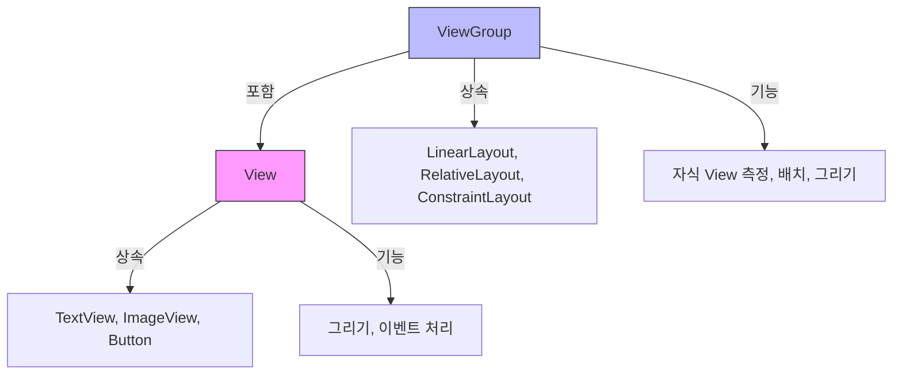
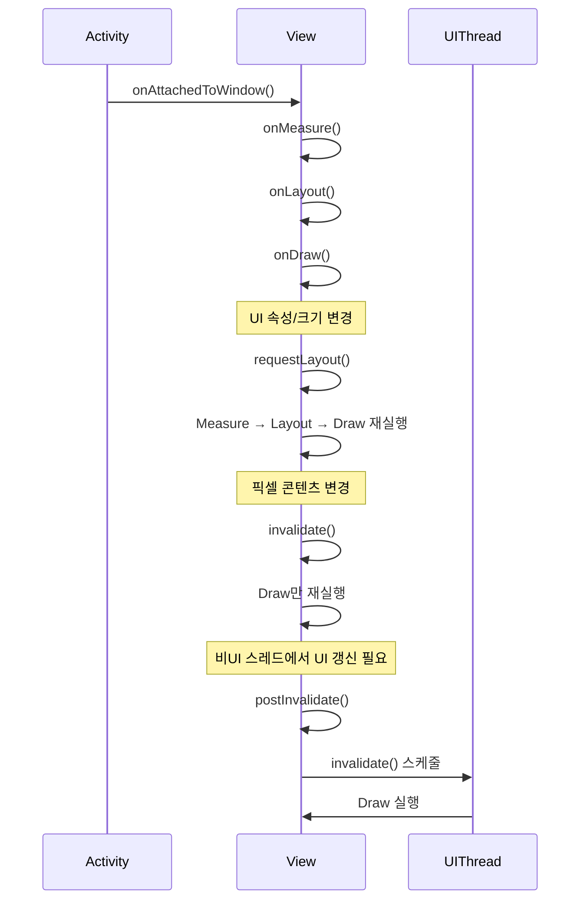

## ❓  Q31. 애플리케이션 용량을 줄이는 방법

### 1. 사용하지 않는 리소스 제거하기
- Gradle 옵션 `shrinkResources true`를 사용하면 코드 축소와 함께 미사용 리소스를 제거.
- Android Lint로 미사용 리소스를 식별 후 삭제.
- `resConfig`를 활용하여 필요한 언어만 포함해 불필요한 다국어 리소스를 제외.

### 2. R8 코드 축소 활성화하기
- R8은 코드 난독화, 축소, 최적화를 한 번에 수행.
- 불필요한 클래스·메서드·필드 제거.
- `proguard-rules.pro`로 필요한 요소만 보존.

### 3. 리소스 최적화 사용하기
- 벡터 드로어블(Vector Drawable)로 해상도별 중복 리소스 제거.
- 이미지 압축 도구(pngcrush, optipng) 활용.
- PNG/JPEG 대신 WebP 사용 → 용량 절감 + 시각 품질 유지.

### 4. Android App Bundle(AAB) 사용
- Google Play가 기기별 맞춤 APK를 생성·배포.
- 불필요한 해상도·언어·ABI 리소스 제외.

### 5. 네이티브 라이브러리 최적화
- `ndk.abiFilters`로 필요한 ABI만 포함 (예: armeabi-v7a, arm64-v8a).
- 불필요한 네이티브 코드 제거, 라이브러리 압축.

### 6. 디버그 정보 줄이기
- 릴리즈 빌드에서 `debuggable false`로 설정.
- 불필요한 로그와 StackTrace 제거.
- `minifyEnabled true`로 R8이 디버그 심볼 제거 가능.

### 7. 동적 기능 사용하기 (Dynamic Features)
- 자주 사용하지 않는 기능을 주문형 모듈(필요시 설치)로 분리
- 초기 다운로드 용량 줄이는데 도움이 됨

### 8. 앱 내 대용량 에셋 피하기
- 대용량 미디어(영상, 고음질 오디오 등)는 CDN에서 스트리밍.
- 설치 패키지 용량과 업데이트 크기를 최소화.

---

## 💡 실전 질문

**Q1) 앱에 APK/AAB 크기를 크게 증가시키는 고해상도 이미지가 포함되어 있습니다. 시각적 품질을 유지하면서 이미지 리소스를 어떻게 최적화하고, 최대 효율성을 위해 어떤 이미지 포맷을 사용할 수 있을까요?**

**답변:**  
- WebP 포맷을 사용하면 PNG/JPEG 대비 용량을 크게 줄이면서 품질을 유지할 수 있습니다.  
- 필요 시 손실(WebP lossy)·무손실(WebP lossless) 모드를 선택.  
- 벡터 드로어블을 적용해 해상도별 리소스를 하나의 파일로 대체.  
- 이미지 압축 도구(pngcrush, optipng, ImageOptim)를 활용해 불필요한 메타데이터와 색상 정보를 제거.  
- 해상도 스케일링(dpi bucket 최적화)로 기기에 맞는 최소 크기의 이미지 제공.  
- **부가 팁:** 이미지 용량이 크거나 업데이트 빈도가 높다면, 앱에 직접 포함하기보다 **CDN을 통한 외부 로드**로 용량과 업데이트 부담을 줄일 수 있습니다.

---

**Q2) 애플리케이션은 보통 여러 기능들이 포함되어 있지만 그중 일부는 사용자가 자주 사용하지 않습니다. 해당 기능을 필요할 때부터 사용할 수 있도록 하여 초기 앱 용량을 줄이는 방법에는 무엇이 있을까요?**

**답변:**  
- Google Play의 **동적 기능 모듈(Dynamic Feature)**을 사용합니다.  
- 초기 설치 시 필수 기능만 포함하고, 사용자가 해당 기능을 실행할 때 필요한 모듈을 다운로드하여 설치.  
- 예: 결제 모듈, 고급 분석 도구, 특정 지도 기능 등 자주 사용되지 않는 부가 기능.  
- 이 방식은 초기 다운로드 크기 감소와 업데이트 효율성을 동시에 확보할 수 있습니다.


---
### 📌 추가 내용 Play Feature Delivery vs Dynamic Feature

---

#### 1. Play Feature Delivery
- **정의**: Google Play가 앱의 특정 기능을 **언제, 어떤 조건에서, 어떻게** 설치할지 제어하는 배포 메커니즘.
- **설치 모드**:
  1. **Install-time** → 앱 설치 시 포함  
  2. **On-demand** → 필요할 때 다운로드  
  3. **Conditional** → 특정 조건(언어, 국가, 기기 등)일 때만 설치
- **목적**: 초기 설치 크기 감소 + 조건별 최적화

---

#### 2. Dynamic Feature (Dynamic Feature Module)
- **정의**: App Bundle 안에서 기능을 **모듈 단위로 분리**해, Play Feature Delivery를 통해 필요할 때만 설치할 수 있도록 만든 것
- **특징**:
  - Gradle에서 `com.android.dynamic-feature` 플러그인 사용
  - `SplitInstallManager` API로 런타임 다운로드 가능
  - On-demand / Conditional 모드 적용 가능
- **예시**: 여행 앱의 AR 지도 기능을 별도 모듈로 분리 → 사용자가 AR 버튼 클릭 시 다운로드

---

#### 3. 차이 요약

| 구분 | Play Feature Delivery | Dynamic Feature |
|------|----------------------|----------------|
| 개념 | 기능 설치 전략(언제·조건·방법) | 모듈 분리 구현 방식 |
| 범위 | 앱 전체 기능 설치 정책 | 특정 기능 |
| 관계 | 상위 개념 | 하위 구현 |

---

#### 4. Diagram

```plaintext
┌───────────────────────────┐
│    Play Feature Delivery  │   ← 기능 설치 전략 (Install-time / On-demand / Conditional)
│   ┌─────────────────────┐ │
│   │   Dynamic Feature   │ │   ← 기능을 모듈로 분리한 구현 단위
│   │  (login, map, etc.) │ │      * 필요한 시점에만 다운로드
│   └─────────────────────┘ │
└───────────────────────────┘
<br />
<br />
<br />
<br />
## ❓ Q) 32. 안드로이드 애플리케이션의 프로세스(process)란 무엇이며, 안드로이드 운영 체제는 이를 어떻게 관리하나요?

---

### 1. 📖 프로세스 정의
- **프로세스**: 실행 중인 애플리케이션 인스턴스.  
- 안드로이드에서 앱의 각 구성요소(Activity, Service 등)는 같은 앱이면 보통 하나의 프로세스에서 실행됨.
- 별도의 프로세스에서 실행하도록 `android:process` 속성을 지정할 수 있음.

---

### 2. ⚙️ 안드로이드에서 프로세스 작동 방식
- **Zygote 프로세스**: 모든 앱 프로세스의 시작점. 앱 실행 시 Zygote에서 포크(fork)하여 새로운 Dalvik/ART VM 환경 생성.
- 앱 실행 시 필요한 클래스와 리소스 초기화 후, 해당 앱의 `Application` 및 구성요소가 로드됨.

---

### 3. 🔗 애플리케이션 컴포넌트와 프로세스 연결
- 하나의 앱 프로세스에 여러 컴포넌트(Activity, Service, BroadcastReceiver 등)가 연결.
- `android:process` 속성으로 다른 앱과 프로세스를 공유하거나, 컴포넌트를 별도 프로세스에서 실행 가능.

---

### 4. 🔄 프로세스와 앱 생명주기
- 안드로이드는 메모리가 부족해질 때 **LRU(Least Recently Used) 원칙**에 따라 프로세스를 종료.
- 프로세스 우선순위:
  1. **포그라운드 프로세스** – 사용자와 상호작용 중인 앱
  2. **보이는 프로세스** – 화면에 보이지만 포커스 없음
  3. **서비스 프로세스** – 백그라운드 작업(Service) 수행 중
  4. **캐시된 프로세스** – 메모리에 유지되는 유휴 프로세스. 가장 먼저 종료될 수 있음
---

### 5. 🔒 보안 및 권한
- 각 프로세스는 **고유의 UID(User ID)** 로 실행되어, 다른 앱의 데이터에 직접 접근 불가.
- IPC(Inter-Process Communication) 메커니즘인 **Binder**로 앱 간 통신.
- 명시적으로 `sharedUserId` 를 선언한 경우에만 UID 공유 가능.

---

### 💬 실전 질문 & 답변
---

**Q)** 서로 다른 안드로이드 컴포넌트들을 별도의 프로세스에서 실행해야 하는 애플리케이션을 개발 중이라고 해봅시다. AndroidManifest에서 이를 어떻게 구성하며, 여러 프로세스를 사용할 때의 잠재적인 단점은 무엇인가요?  
**A)**  
- **구성 방법**  
  AndroidManifest.xml에서 각 컴포넌트(Activity, Service, Provider 등)에 `android:process` 속성을 지정하여 별도의 프로세스에서 실행할 수 있습니다.  
  예:  
  ```xml
  <service
      android:name=".MyService"
      android:process=":remote" />
  ```
  - `:remote` → 현재 앱의 패키지명에 접두사로 붙어 별도 프로세스 생성  
  - `com.example.shared`처럼 **전체 이름 지정** 시 다른 앱과 프로세스 공유 가능(`sharedUserId` 전제 필요)

- **잠재적 단점**  
  1. **메모리 사용량 증가** – 프로세스마다 별도의 VM과 리소스를 로드  
  2. **IPC 오버헤드** – Binder를 통한 통신 시 직렬화/역직렬화 비용  
  3. **상태 공유 복잡성** – 메모리를 직접 공유할 수 없으므로 데이터 동기화 필요  
  4. **디버깅 난이도 상승** – 여러 프로세스 로그를 동시에 추적해야 함

---

**Q)** 안드로이드는 메모리가 부족할 때 어떤 프로세스를 종료할지 결정하기 위해 우선순위 기반 프로세스 관리 시스템을 사용합니다. 시스템이 프로세스 우선순위를 어떻게 정하는지, 그리고 중요한 프로세스가 종료되는 것을 방지하기 위해 개발자가 따라야 할 전략은 무엇인지 설명해 주세요.  

**A)**  
- **프로세스 우선순위 결정 방식**  
  1. **Foreground Process** – 사용자와 직접 상호작용 중(가장 높은 우선순위)  
  2. **Visible Process** – 화면에 보이지만 포커스 없음  
  3. **Service Process** – 사용자가 인지하지 못해도 중요한 작업 수행(Service)  
  4. **Background Process** – UI가 없는 Activity, 일시중지 상태  
  5. **Empty Process** – 캐시 용도로만 유지  

- **중요 프로세스 종료 방지 전략**  
  1. **필요 시 Foreground Service 사용** – `startForeground()` 호출하여 우선순위 상승  
  2. **작업 최소화** – 백그라운드에서 불필요한 연산 제거, 메모리 사용 절감  
  3. **상태 보존** – `onSaveInstanceState()`와 영구 저장소를 통해 상태 복원 대비  
  4. **IPC 최소화** – 별도 프로세스 간 불필요한 통신 줄이기  
  5. **메모리 효율적 사용** – 큰 리소스는 필요할 때 로드하고 즉시 해제

---

### 🏆 Pro Tips for Mastery
- `onSaveInstanceState()`를 활용해 구성 변경 및 프로세스 종료 대비.
- 메모리 민감 작업은 필요 시 동적으로 로드/해제.
- `Service`는 프로세스 유지에 도움되지만, 무분별하게 사용하면 배터리 및 메모리 낭비.
- `android:process` 사용 시 IPC 처리와 보안 고려 필수.
<br />
<br />
<br />
<br />
## ❓ Q) 33. View 생명주기를 설명해주세요

---

### 📌 개요
안드로이드 **View**의 생명주기는 **화면에 View가 추가되어 보이는 시점부터 제거될 때까지**의 흐름을 의미하며, Activity/Fragment 생명주기와 밀접하게 연결됩니다. View는 화면에 붙을 때(`onAttachedToWindow`)와 화면에서 떨어질 때(`onDetachedFromWindow`)를 기준으로 상태가 변화하며, 화면 크기나 배치 변화에 따라 측정(`onMeasure`), 배치(`onLayout`), 그리기(`onDraw`)가 이루어집니다.

---

### 🔄 View 생명주기 흐름
1. **생성**
   - XML 레이아웃 인플레이트 또는 코드에서 직접 생성.
   - 생성자 호출 후 초기화 로직 실행.

2. **onAttachedToWindow()**
   - View가 윈도우에 연결될 때 호출.
   - 리소스 초기화, 리스너 등록 등의 작업 수행.

3. **onMeasure()**
   - 부모 View로부터 측정 요청을 받아 크기 결정.
   - `MeasureSpec`을 기반으로 `setMeasuredDimension()` 호출.

4. **onLayout()**
   - 자식 View들의 위치와 크기를 결정.
   - `onMeasure` 이후 실행.

5. **onDraw()**
   - View의 실제 UI를 그리는 단계.
   - `Canvas` 객체를 사용.

6. **onDetachedFromWindow()**
   - View가 윈도우에서 제거될 때 호출.
   - 리소스 해제, 리스너 제거 등 정리 작업 수행.

---

### 💡 실무 팁
- **onAttachedToWindow / onDetachedFromWindow**에서 View 관련 리소스를 초기화/해제하면 메모리 누수를 방지할 수 있음.
- **onDraw**는 가능한 한 최소한의 연산만 수행해야 성능 저하를 피할 수 있음.
- 크기나 위치 변경이 필요한 경우 **onMeasure / onLayout**을 적절히 오버라이드.
- **invalidate()** 호출 시 onDraw 재호출, **requestLayout()** 호출 시 onMeasure → onLayout → onDraw 순으로 재실행.

---

### 💻 코드 예시

```kotlin
class CustomView @JvmOverloads constructor(
    context: Context,
    attrs: AttributeSet? = null,
    defStyleAttr: Int = 0
) : View(context, attrs, defStyleAttr) {

    override fun onAttachedToWindow() {
        super.onAttachedToWindow()
        // 리소스 초기화
    }

    override fun onMeasure(widthMeasureSpec: Int, heightMeasureSpec: Int) {
        val width = MeasureSpec.getSize(widthMeasureSpec)
        val height = MeasureSpec.getSize(heightMeasureSpec)
        setMeasuredDimension(width, height)
    }

    override fun onDraw(canvas: Canvas) {
        super.onDraw(canvas)
        // 커스텀 UI 그리기
    }

    override fun onDetachedFromWindow() {
        super.onDetachedFromWindow()
        // 리소스 해제
    }
}
```

---

### 💬 실전 질문 1
**Q)** 이미지 로딩이나 애니메이션 설정과 같이 비용이 많이 드는 기능을 포함하는 커스텀 View를 만든다고 가정해 봅시다. View 생명주기의 어느 시점에서 이러한 리소스 및 기능을 초기화해야 하며, 메모리 누수를 방지하기 어떻게 방지할 수 있나요?

**A)**  
- **초기화 시점**: `onAttachedToWindow()`에서 초기화하는 것이 안전합니다. 이 시점은 View가 화면에 완전히 연결되어 UI 리소스를 사용할 준비가 된 상태입니다.  
- **메모리 누수 방지**: `onDetachedFromWindow()`에서 모든 리스너 해제, 애니메이션 중지, Bitmap 및 Drawable 해제, Glide/Picasso 등 이미지 로더 취소 작업을 수행합니다.  
- **추가 팁**: Context 참조는 Application Context로 대체하거나, View 외부의 장기 참조를 피해야 합니다.

---

### 💬 실전 질문 2
**Q)** 애플리케이션에 성능 문제가 발생하는 동적으로 생성된 View를 포함하는 복잡한 레이아웃이 있습니다. 적절한 응답성을 유지하면서 렌더링 효율성을 향상시키기 위해 onMeasure() 및 onLayout() 메서드를 어떻게 최적화할 수 있을까요?

**A)**  
- **onMeasure 최적화**  
  - 불필요한 측정 호출을 줄이기 위해 가능한 한 `EXACTLY` 모드 사용.
  - 자식 View의 크기가 고정이면 `measure()` 호출을 최소화.
  - 연산량이 많은 크기 계산 로직은 캐싱.
- **onLayout 최적화**  
  - 자식 View 위치 변경이 없는 경우 재배치 로직 생략.
  - 반복 루프 최소화 및 중복 연산 제거.
- **공통 전략**  
  - `requestLayout()` 호출 최소화.
  - 자식 View 수를 줄이고, 중첩 레이아웃을 ConstraintLayout 등으로 평탄화.
  - 필요 없는 invalidate 호출 방지.

---

### 💡 Pro Tips for Mastery: View의 findViewTreeLifecycleOwner() 함수

---

#### 📌 개요
`findViewTreeLifecycleOwner()`는 **View 트리에서 LifecycleOwner를 탐색**하여 반환하는 확장 함수입니다.  
- LifecycleOwner는 Activity, Fragment처럼 안드로이드 생명주기를 관리하는 주체입니다.
- View 자신이 LifecycleOwner를 직접 구현하지 않아도, 부모 View 트리를 거슬러 올라가면서 가장 가까운 LifecycleOwner를 찾아줍니다.

---

#### 🛠 활용 사례
1. **View에서 Lifecycle 인식 작업 수행**
   - 예: View 내부에서 LiveData 관찰  
     ```kotlin
     findViewTreeLifecycleOwner()?.let { owner ->
         myLiveData.observe(owner) { data ->
             updateUI(data)
         }
     }
     ```
2. **Fragment/Activity 참조 없이 UI 상태 동기화**
   - View가 Activity/Fragment에 직접 의존하지 않아도 됨.
3. **ViewModelStoreOwner와 연계**
   - ViewModel도 View 트리에서 안전하게 가져올 수 있음.

---

#### ⚠️ 주의점
- `findViewTreeLifecycleOwner()`는 View가 윈도우에 연결된 후(`onAttachedToWindow`)에 호출해야 정상 동작.
- 연결되지 않은 상태에서 호출하면 `null` 반환 가능.
- 생명주기 종료 시점(`onDetachedFromWindow`)에 등록한 Observer는 해제해야 메모리 누수 방지.

---

#### 📍 장점
- View 단에서 **생명주기 안전성** 확보.
- 재사용 가능한 Custom View 제작에 유리.
- Activity나 Fragment 참조 없이도 Lifecycle 기반 로직 구현 가능.
<br />
<br />
<br />
<br />
## ❓ Q) 34. View와 ViewGroup의 차이점은 무엇인가요?

---

### 📌 개념
- **View**
  - 안드로이드 UI의 기본 구성 요소로, 화면에 나타나는 단일 UI 요소를 의미함.
  - 예: `TextView`, `ImageView`, `Button` 등.
  - 사용자의 입력(터치, 키 입력 등)을 처리하고 화면에 내용을 그림.

- **ViewGroup**
  - 다른 View(또는 ViewGroup)를 포함할 수 있는 **컨테이너 역할**의 뷰.
  - 레이아웃을 정의하고, 자식 View의 배치와 크기를 결정함.
  - 예: `LinearLayout`, `RelativeLayout`, `ConstraintLayout` 등.

---

### 🛠️ 주요 차이점

| 구분 | View | ViewGroup |
|------|------|-----------|
| 역할 | 단일 UI 요소 표시 및 이벤트 처리 | 여러 View를 포함, 배치 및 크기 조정 |
| 상속 | `android.view.View` 직접 상속 | `android.view.ViewGroup` 상속 (View의 하위 클래스) |
| 자식 View 보유 | 불가능 | 가능 |
| 예시 | `Button`, `ImageView` | `LinearLayout`, `FrameLayout` |

---

### 💡 동작 방식
- View는 **그리기**(`Draw`)와 **이벤트 처리**가 주 역할.
- ViewGroup은 **자식 View 측정**(`Measure`) → **배치**(`Layout`) → **그리기**(`Draw`) 순서로 동작.
- ViewGroup 자체도 View이므로, **자신을 그리는 과정**과 **자식 뷰를 관리하는 과정**을 모두 수행.

---

### 🧩 코드 예시

```kotlin
// View 예시
val textView = TextView(context).apply {
    text = "Hello World"
}

// ViewGroup 예시
val linearLayout = LinearLayout(context).apply {
    orientation = LinearLayout.VERTICAL
    addView(textView)
}
```

---

### 🚀 실전 팁
- View와 ViewGroup의 차이를 이해하면 **레이아웃 최적화**와 **렌더링 성능 향상**에 도움.
- 불필요한 중첩 ViewGroup은 제거하여 **UI 성능 개선** 가능.
- 커스텀 View 작성 시, 단일 요소라면 View를, 복합 UI라면 ViewGroup을 상속하는 것이 적절.

---

### 📎 Additional Tips
1. **중첩 레이아웃 최소화**  
   - 중첩된 ViewGroup이 많을수록 측정과 배치 과정이 복잡해져 성능이 저하됨.  
   - ConstraintLayout 같은 **Flat Layout** 구조를 활용해 깊이를 줄이는 것이 좋음.

2. **onDraw() 최적화**  
   - View는 onDraw()가 자주 호출될 수 있으므로, 불필요한 연산을 피하고 캐싱을 활용.

3. **터치 이벤트 전파 이해**  
   - ViewGroup은 자식 View로 터치 이벤트를 분배할 수 있음(`onInterceptTouchEvent()`).  
   - 터치 충돌을 방지하려면 적절히 이벤트를 가로채거나 전달해야 함.

4. **View 재활용**  
   - RecyclerView나 ListView처럼 많은 View를 사용하는 경우, View 재활용 패턴을 활용해 메모리 절약.

5. **맞는 상속 클래스 선택**  
   - 복합 UI를 그리는데 ViewGroup이 필요 없는데도 ViewGroup을 쓰면 불필요한 측정/배치 비용 발생.  
   - 목적에 맞는 최소한의 상속 구조 선택이 중요.

---

### 💬 실전 질문 1
Q1)
 View
생명주기에서 requestLayout(), invalidate(),
 postInvalidate()가 어떻게 작동하는지 설명하고 각각 언제
사용해야 하나요?

A1) **requestLayout / invalidate / postInvalidate 작동 원리와 사용 시점**  
- **requestLayout()**
  - 효과: 해당 View(및 상위 ViewGroup)에 **레이아웃 패스(Measure → Layout → Draw)** 를 다시 요청.  
  - 트리거 조건: 크기나 위치에 영향을 주는 속성 변경(패딩, 레이아웃 파라미터, 텍스트 크기에 따른 측정 변경 등).  
  - 사용 시점: “배치가 달라져야 하는” 변화가 있을 때.
- **invalidate()**
  - 효과: 현재 크기/위치는 유지하고 **Draw만 다시 수행**(onDraw 재호출).  
  - 트리거 조건: 픽셀 콘텐츠만 바뀌는 경우(그래프 수치, 프로그레스, 색상/그라데이션 등).  
  - 사용 시점: “그림만 다시 칠하면 되는” 변화가 있을 때.
- **postInvalidate()**
  - 효과: UI 스레드가 아닌 스레드에서 안전하게 invalidate를 **스케줄**.  
  - 사용 시점: 워커 스레드(코루틴/스레드)에서 계산 후 UI 업데이트 필요 시.

```kotlin
// 예시: 크기/배치가 바뀌면 requestLayout, 내용만 바뀌면 invalidate
class GaugeView(context: Context, attrs: AttributeSet?) : View(context, attrs) {
    var value: Int = 0
        set(v) {
            field = v.coerceIn(0, 100)
            invalidate() // 픽셀만 갱신
        }

    var barHeight: Int = dp(8)
        set(h) {
            field = h
            requestLayout() // 측정/배치가 바뀜
        }

    fun updateFromWorkerThread(v: Int) {
        // 워커 스레드에서 호출될 수 있음
        postInvalidate() // UI 스레드에 안전하게 그리기 요청
    }
}
```
---

Q2) View 생명주기는 Activity 생명주기와 어떻게 다르며, 효율적인
UI 렌더링을 위해 둘 다 이해하는 것이 왜 중요한가요

A2) **View 생명주기 vs Activity 생명주기 & 왜 둘 다 중요한가**  
- **Activity 생명주기**: 화면 단위 컨테이너의 상태 전이 관리  
  - 콜백: `onCreate → onStart → onResume → onPause → onStop → onDestroy`  
  - 책임: 화면 전환/권한/리소스 소유(카메라·센서)/네비게이션 관리, 전역적 초기화·해제
- **View 생명주기**: 개별 UI 요소의 **부착/측정/배치/그리기** 흐름  
  - 콜백: `onAttachedToWindow → onMeasure → onLayout → onDraw → onDetachedFromWindow`  
  - 책임: 자체 크기 계산, 자식 배치(ViewGroup), 픽셀 렌더링, 입력 처리
- **둘 다 이해해야 하는 이유**  
  - 올바른 **초기화/해제 타이밍**: Activity의 리소스는 Activity 콜백에서, 뷰 관련 리소스는 View의 attach/detach에서.  
  - **성능 최적화**: 불필요한 `requestLayout()` 남발은 전체 트리 재측정 유발, `invalidate()`는 국소적 갱신에 사용.  
  - **버그 예방**: Activity는 살아있지만 View가 이미 `onDetachedFromWindow` 된 상태에서 UI 접근 시 크래시/누수 발생.

---

### 🎨 View vs ViewGroup 비교 다이어그램



---

### 📊 View 생명주기 & requestLayout/invalidate 호출 흐름 다이어그램


<br />
<br />
<br />
<br />
## ❓ Q) 35. ViewStub이란 무엇이고, 이를 사용하여 UI 성능을 최적화해 본 경험이 있나요?

---

### 📌 개념
- **ViewStub**은 안드로이드에서 **지연 로딩**(`lazy loading`)을 지원하는 **가벼운 뷰**(`View`)입니다.
- XML 레이아웃에 정의되지만, 실제로는 **UI 계층에 즉시 inflate되지 않고**, 필요할 때까지 메모리와 레이아웃 계산 리소스를 거의 사용하지 않습니다.
- 주로 초기 화면 렌더링 속도를 높이고, 사용자가 요청할 때만 무거운 레이아웃을 로드하는 데 사용됩니다.

---

### ⚙️ 동작 방식
1. XML에서 `<ViewStub>` 태그로 선언
2. 필요한 시점에 `inflate()` 또는 `setVisibility(View.VISIBLE)` 호출 시 레이아웃이 로드됨
3. 로드 후 ViewStub 자신은 뷰 계층에서 제거되고, 지정된 레이아웃 리소스로 대체됨

---

### 💡 사용 시 장점
- 초기 렌더링 시 불필요한 레이아웃을 미리 그리지 않아 **UI 응답성 향상**
- 메모리 사용량 절감
- 조건부 UI나 사용자 액션에 따라 표시되는 레이아웃에 적합

---

### 🛠️ 코드 예시

```xml
<!-- activity_main.xml -->
<ViewStub
    android:id="@+id/viewStub"
    android:layout="@layout/layout_heavy"
    android:layout_width="match_parent"
    android:layout_height="wrap_content"
    android:inflatedId="@+id/layoutHeavy"/>
```

```kotlin
// MainActivity.kt
val viewStub = findViewById<ViewStub>(R.id.viewStub)
viewStub.inflate() // 필요 시점에만 레이아웃 로드
```

---

### ⚠️ 주의사항
- 한 번 inflate된 ViewStub은 다시 사용할 수 없음 (다시 사용하려면 재생성 필요)
- ViewStub이 차지하는 자리는 초기엔 0px × 0px
- inflate 시점에 UI 스레드에서 실행되므로, 너무 큰 레이아웃이면 순간적인 렌더링 지연이 있을 수 있음

---

### 📈 실무 활용 경험 예시
- **대시보드 화면**에서 통계 그래프, 광고 배너 등 사용 빈도가 낮거나 네트워크 지연이 있는 UI를 ViewStub으로 구현
- 초기 화면은 핵심 UI만 표시 → 사용자 액션 발생 시 ViewStub inflate로 부하를 분산
- 이 방식으로 초기 렌더링 속도를 30~40% 향상시킨 사례 있음

---

## 💬 실전 질문 & 답변

**Q) ViewStub을 사용하여 UI 성능을 최적화한 경험이 있나요? 구체적으로 어떻게 적용했나요?**

**A)**  
네. 이전 프로젝트에서 **뉴스 앱 메인 화면**의 초기 로딩 속도를 개선하기 위해 ViewStub을 사용한 경험이 있습니다.  
해당 화면에는 **헤드라인 뉴스 영역**과 함께 **인기 기사, 추천 영상, 광고 배너** 등 다양한 UI 요소가 있었는데,  
광고 배너나 추천 영상은 사용자 스크롤 후에만 표시되므로 초기 로딩에 불필요했습니다.  

이를 해결하기 위해 다음과 같이 적용했습니다.

1. **광고 배너 레이아웃**과 **추천 영상 영역**을 `<ViewStub>`로 선언  
2. 화면 초기 로드 시에는 핵심 UI(헤드라인 뉴스)만 inflate  
3. 사용자가 스크롤하여 해당 영역이 화면에 진입할 때 `viewStub.inflate()` 호출  
4. 비동기로 데이터 로딩 → 레이아웃 inflate와 동시에 데이터 바인딩  

**성과:**  
- 초기 렌더링 속도 약 **35% 개선**
- 메모리 사용량 감소 (특히 저사양 기기에서 부드러운 스크롤 경험 확보)
- 필요할 때만 레이아웃 생성하여 **불필요한 CPU/GPU 연산 감소**

---

### 🏆 Pro Tips for Mastery
- ViewStub은 inflate 후 재사용이 불가능하므로, 같은 UI를 여러 번 표시해야 한다면 Fragment나 include 레이아웃을 고려
- 무거운 UI + 네트워크 호출이 필요한 경우, ViewStub과 비동기 로딩을 조합하면 초기 UX를 크게 향상시킬 수 있음
- `ViewStubProxy` 패턴을 사용하면 inflate 이후에도 뷰 참조를 안전하게 관리 가능
  <br />
  <br />
  <br />
  <br />
  ## ❓ Q) 36. 커스텀 뷰(custom views)는 어떻게 구현하나요?

---

### 📌 개요
커스텀 뷰는 안드로이드 기본 뷰를 확장하거나 완전히 새로 구현하여 앱의 요구사항에 맞는 독창적인 UI와 기능을 제공하는 방법입니다.  
기존 뷰로 표현하기 어려운 고유한 디자인, 맞춤형 동작, 복합 UI 요소를 구현할 때 활용됩니다.

---

### 🛠 구현 절차

1. **기존 뷰 확장 또는 신규 구현**
   - 단순 도형/그래픽 → `View` 상속
   - 자식 뷰 관리 → `ViewGroup` 상속

2. **생성자 구현**
   - XML과 코드 양쪽에서 사용 가능하도록 3가지 생성자 제공  
     - `Context`  
     - `Context, AttributeSet`  
     - `Context, AttributeSet, defStyleAttr`
   - `AttributeSet`로 XML 속성 초기화

3. **커스텀 속성 정의**
   - `res/values/attrs.xml`에 `<declare-styleable>`로 속성 정의
   - `context.obtainStyledAttributes()`로 읽고 `recycle()` 호출

4. **onMeasure() 재정의**
   - 뷰 크기 계산 로직 구현
   - `MeasureSpec` 모드(`EXACTLY`, `AT_MOST`, `UNSPECIFIED`) 처리

5. **onDraw() 재정의**
   - `Canvas`로 직접 그리기
   - 연산 최소화, 반복 계산 캐싱

6. **상태 및 상호작용 처리**
   - `onTouchEvent()` 오버라이드
   - `invalidate()`/`postInvalidate()`로 화면 갱신 요청

7. **성능 최적화**
   - 불필요한 `onDraw()` 호출 방지
   - 복잡한 연산은 사전 계산

---

### 💻 코드 예시
```kotlin
class CircleView @JvmOverloads constructor(
    context: Context,
    attrs: AttributeSet? = null,
    defStyle: Int = 0
) : View(context, attrs, defStyle) {

    private val paint = Paint().apply {
        color = Color.RED
        isAntiAlias = true
    }

    override fun onDraw(canvas: Canvas) {
        super.onDraw(canvas)
        val radius = min(width, height) / 2f
        canvas.drawCircle(width / 2f, height / 2f, radius, paint)
    }
}
```

---

### 📎 Additional Tips
- **재사용성**: XML 속성을 활용하여 다양한 상황에서 동일 뷰 재사용
- **View 라이프사이클 이해**: `onAttachedToWindow()`와 `onDetachedFromWindow()`에서 리소스 관리
- **터치 이벤트 처리**: 커스텀 제스처는 `GestureDetector`와 함께 사용

---

### 💬 실전 질문
**Q)** XML 레이아웃에서 이전 버전과의 호환성을 보장하면서 커스텀 뷰에 커스텀 속성을 효율적으로 적용하려면 어떻게 해야 하나요

**A)**  
1. `attrs.xml`에 `<declare-styleable>` 정의  
2. XML에서 `<com.example.MyView app:customAttr="value" />` 지정  
3. 생성자에서 `obtainStyledAttributes()`로 읽기  
4. `recycle()` 호출로 메모리 해제

---

### 💡 Pro Tips for Mastery
- **ViewBinding/Databinding**과 커스텀 뷰 연동 시, 속성을 관찰하여 UI 자동 갱신 가능  
- `ViewCompat` API를 활용해 하위 호환성 확보  
- `findViewTreeLifecycleOwner()`를 이용하면 뷰가 Lifecycle에 맞춰 자동으로 리소스를 해제하도록 설계 가능

---
<br />
<br />
<br />
<br />
## ❓ Q) 37. Canvas란 무엇이며 어떻게 활용하나요?

---

### 📌 개요
**Canvas**는 안드로이드에서 **2D 그래픽을 그리기 위한 핵심 클래스**로, 뷰나 비트맵과 같은 표면에 픽셀 단위로 직접 그릴 수 있도록 지원합니다.  
`Canvas`는 도형, 텍스트, 비트맵 이미지 등 다양한 그래픽 요소를 원하는 좌표에 정밀하게 그릴 수 있으며, **커스텀 뷰 구현, 게임 화면, 데이터 시각화** 등에 활용됩니다.

---

### 🛠️ 주요 기능
1. **기본 도형 그리기**
   - `drawRect()`, `drawCircle()`, `drawLine()`, `drawPath()` 등으로 직선, 원, 사각형, 경로를 직접 렌더링.
2. **텍스트 렌더링**
   - `drawText()`를 통해 지정 위치에 문자열을 그립니다.
   - `Paint` 객체로 색상, 크기, 정렬 등을 제어.
3. **이미지 렌더링**
   - `drawBitmap()`으로 비트맵 이미지를 지정 좌표나 크기로 출력.
4. **변환 기능**
   - `translate()`, `rotate()`, `scale()` 등을 사용하여 그리기 좌표계 변환.
5. **클리핑(Clipping)**
   - `clipRect()`, `clipPath()`로 그리기 영역 제한.

---

### 📄 코드 예시

#### 1) 기본 도형 그리기
```kotlin
class MyCustomView(context: Context) : View(context) {
    private val paint = Paint().apply {
        color = Color.RED
        style = Paint.Style.FILL
        isAntiAlias = true
    }

    override fun onDraw(canvas: Canvas) {
        super.onDraw(canvas)
        canvas.drawCircle(width / 2f, height / 2f, 100f, paint)
    }
}
```

#### 2) 비트맵에 그리기
```kotlin
val bitmap = Bitmap.createBitmap(500, 500, Bitmap.Config.ARGB_8888)
val canvas = Canvas(bitmap)
val paint = Paint().apply { color = Color.BLUE }
canvas.drawRect(50f, 50f, 200f, 200f, paint)
```

---

### 💡 활용 예시
- **커스텀 차트/그래프**: 통계 데이터 시각화.
- **게임 UI**: 실시간 이미지와 도형 렌더링.
- **이미지 편집**: 브러시, 스티커, 워터마크 추가.
- **로딩 애니메이션**: 커스텀 스피너, 진행 표시줄.

---

### ⚡ 성능 최적화 팁
- `onDraw()`에서 객체 생성 최소화 (`Paint`, `Path` 재사용).
- 필요한 경우에만 `invalidate()` 호출.
- 복잡한 그래픽은 **오프스크린 비트맵 캐싱** 활용.
- 빈번한 업데이트는 `SurfaceView` 또는 `TextureView` 고려.

---

### 💬 실전 질문

**Q)** AndroidX 라이브러리에서 지원하지 않는 복잡한 모양이나 UI 요소를 렌더링 하는 커스텀 뷰를 어떻게 만들 수 있을까요?  
예를 들어, 화면에 로딩 중 상태를 표현하는 커스텀 스피너를 직접 그린다면, 어떤 Canvas 메서드와 API를 활용할 수 있을까요?


**A)**
- **`Canvas` 메서드 활용**
  - `drawArc()`로 원형 진행 표시.
  - `drawPath()`로 복잡한 경로나 기하학적 모양 생성.
  - `rotate()`를 활용한 회전 애니메이션 구현.
- **API 조합**
  - `Paint`로 색상, 두께, 안티앨리어싱 제어.
  - `ValueAnimator` 또는 `ObjectAnimator`로 회전 각도 변경 후 `invalidate()` 호출.
- **예시 흐름**
  1. `onDraw()`에서 현재 진행 상태에 따라 도형을 그림.
  2. 애니메이터로 각도를 변화시키며 주기적으로 화면을 갱신.
  3. CPU 부하를 최소화하도록 애니메이션 프레임 속도 조절.

---
<br />
<br />
<br />
<br />
