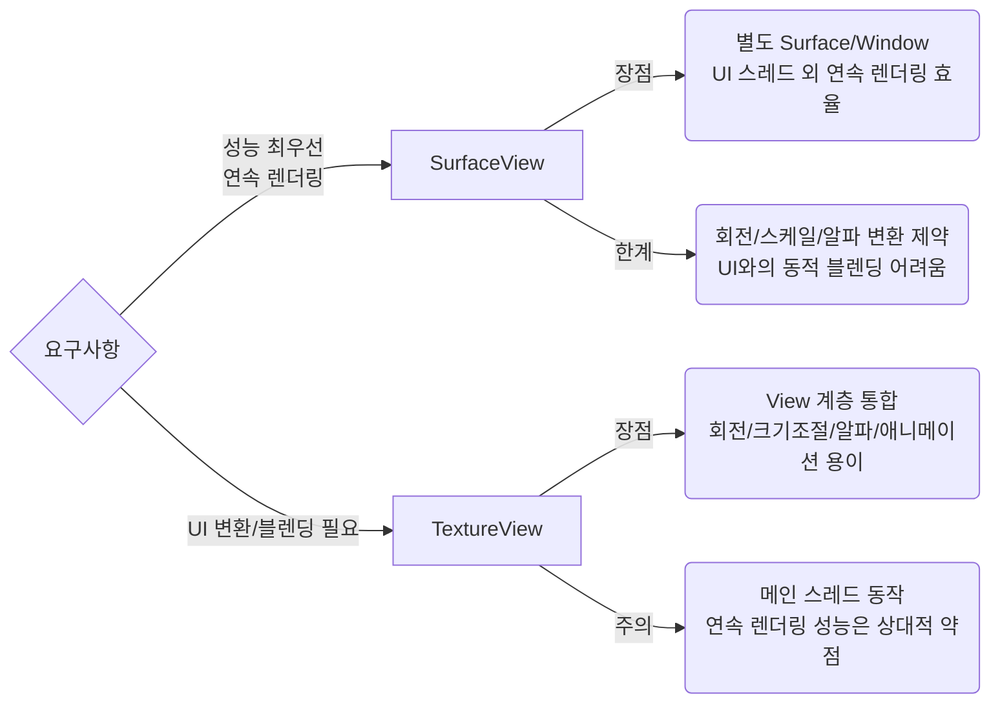

## ❓ Q38) View 시스템의 무효화(invalidation)란 무엇인가요?

---

### 📌 개요
안드로이드 **View 시스템의 무효화(invalidation)** 는  
`View`의 내용이 변경되어 **다시 그려져야 할 필요가 있을 때** 발생하는 과정입니다.  
예를 들어 텍스트, 색상, 크기 등이 바뀌면 이전에 그려진 화면은 더 이상 유효하지 않으므로,  
무효화를 통해 **다음 렌더링 사이클에서 갱신**이 이루어집니다.

---

### 🛠️ 주요 메서드
- **invalidate()**
  - `View` 자체를 무효화 → **다음 프레임에서 onDraw() 호출**  
  - 전체 뷰를 다시 그리는 비용이 발생  
- **postInvalidate()**
  - UI 스레드가 아닌 다른 스레드에서 무효화를 요청할 때 사용  
  - 내부적으로 메인(UI) 스레드에 안전하게 invalidate()를 전달  
- **requestLayout()**
  - 뷰의 크기나 위치가 변경될 때 호출  
  - 레이아웃 단계 전체가 다시 수행됨 (`onMeasure()` → `onLayout()`)

---

### ⚙️ 동작 방식
1. 뷰의 속성이 변경됨 (예: 색상, 텍스트, 좌표 등)
2. `invalidate()` 또는 `postInvalidate()`가 호출됨
3. `ViewRootImpl`이 무효화 요청을 수집
4. **다음 vsync 시점**에서 UI 트리 전체 혹은 부분적으로 다시 그려짐
5. `onDraw()`가 호출되어 화면에 반영됨

---

### 💡 Additional Tips  
- 무효화는 **즉각 갱신 대신 시기 적절한 업데이트**로 성능 최적화  
- 자동 갱신 시 **불필요한 렌더링 → 성능 저하** 위험  
- **Jetpack Compose**는 무효화 과정 없이 상태(state) 변화로 자동 UI 갱신  
- 따라서 Compose는 **성능 관리 주의 필요**


---

### 💻 코드 예시

```kotlin
class CustomView(context: Context) : View(context) {
    private val paint = Paint().apply { color = Color.RED }

    override fun onDraw(canvas: Canvas) {
        super.onDraw(canvas)
        canvas.drawCircle(100f, 100f, 50f, paint)
    }

    fun changeColor(newColor: Int) {
        paint.color = newColor
        invalidate() // 다시 그리기 요청
    }
}
```

### 📝 무효화 모범 사례
- **최소 영역 무효화**: 전체 뷰가 아니라 변경된 영역만 무효화 (`invalidate(rect)`)  
- **불필요한 호출 방지**: UI 성능 저하를 막기 위해 중복 호출을 피함  
- **UI 스레드에서만 직접 호출**: 비UI 스레드에서는 반드시 `postInvalidate()` 사용  
- **빈번한 업데이트 최적화**: 애니메이션이나 센서 데이터 등은 `Handler`나 `Choreographer` 활용  

---

### ⚖️ invalidate() vs requestLayout()
| 메서드 | 목적 | 호출 결과 |
|--------|------|-----------|
| **invalidate()** | 뷰를 다시 그림 | `onDraw()` 호출 |
| **requestLayout()** | 뷰의 레이아웃 갱신 | `onMeasure()` & `onLayout()` 호출 |

---

### 💬 실전 질문

**Q) invalidate() 메서드는 어떻게 작동하며 postInvalidate()와 어떻게 다른가요? 각각이 적합한 실제 사용 사례를 제시해주세요.**  
- **invalidate()**: 메인(UI) 스레드에서 호출할 때 사용 → `onDraw()`가 다음 프레임에서 실행됨  
  - 사용 사례: 버튼 색상, 텍스트 변경 등 단순 UI 갱신  
- **postInvalidate()**: 비UI 스레드에서 호출할 때 안전하게 무효화 요청을 보장  
  - 사용 사례: 센서 데이터, 네트워크 응답에 따른 UI 변경  

---

**Q) 백그라운드 스레드에서 UI 요소를 업데이트해야 하는 경우, 다시 그리기 작업이 메인 스레드에서 안전하게 수행되도록 어떻게 보장할 수 있나요?**  
- `postInvalidate()` 사용 → 내부적으로 메인 스레드의 메시지 큐에 무효화 요청을 전달  
- 또는 `Handler(Looper.getMainLooper())`를 사용해 UI 스레드에서 `invalidate()` 호출  
- 더 현대적인 방식으로는 `runOnUiThread { invalidate() }` 또는 `lifecycleScope.launch(Dispatchers.Main)` 사용  

---

### 📌 정리
- **무효화(invalidation)** 는 UI가 변경되었음을 시스템에 알리고,  
  다음 렌더링 사이클에서 새롭게 그려지도록 하는 과정  
- `invalidate()` → 단순 그리기 갱신  
- `postInvalidate()` → 비UI 스레드에서 안전하게 갱신 요청  
- `requestLayout()` → 레이아웃 변화 시 전체 측정/배치 재수행  
<br />
<br />
<br />
<br />
## ❓ Q) 39. ConstraintLayout이란 무엇인가요

---

### 📌 개요
- **ConstraintLayout**은 복잡한 뷰 계층 구조를 단순화하고, **성능 최적화**를 돕는 레이아웃 매니저입니다.  
- 모든 뷰를 **제약(Constraint)** 을 기반으로 배치하여, 중첩 레이아웃을 줄이고 효율적인 UI 구성이 가능합니다.  
- **RelativeLayout**이나 **LinearLayout**을 중첩하지 않고도, 동일한 결과를 얻을 수 있습니다.

---

### 🛠️ 주요 특징
1. **제약 기반 배치**  
   - 뷰 간의 상대적 위치, 부모 레이아웃과의 관계를 제약으로 정의.
   - 예: `start_toEndOf`, `top_toBottomOf`.

2. **성능 최적화**  
   - 중첩 레이아웃 최소화 → 측정 및 레이아웃 트리 탐색 속도 향상.

3. **가시적 편집 지원**  
   - Android Studio의 **Layout Editor**에서 드래그 앤 드롭으로 직관적 UI 구성 가능.

4. **다양한 제약 기능**  
   - 비율 제약 (aspect ratio)  
   - 가이드라인(Guideline)  
   - 배리어(Barrier)  
   - 체인(Chain)  

---

### 💻 코드 예시

```xml
<androidx.constraintlayout.widget.ConstraintLayout
    android:layout_width="match_parent"
    android:layout_height="match_parent">

    <Button
        android:id="@+id/button1"
        android:layout_width="wrap_content"
        android:layout_height="wrap_content"
        app:layout_constraintTop_toTopOf="parent"
        app:layout_constraintStart_toStartOf="parent"/>

    <Button
        android:id="@+id/button2"
        android:layout_width="wrap_content"
        android:layout_height="wrap_content"
        app:layout_constraintTop_toBottomOf="@id/button1"
        app:layout_constraintStart_toStartOf="@id/button1"/>
</androidx.constraintlayout.widget.ConstraintLayout>
```

---

### 💡 Additional Tips
- 복잡한 UI일수록 **ConstraintLayout 하나로 대부분 해결** 가능.
- **MotionLayout**은 ConstraintLayout을 기반으로 동작 → 애니메이션 제약도 손쉽게 적용 가능.
- ConstraintLayout은 성능이 좋아서 구글에서 권장하는 기본 레이아웃 매니저.

---

### 💬 실전 질문
**Q) ConstraintLayout은 중첩된 LinearLayout 및 RelativeLayout과 비교하여 성능을 어떻게 향상시키나요? ConstraintLayout 사용이 더 효율적인 시나리오를 말씀해주세요.**

**A)**  
- **성능 향상 원리**  
  - LinearLayout이나 RelativeLayout은 **중첩이 많아질수록 뷰 계층 트리가 깊어짐** → `measure`와 `layout` 연산이 반복 → 성능 저하 발생.  
  - ConstraintLayout은 **단일 레이아웃 트리** 내에서 제약 조건으로 뷰를 배치하므로, **측정/레이아웃 연산이 단일 단계에서 처리** → 성능이 향상됨.  

- **효율적인 시나리오**  
  1. **복잡한 UI 배치**: 로그인 화면, 대시보드, 상세 뷰 등 다양한 뷰들이 서로 다른 제약을 가질 때.  
  2. **다양한 해상도 대응**: 가이드라인, 배리어(Barrier) 등을 활용하여 반응형 UI 구현 시.  
  3. **중첩 레이아웃 최소화**: XML 가독성을 높이고, 유지보수를 쉽게 하고자 할 때.  

---

**Q) ConstraintLayout에서 match_constraint (0dp) 동작이 어떻게 작동하는지 설명해주세요. wrap_content 및 match_parent와 어떻게 다르며, 어떤 상황에서 사용해야 하나요?**

**A)**  
- **wrap_content**  
  - 뷰의 크기가 **콘텐츠 크기에 맞게 확장**됨.  
  - 예: `TextView`가 텍스트 길이에 따라 크기 결정.  

- **match_parent**  
  - 뷰가 **부모 레이아웃의 크기를 꽉 채움**.  
  - 부모와 동일한 가로/세로 크기를 갖고 싶을 때 사용.  

- **match_constraint (0dp)**  
  - ConstraintLayout 전용 속성.  
  - **제약 조건 사이에서 남는 공간을 채우는 방식**으로 동작.  
  - 체인(Chain)과 결합하면, 여러 뷰가 **가중치(weight)** 를 기반으로 남은 공간을 분배 가능.  

- **사용 상황**  
  1. 동일한 크기로 여러 버튼/아이템을 나란히 배치하고 싶을 때.  
  2. 화면 크기에 따라 유연하게 크기를 조절해야 할 때 (반응형 UI).  
  3. wrap_content는 너무 작고, match_parent는 너무 클 때 → 0dp로 제약 기반 크기 설정.  

```xml
<Button
    android:layout_width="0dp"
    android:layout_height="wrap_content"
    app:layout_constraintStart_toStartOf="parent"
    app:layout_constraintEnd_toEndOf="parent"/>
```

위 예시는 버튼이 **부모의 시작~끝 제약 사이 전체를 채우도록 동작**합니다.

---
<br />
<br />
<br />
<br />
## ❓ Q) 40. SurfaceView 대신 TextureView는 언제 사용해야 하나요

- **SurfaceView**는 별도의 윈도우를 만들어 화면을 그리는 뷰로, 하드웨어 가속 및 독립된 렌더링에 유리합니다. 하지만 **Z-order 제어(겹침 처리)**, 회전/스케일 변환, 애니메이션 적용이 어렵습니다.
- **TextureView**는 일반 뷰처럼 동작하여 **View 계층구조 내에서 자유롭게 변형(transform)** 가능하고, 알파값, 회전, 스케일 등의 애니메이션을 지원합니다.
- 따라서 **SurfaceView의 제약을 벗어나야 하는 경우** 즉, **뷰 트리 내에서 다른 뷰와 자연스럽게 섞이고 변형/애니메이션 효과가 필요한 경우** TextureView를 선택합니다.
- 단점으로는 **퍼포먼스가 SurfaceView보다 떨어질 수 있으며**, **하드웨어 가속이 필수**라는 점이 있습니다 (하드웨어 가속이 비활성화된 환경에서는 동작하지 않음).

---
### ✅ 사용 시나리오
- **SurfaceView**는 **비디오 플레이어, 게임** 등 **퍼포먼스가 최우선**인 경우 유리합니다.  
- **TextureView**는 다음과 같은 경우에 고려해야 합니다:
  1. 뷰 트리(View hierarchy) 내에서 다른 뷰와 **겹치거나 투명도**를 적용해야 할 때  
  2. 영상이나 카메라 프리뷰를 **회전·스케일링·애니메이션** 처리해야 할 때  
  3. `View` 기반 UI와 **자연스럽게 통합**되어야 할 때 (예: RecyclerView 안에서 영상 썸네일 미리보기)  
- 단, `TextureView`는 **하드웨어 가속**에 의존하므로 **저사양 기기에서는 성능 이슈**를 반드시 테스트해야 합니다.

---

### 💻 기본 코드 스니펫

**SurfaceView** 생명주기 콜백(핵심 지점만 발췌)  
```kotlin
class CustomSurfaceView(context: Context) : SurfaceView(context), SurfaceHolder.Callback {
    init { holder.addCallback(this) }

    override fun surfaceCreated(holder: SurfaceHolder) {
        // 렌더링 시작 (스레드/디코더/플레이어 시작)
    }

    override fun surfaceChanged(holder: SurfaceHolder, format: Int, width: Int, height: Int) {
        // 크기/포맷 변화 대응
    }

    override fun surfaceDestroyed(holder: SurfaceHolder) {
        // 렌더링 중지 및 리소스 해제
    }
}
```


**TextureView** 변환/애니메이션 친화  
```kotlin
class CustomTextureView(context: Context, attrs: AttributeSet? = null)
  : TextureView(context, attrs), TextureView.SurfaceTextureListener {

    init { surfaceTextureListener = this }

    override fun onSurfaceTextureAvailable(surface: SurfaceTexture, w: Int, h: Int) {
        // SurfaceTexture로 렌더링 시작
    }
    override fun onSurfaceTextureSizeChanged(surface: SurfaceTexture, w: Int, h: Int) {}
    override fun onSurfaceTextureDestroyed(surface: SurfaceTexture): Boolean = true
    override fun onSurfaceTextureUpdated(surface: SurfaceTexture) {}
}
```
### 🖼️ 비교 다이어그램


### 💬 실전 질문 & 답변

**Q) 효율적인 리소스 관리 및 메모리 누수 방지를 위해 **SurfaceView**의 생명주기를 어떻게 적절하게 관리해야 하나요?**

**A)**  
- `surfaceCreated()`에서만 렌더링 시작 (표면 확보 보장).  
- `surfaceChanged()`에서는 사이즈/포맷 변화 시에만 재설정.  
- `surfaceDestroyed()`에서는 루프 종료, 핸들/버퍼/스레드 해제.  
👉 **표면 수명 이후 참조를 방지**하면 메모리 누수 가능성을 줄일 수 있습니다.

**Q) 카메라 미리보기를 **회전 및 크기 조절과 같은 UI 변환**과 함께 표시해야 하는 요구 사항이 주어졌을 때, **SurfaceView**와 **TextureView** 중 어떤 컴포넌트를 선택하는 것이 적합한가요?**

**A)** `TextureView` 선택.  
- **View 계층 통합 + 실시간 변환 지원** 덕분에 카메라 프리뷰 회전·스케일링 요구에 적합합니다.  
- SurfaceView는 성능은 우수하나, UI 변환에 제약이 있어 해당 시나리오에는 적절하지 않습니다.

<br />
<br />
<br />
<br />

## ❓ Q) 41. RecyclerView는 내부적으로 어떻게 작동하나요?

---

### 📌 개요
`RecyclerView`는 **새로운 아이템 뷰를 반복 인플레이트하지 않고 재활용**하여 대규모 데이터 셋을 효율적으로 표시하는 컴포넌트입니다. 이 효율성은 **ViewHolder 패턴**과 **객체 풀(object pool) 유사 메커니즘(RecycledViewPool)**을 통해 달성됩니다.

---

### ⚙️ 내부 메커니즘 핵심 개념
- **뷰 재활용(Recycling Views)**: 화면을 벗어난 뷰는 소멸되지 않고 `RecycledViewPool`에 보관되었다가 필요한 경우 재사용됩니다.
- **ViewHolder 패턴**: 바인딩 중 반복적인 `findViewById()`를 피하기 위해 아이템 뷰 참조를 보관합니다.
- **Adapter의 역할**: 보이는 항목만 `onBindViewHolder()`로 업데이트되도록 보장합니다.
- **RecycledViewPool**: 사용되지 않는 뷰를 저장하는 풀로, 유사한 뷰 유형 간 재사용을 통해 메모리 최적화가 가능합니다.

---

### 🔁 재활용 동작 흐름
1. **스크롤 시 가시성 변화**: 화면 밖으로 나간 항목은 분리되며 풀에 추가됩니다.
2. **리바인딩**: 새 항목이 들어오면 풀에서 적합한 뷰를 찾아 **새 데이터로 바인딩**하여 재사용합니다.
3. **풀에 적합한 뷰가 없을 때**: `onCreateViewHolder()`로 **새 뷰 인플레이트**.
4. **효율적 메모리 사용**: 재활용으로 메모리 할당/GC를 최소화합니다.

---

#### RecyclerView Adapter Example
```kotlin
class MyAdapter(private val dataList: List<String>) : RecyclerView.Adapter<MyAdapter.MyViewHolder>() {

    // ViewHolder 클래스: 아이템 뷰의 참조를 저장
    class MyViewHolder(itemView: View) : RecyclerView.ViewHolder(itemView) {
        val textView: TextView = itemView.findViewById(R.id.textView)
    }

    // ViewHolder 생성: 새 뷰 인플레이션
    override fun onCreateViewHolder(parent: ViewGroup, viewType: Int): MyViewHolder {
        val view = LayoutInflater.from(parent.context).inflate(R.layout.item_layout, parent, false)
        return MyViewHolder(view)
    }

    // ViewHolder에 데이터 바인딩
    override fun onBindViewHolder(holder: MyViewHolder, position: Int) {
        holder.textView.text = dataList[position]
    }

    // 데이터 셋 크기 반환
    override fun getItemCount(): Int = dataList.size
}
```

#### (여러 아이템 유형) 데이터 클래스
```kotlin
// 다양한 아이템 유형을 나타내는 데이터 클래스 (Sealed Class 사용)
sealed class ListItem {
    data class Header(val title: String) : ListItem()
    data class Content(val text: String) : ListItem()
}
```

#### (여러 아이템 유형) ViewHolder의 bind 예시
```kotlin
class ContentViewHolder(itemView: View) : RecyclerView.ViewHolder(itemView) {
    private val content: TextView = itemView.findViewById(R.id.contentText)

    fun bind(item: ListItem.Content) {
        content.text = item.text
    }
}
```

#### 그림 92. DiffUtil Callback Implementation
```kotlin
class MyDiffUtilCallback : DiffUtil.ItemCallback<MyItem>() {
    override fun areItemsTheSame(oldItem: MyItem, newItem: MyItem): Boolean {
        // 아이템이 동일한 데이터를 나타내는지 확인
        return oldItem.id == newItem.id
    }

    override fun areContentsTheSame(oldItem: MyItem, newItem: MyItem): Boolean {
        // 아이템의 내용이 동일한지 확인
        return oldItem == newItem
    }
}
```

### 🧩 여러 아이템 유형 구현 단계 (원문 요약)
- **아이템 유형 정의** → `getItemViewType()` 재정의 → 유형별 **ViewHolder/레이아웃** 구성 → 올바른 바인딩.

---
### ➕ 추가 심화 개념

#### 1) DiffUtil
- 두 리스트 간의 차이를 계산해, 변경된 부분만 갱신합니다.
- **장점**: 불필요한 `notifyDataSetChanged()` 호출을 줄여  
  **애니메이션/성능 최적화**에 효과적입니다.

```kotlin
val diffCallback = object : DiffUtil.ItemCallback<MyModel>() {
    override fun areItemsTheSame(oldItem: MyModel, newItem: MyModel): Boolean =
        oldItem.id == newItem.id

    override fun areContentsTheSame(oldItem: MyModel, newItem: MyModel): Boolean =
        oldItem == newItem
}
```

---

#### 2) ListAdapter
- `RecyclerView.Adapter`를 상속한 추상 클래스.
- 내부적으로 **DiffUtil**을 자동으로 사용해,  
  `submitList()` 호출만으로 갱신이 안전하게 처리됩니다.

```kotlin
class MyListAdapter :
    ListAdapter<MyModel, MyViewHolder>(diffCallback) {

    override fun onCreateViewHolder(parent: ViewGroup, viewType: Int): MyViewHolder =
        MyViewHolder.create(parent)

    override fun onBindViewHolder(holder: MyViewHolder, position: Int) =
        holder.bind(getItem(position))
}
```

---

#### 3) ConcatAdapter
- 여러 개의 어댑터를 **하나의 RecyclerView**에 붙일 수 있습니다.
- 헤더/본문/푸터를 독립된 어댑터로 분리해 관리할 수 있습니다.

```kotlin
val headerAdapter = HeaderAdapter()
val contentAdapter = ContentAdapter()
val footerAdapter = FooterAdapter()

recyclerView.adapter = ConcatAdapter(
    headerAdapter,
    contentAdapter,
    footerAdapter
)
```

---

#### 4) Multi ViewHolder (멀티 타입 아이템)
- **여러 뷰 타입**을 하나의 어댑터에서 처리.
- `getItemViewType()`에서 타입 분기 → 인덱스 꼬임 방지.

```kotlin
sealed class UiModel {
    data class Header(val title: String) : UiModel()
    data class Item(val id: Long, val name: String) : UiModel()
    data class Footer(val info: String) : UiModel()
}

class MultiAdapter :
    ListAdapter<UiModel, RecyclerView.ViewHolder>(diff) {

    companion object {
        private const val TYPE_HEADER = 1
        private const val TYPE_ITEM = 2
        private const val TYPE_FOOTER = 3

        val diff = object : DiffUtil.ItemCallback<UiModel>() {
            override fun areItemsTheSame(old: UiModel, new: UiModel): Boolean =
                when {
                    old is UiModel.Header && new is UiModel.Header -> true
                    old is UiModel.Footer && new is UiModel.Footer -> true
                    old is UiModel.Item && new is UiModel.Item -> old.id == new.id
                    else -> false
                }

            override fun areContentsTheSame(old: UiModel, new: UiModel): Boolean = old == new
        }
    }

    override fun getItemViewType(position: Int): Int = when (getItem(position)) {
        is UiModel.Header -> TYPE_HEADER
        is UiModel.Item   -> TYPE_ITEM
        is UiModel.Footer -> TYPE_FOOTER
    }

    override fun onCreateViewHolder(parent: ViewGroup, viewType: Int): RecyclerView.ViewHolder =
        when (viewType) {
            TYPE_HEADER -> HeaderVH(...)
            TYPE_ITEM   -> ItemVH(...)
            else        -> FooterVH(...)
        }

    override fun onBindViewHolder(holder: RecyclerView.ViewHolder, pos: Int) {
        when (val model = getItem(pos)) {
            is UiModel.Header -> (holder as HeaderVH).bind(model)
            is UiModel.Item   -> (holder as ItemVH).bind(model)
            is UiModel.Footer -> (holder as FooterVH).bind(model)
        }
    }
}
```


---

### 🚀 Pro Tips for Mastery (원문)
- **성능 향상**: `ListAdapter`와 `DiffUtil`을 사용해 변경점만 반영. 전체 `notifyDataSetChanged()`를 피하고 최소 업데이트(삽입/삭제/수정)만 적용

---

### ⚠️ 인덱스 충돌 방지 & 실수 예시

#### 실수 & 해결책
- ❌ `position`을 데이터 인덱스로 직접 사용 → 헤더 추가 시 전부 +1 필요  
  ✅ 해결: **Multi ViewType 또는 ConcatAdapter**로 오프셋 제거

- ❌ `adapterPosition` 사용 중 애니메이션 시 `NO_POSITION` 크래시  
  ✅ 해결: `bindingAdapterPosition` 체크 후 != `NO_POSITION`일 때만 사용

- ❌ `notifyDataSetChanged()` 남발 → 애니메이션 붕괴  
  ✅ 해결: `ListAdapter + DiffUtil` 사용, 변경점만 `submitList()`

- ❌ 아이템 클릭 시 포지션 기반 참조  
  ✅ 해결: **모델 자체를 콜백에 전달**

```kotlin
class ItemVH(val binding: RowItemBinding): RecyclerView.ViewHolder(binding.root) {
    fun bind(model: UiModel.Item, onClick: (UiModel.Item) -> Unit) {
        binding.title.text = model.name
        binding.root.setOnClickListener { onClick(model) } // position 참조 제거
    }
}
```

### 📝 결론
- RecyclerView는 **뷰 재사용 + DiffUtil 최적화 + 다양한 어댑터 전략**으로 동작합니다.
- 인덱스 충돌을 방지하려면:
  - 단일 어댑터 + sealed class (멀티 뷰타입)  
  - ConcatAdapter (헤더/푸터 분리)  
- 두 패턴 중 상황에 맞는 방식을 선택하면, **포지션 꼬임 자체를 없앨 수 있습니다**.

---

### 💬 실전 질문
**Q1_ RecyclerView가 ListView보다 성능이 좋은 이유는 무엇인가요?**

**A)**
  - RecyclerView는 ViewHolder 패턴을 강제하고,  
    `LayoutManager`로 레이아웃을 유연하게 변경할 수 있습니다.  
  - 또한, DiffUtil과 같은 도구로 변경점만 갱신 가능해,  
    ListView보다 효율적이고 확장성이 뛰어납니다.

---

**Q2) RecyclerView에서 스크롤 성능 최적화를 위해 어떤 전략을 사용하나요**

**A)**  
  1. ViewHolder에서 findViewById() 대신 **ViewBinding/데이터바인딩** 사용  
  2. Glide/Picasso로 이미지 로딩 시 **placeholder + 캐싱 전략** 적용  
  3. `setHasFixedSize(true)`로 성능 최적화  
  4. DiffUtil로 불필요한 notify 호출 제거  
  5. RecyclerViewPool 재사용으로 중첩 리스트 최적화

---

**Q3) RecyclerView에서 여러 ViewType을 처리할 때 발생할 수 있는 문제와 해결책은**

**A)**
  - 문제: `position`을 직접 데이터 인덱스로 매핑하면,  
    **헤더/푸터 추가 시 인덱스 충돌**이 발생합니다.  
  - 해결책:  
    1. **getItemViewType() + sealed class**로 명시적 타입 분리  
    2. 또는 **ConcatAdapter**를 사용해 어댑터 자체를 분리  
    3. 포지션 기반 접근 대신 **데이터 객체 자체를 콜백에 전달**  

---

### 🧾 요약
RecyclerView는 **RecycledViewPool + ViewHolder**로 **인플레이트 오버헤드와 메모리 할당을 최소화**하여 스크롤 성능을 극대화합니다. `ListAdapter`/`DiffUtil`을 접목하면 **세분화된 변경만 반영**되어 대규모 데이터에서도 효율적인 업데이트가 가능합니다.

<br />
<br />
<br />
<br />

## ❓ Q) 42. Dp와 Sp의 차이점은 무엇인가요

---

### 📌 개요
- **dp(density-independent pixels)**: 디스플레이의 **밀도에 독립적**인 픽셀 단위  
- **sp(scale-independent pixels)**: **dp와 동일**하지만, 여기에 **사용자 글꼴 크기 설정(폰트 스케일)** 이 반영됨  

---

### 🔑 차이점
1. **dp**
   - 주로 **레이아웃 요소(버튼, 마진, 패딩)** 크기 지정에 사용  
   - 화면 해상도와 관계없이 **일관된 UI 크기**를 유지  

2. **sp**
   - 주로 **텍스트 크기 지정**에 사용  
   - 기기 해상도뿐만 아니라 **사용자가 설정한 글꼴 크기**를 반영  
   - 접근성(Accessibility) 보장에 필수  

---

### 🧭 사용 가이드
- **UI 레이아웃 요소** → `dp` 사용  
- **텍스트 크기** → `sp` 사용  

---

### 🛠️ 면 깨짐 방지 전략
사용자가 시스템 글꼴 크기를 크게 늘리면 `sp` 단위로 인해 텍스트 요소가 경계를 넘어 커질 수 있습니다.  
이를 방지하기 위한 전략은 다음과 같습니다:

1. **콘텐츠를 적절하게 감싸기 (Wrap Content Properly)**  
   - `TextView`, `Button`과 같은 텍스트 기반 컴포넌트를 `wrap_content`로 설정  
   - 텍스트 크기에 따라 컨테이너가 확장되어 잘림/오버플로우 방지  

   ```xml
   <TextView
       android:layout_width="wrap_content"
       android:layout_height="wrap_content"
       android:textSize="16sp"
       android:text="샘플 텍스트" />
   ```

2. **`minLines`, `maxLines` + `ellipsize` 활용**  
   - 텍스트 확장 동작을 제어하고, 레이아웃 안정성 확보  

   ```xml
   <TextView
       android:layout_width="match_parent"
       android:layout_height="wrap_content"
       android:textSize="16sp"
       android:maxLines="2"
       android:ellipsize="end"
       android:text="이것은 제대로 처리되지 않으면 레이아웃을 깨뜨릴 수 있는 긴 샘플 텍스트입니다." />
   ```

3. **중요한 UI 컴포넌트에 고정 크기 사용**  
   - 버튼 등은 `dp`로 고정 크기 지정  
   - 단, 내부 텍스트는 `sp`를 신중히 사용  

   ```xml
   <Button
       android:layout_width="100dp"
       android:layout_height="50dp"
       android:textSize="14sp"
       android:text="버튼" />
   ```

4. **극단적인 글꼴 크기로 테스트**  
   - 시스템 설정에서 **가장 큰 글꼴 크기**로 테스트해 깨짐 여부 확인  

5. **ConstraintLayout 제약 조건 활용**  
   - 텍스트가 커져도 다른 UI와 겹치지 않도록 유연한 배치  

   ```xml
   <androidx.constraintlayout.widget.ConstraintLayout
       xmlns:android="http://schemas.android.com/apk/res/android"
       xmlns:app="http://schemas.android.com/apk/res-auto"
       android:layout_width="match_parent"
       android:layout_height="wrap_content">

       <TextView
           android:id="@+id/sampleText"
           android:layout_width="0dp"
           android:layout_height="wrap_content"
           android:textSize="16sp"
           app:layout_constraintStart_toStartOf="parent"
           app:layout_constraintEnd_toEndOf="parent"
           app:layout_constraintTop_toTopOf="parent"
           android:text="동적 레이아웃 예제" />
   </androidx.constraintlayout.widget.ConstraintLayout>
   ```

6. **Sp 대신 Dp 사용 (특수 케이스)**  
   - 일부 팀은 레이아웃 깨짐 방지를 위해 텍스트에 `dp` 사용  
   - 그러나 이는 접근성을 저해할 수 있으므로 권장되지 않음  

---

### ✨ AutoSize (자동 텍스트 크기 조정)
안드로이드에서는 **AutoSize TextView** 기능을 제공하여, 공간에 맞게 글자 크기를 자동 조정할 수 있습니다.

- **설정 방법**:  
  XML 속성 또는 코드로 `setAutoSizeTextTypeWithDefaults()` 사용  

  ```xml
  <TextView
      android:layout_width="match_parent"
      android:layout_height="wrap_content"
      android:autoSizeTextType="uniform"
      android:autoSizeMinTextSize="12sp"
      android:autoSizeMaxTextSize="100sp"
      android:autoSizeStepGranularity="2sp"
      android:text="자동 크기 조정 텍스트" />
  ```

- **장점**:
  - 제한된 공간에서도 텍스트 잘림 방지  
  - 다양한 화면 크기 및 글꼴 설정에 유연하게 대응  

---

### 💬 실전 질문
**Q1) 텍스트 크기에 Sp를 사용할 때 발생할 수 있는 잠재적인 레이아웃 깨짐 문제를 경험해 보거나 해결해 본 적이 있나요**

**A)**
- 키오스크 개발시, 커스텀으로 해상도를 확장한 경우
- 일반 플래그쉽 휴대전화의 경우, 가로가 360dp ~ 431dp 지만,, 폴드나 플립의 경우 가로길이가 341dp 로 작아서 대응이 쉽지 않음
- 지하철 앱을 만드는 경우, 가장 긴 역의 이름은 "동대문역사문화공원역" 이고 가장 짧은 역 이름은 "신사" 역으로 글자 수 대응이 어려워 AutoSize TextView 를 사용하여 동적으로 길이 조정

<br />
<br />
<br />
<br />

## ❓ Q) 43. 나인패치(nine-patch) 이미지의 용도는 무엇인가요?

---

### 📌 개요
- **나인패치(Nine-patch) 이미지**는 안드로이드에서 **유연한 크기 조절이 가능한 비트맵 이미지**를 만들기 위한 특별한 PNG 형식입니다.  
- 파일 확장자는 `.9.png` 이며, 이미지의 가장자리에 **1픽셀 두께의 검은색 선**을 추가하여 **확장 가능한 영역**과 **내용을 배치할 수 있는 영역**을 정의합니다 .

---

### 🎯 용도
- 버튼, 대화상자, 배경 등 **다양한 크기와 해상도**에서 재사용해야 하는 UI 요소에 적합합니다.
- 특정 부분(예: 모서리)은 **고정**시키고, 다른 부분(예: 중앙, 세로/가로 라인)은 **늘어나도록 지정**할 수 있어 레이아웃이 깨지지 않습니다.
- 동일한 이미지를 다양한 화면 크기와 비율에서 자연스럽게 적용 가능.

---

### 🛠️ 동작 방식
- 나인패치 편집기(`draw9patch` 툴)에서 검은 선으로 확장 영역을 정의:
  - **위/왼쪽 테두리**: **늘어날 수 있는 영역**  
  - **아래/오른쪽 테두리**: **콘텐츠가 들어갈 수 있는 영역**
- 안드로이드가 런타임 시 해당 규칙에 맞게 이미지를 늘리거나 유지하여 표시.

---

### ✅ 코드 예시
```xml
<ImageView
    android:layout_width="wrap_content"
    android:layout_height="wrap_content"
    android:src="@drawable/button_background_9" />
```

---

### 💡 Additional Tips
- 나인패치는 **다양한 해상도와 DPI**에서 동일한 UI를 유지하는 데 특히 유용합니다.  
- 단순 배경 이미지를 해상도별로 다 만드는 대신, `.9.png` 하나로 처리해 앱 용량 절감 효과도 있습니다.

---


### 💬 실전 질문
**Q) 버튼이나 대화상자 배경으로 일반 PNG를 사용했을 때 어떤 문제가 발생할 수 있으며, 나인패치를 사용하면 어떻게 해결되나요?**

**A)**
일반 PNG는 크기가 변할 때 이미지가 왜곡되거나 모서리가 깨질 수 있습니다.  
하지만 나인패치는 **늘어나야 할 부분과 유지해야 할 부분을 구분**하기 때문에  
버튼 크기가 달라져도 **모서리는 고정되고, 중앙 영역만 늘어나 자연스럽게 표현**됩니다.

<br />
<br />
<br />
<br />

## ❓ Q) 44. Drawable이란 무엇이며, UI 개발에서 어떻게 사용되나요?

---

### 📌 개요
- **Drawable**은 화면에 그릴 수 있는 모든 그래픽 리소스의 **추상화 클래스**로, 배경, 버튼, 아이콘, 커스텀 뷰 등에서 폭넓게 사용됩니다. 유형별로 용도에 맞춘 다양한 서브클래스를 제공합니다. 

---

### 🎨 주요 Drawable 유형 & 대표 코드

#### 1) **BitmapDrawable**(래스터 이미지)
- PNG/JPG/GIF 등의 **비트맵**을 그릴 때 사용. 크기 조절/타일링/필터링 지원. 주로 `ImageView` 소스나 배경으로 활용. 
- XML 예시(문서 원문):
```xml
<bitmap xmlns:android="http://schemas.android.com/apk/res/android"
    android:src="@drawable/sample_image"
    android:tileMode="repeat"/>
```

- Kotlin 사용 예:
```kotlin
val iv = findViewById<ImageView>(R.id.iv)
iv.setImageResource(R.drawable.sample_image)
```

#### 2) **VectorDrawable**(벡터 그래픽)
- XML path를 이용한 **해상도 독립** 그래픽. 아이콘/로고에 적합, 픽셀화 방지. 
- XML 예시(문서 원문):
```xml
<vector xmlns:android="http://schemas.android.com/apk/res/android"
    android:width="24dp"
    android:height="24dp"
    android:viewportWidth="24"
    android:viewportHeight="24">
    <path
        android:fillColor="#FF0000"
        android:pathData="M12,2L15,8H9L12,2Z"/>
</vector>
```

- Kotlin 사용 예:
```kotlin
val iv = findViewById<ImageView>(R.id.iv)
iv.setImageResource(R.drawable.ic_triangle) // 위 벡터를 ic_triangle로 저장 가정
```

#### 3) **NinePatchDrawable**(패딩 포함, 크기 조절 가능 이미지)
- `.9.png` 외곽 1px 가이드로 **늘어나는 영역/고정 영역**을 정의해, 채팅 말풍선/버튼 등 **늘어나는 UI**에 적합. 
- XML 예시(문서 원문):
```xml
<nine-patch xmlns:android="http://schemas.android.com/apk/res/android"
    android:src="@drawable/chat_bubble.9.png"/>
```


#### 4) **ShapeDrawable**(커스텀 도형)
- 이미지 없이 XML로 **사각형/타원 등**을 정의해 배경/버튼/커스텀 UI에 유용. 
- XML 예시(문서 원문):
```xml
<shape xmlns:android="http://schemas.android.com/apk/res/android"
    android:shape="rectangle">
    <solid android:color="#FF5733"/>
    <corners android:radius="8dp"/>
</shape>
```


#### 5) **LayerDrawable**(여러 Drawable 겹치기)
- 여러 Drawable을 **계층**으로 결합해 복잡한 배경/오버레이 효과 구현. 
- XML 예시(문서 원문):
```xml
<layer-list xmlns:android="http://schemas.android.com/apk/res/android">
    <item>
        <shape android:shape="rectangle">
            <solid android:color="#000000"/>
        </shape>
    </item>
    <item
        android:drawable="@drawable/icon"
        android:top="10dp"
        android:left="10dp"/>
</layer-list>
```


---

### 🛠️ 뷰에 적용하는 일반 패턴

- **XML로 소스 지정(예: ImageView)**
```xml
<ImageView
    android:id="@+id/iv"
    android:layout_width="wrap_content"
    android:layout_height="wrap_content"
    android:src="@drawable/sample_image"/>
```

- **XML로 배경 지정(예: Button)**
```xml
<Button
    android:id="@+id/cta"
    android:layout_width="wrap_content"
    android:layout_height="wrap_content"
    android:background="@drawable/bg_button"/>
```

- **Kotlin에서 설정**
```kotlin
val btn = findViewById<Button>(R.id.cta)
btn.background = AppCompatResources.getDrawable(this, R.drawable.bg_button)
```

---

### 🧭 선택 가이드(요약)
- 요구사항(품질/확장성/복잡도)에 맞는 Drawable을 선택하면, **최적화된·매력적인 UI**를 구현할 수 있습니다. 

---

### 💬 실전 질문
**Q)** Drawable만 사용하여 **사용자 상호작용에 따라 모양과 색상이 변경되는 동적 배경**을 가진 버튼을 어떻게 만들 수 있나요? 

**A1)**
- 상태별로 다른 Drawable을 지정하는 **상태 셀렉터**를 만들고(예: `bg_button_states.xml`), 각 상태에서 **ShapeDrawable**로 색/모서리 등을 바꿉니다. (상태 셀렉터는 Drawable 계열로, Drawable만으로 해결 가능)
- 상태 셀렉터:
```xml
<!-- res/drawable/bg_button_states.xml -->
<selector xmlns:android="http://schemas.android.com/apk/res/android">
    <item android:state_pressed="true">
        <shape android:shape="rectangle">
            <solid android:color="#FF7043"/>
            <corners android:radius="12dp"/>
        </shape>
    </item>
    <item android:state_focused="true">
        <shape android:shape="rectangle">
            <solid android:color="#42A5F5"/>
            <corners android:radius="12dp"/>
            <stroke android:width="2dp" android:color="#1E88E5"/>
        </shape>
    </item>
    <item>
        <shape android:shape="rectangle">
            <solid android:color="#26A69A"/>
            <corners android:radius="12dp"/>
        </shape>
    </item>
</selector>
```
- 적용:
```xml
<Button
    android:id="@+id/cta"
    android:layout_width="wrap_content"
    android:layout_height="48dp"
    android:background="@drawable/bg_button_states"
    android:text="확인"/>
```
- 필요 시, **LayerDrawable**로 그림자/하이라이트를 얹거나, **NinePatchDrawable**로 캡션 길이에 따른 자연스러운 확장을 보장할 수 있습니다. (각 유형은 위 섹션 참조)

---

**A2)**

단순 클릭에 대한 알림이나 상호작용만 필요하다면 ripple 사용 가능

## 1) 직사각형 카드형 버튼: 배경 + 얇은 하이라이트 + 리플
- **요점**: 모서리 12dp 둥근 배경, 위에 하이라이트 오버레이, **리플 색상은 테마의 `colorControlHighlight`** 사용  
- **mask**: 둥근 모서리로 **리플 범위**를 동일하게 제한

```xml
<!-- res/drawable/bg_card_ripple.xml -->
<ripple xmlns:android="http://schemas.android.com/apk/res/android"
    android:color="?attr/colorControlHighlight">

    <!-- 1) 내용물(content) : 여러 drawable layer를 겹침 -->
    <item>
        <layer-list>
            <!-- 바탕 레이어: 카드 배경 -->
            <item>
                <shape android:shape="rectangle">
                    <solid android:color="#263238"/>
                    <corners android:radius="12dp"/>
                </shape>
            </item>

            <!-- 상단 얇은 하이라이트(선택) -->
            <item android:top="0dp">
                <shape android:shape="rectangle">
                    <size android:height="1dp"/>
                    <solid android:color="#334455"/>
                    <corners android:topLeftRadius="12dp"
                             android:topRightRadius="12dp"/>
                </shape>
            </item>

            <!-- 아이콘/장식 레이어(선택) -->
            <!-- <item android:drawable="@drawable/ic_whatever" android:left="12dp" android:top="12dp"/> -->
        </layer-list>
    </item>

    <!-- 2) 마스크: 리플 번짐 영역/모서리를 제한(=배경과 동일한 라운드) -->
    <item android:id="@android:id/mask">
        <shape android:shape="rectangle">
            <solid android:color="#FFFFFFFF"/>
            <corners android:radius="12dp"/>
        </shape>
    </item>
</ripple>
```

### 🧾 문서 요약 문구(원문)
- “Drawable 클래스는 안드로이드에서 다양한 유형의 그래픽을 처리하는 유연한 방법을 제공합니다… 개발자는 최적화되고 시각적으로 매력적인 UI 컴포넌트를 만들 수 있습니다.” 

---
