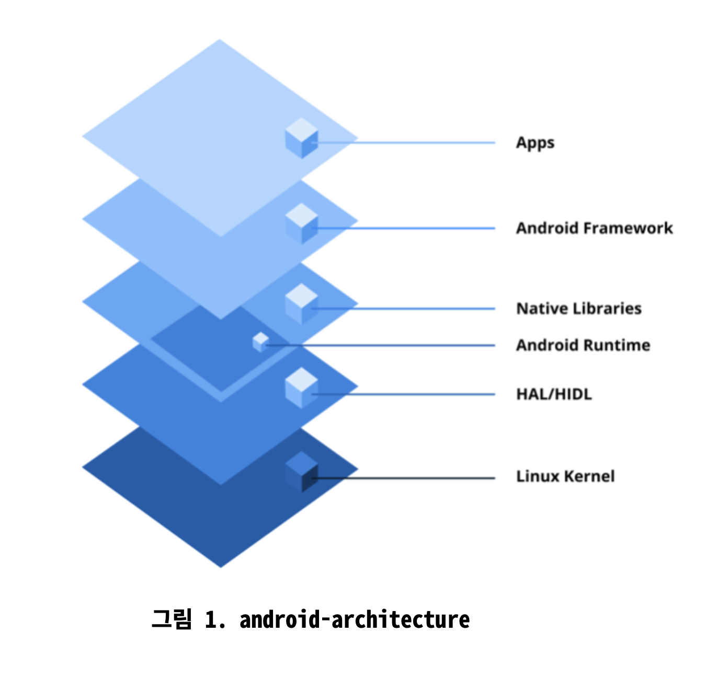

# Week1. Q0 ~ Q2

## Q) 0. 안드로이드란 무엇인가요?
안드로이드는 주로 모바일 기기를 위해 설계된 **오픈소스** 운영 체제입니다.  
리눅스 커널에 기반하며 광범위한 하드웨어 구성과 기기를 지원하는 **강력하고 유연한 플랫폼**을 제공합니다.  

### 주요 특징  
1. **오픈 소스 및 커스텀화** : 오픈 소스이므로 필요에 맞게 수정하고 커스텀할 수 있습니다. (광범위한 채택과 혁신에 기여)
2. **SDK를 이용한 애플리케이션 개발** : Java/Kotlin과 소프트웨어 개발 키트(SDK)를 사용하여 개발됨
3. **풍부한 앱 생태계** : Google Play Store는 안드로이드의 공식 앱 배포 플랫폼  
  개발자는 서브파티 스토어나 직접 다운로드를 통해 앱을 독립적으로 배포할 수도 있음
4. **멀티태스팅 및 리소스 관리** : 안드로이드는 멀티태스킹을 지원하여 사용자가 여러 앱을 동시에 실행할 수 있게 합니다.  
  관리형 메모리 시스템과 효율적인 가비지 컬렉션을 사용하여 다양한 기기에서 성능을 최적화
5. **다양한 하드웨어 지원** : 광범위한 기기를 구동, 크기, 해상도 및 하드웨어 구성과 광범위한 호환성

4번에 대한 추가 설명 https://developer.android.com/guide/components/fundamentals?hl=ko


### 안드로이드 아키텍처
안드로이드 플랫폼 아키텍처는 모듈식으로 계층화되어 있으며, 여러 구성 요소로 이루어져 있습니다.



- **리눅스 커널 (Linux Kernal)**
  - 안드로이드 운영체제의 기반을 형성함 하드웨어 추상화를 처리하여 소프트웨어와 하드웨어 간의 원활한 상호 작용을 보장  
    주요 책임에는 메모리 및 프로세스 관리, 보안 강화, 디스플레이와 같은 하드웨어 구성 요소의 장치 드라이버 관리가 포함됨
- **하드웨어 추상화 계층 (Hardware abstraction layer (HAL))**
  - 안드로이드의 Java API 프레임워크를 기기 하드웨어에 연결하는 표준 인터페이스를 제공  
    라이브러리 모듈로 구성되며, 각 모듈은 카메라나 Bluetooth와 같은 특정 하드웨어 구성 요소에 맞춰져 있음  
    프레임워크 API가 하드웨어 접근을 요청하면, 안드로이드 시스템은 해당 HAL 모듈을 동적으로 로드하여 요청을 처리함
- **안드로이드 런타임 및 코어 라이브러리 (Android Runtime (ART) 및 Core Libraries)**
  - ART는 Kotlin/Java 에서 컴파일된 바이트코드를 사용하여 애플리케이션을 실행  
    ART는 최적화된 성능을 위해 Ahead-of-Time (AOT) 및 Just-in-Time 컴파일을 지원  
    핵심 라이브러리는 데이터 구조, 파일 조작, 스레딩 등을 위한 필수 API를 제공하여 앱 개발을 위한 포괄적인 환경을 제공
  - Dalvik -> JIT : 실행되는 시점에 필요한 코드만 컴파일 (런타임에 느리게 동작할 수 있음)
  - ART -> AOT : 애플리케이션이 실행되는 시점에 코드를 컴파일하고 미리 캐시해서 사용하는 방식
- **네이티브 C/C++ 라이브러리 모음 (Native C/C++ Libraries)**
  - 안드로이드은 중요한 기능을 지원하기 위해 C 및 C++로 작성된 네이티브 라이브러리 모음을 포함  
    OpenGL -> 그래픽 랜더링  
    SQLite -> 데이터베이스  
    안드로이드 프레임워크와 애플리케이션에서 성능 집약적인 작업을 위해 직접 사용됩니다.  
- **안드로이드 프레임워크 (Android Frameworks (APIs))**
  - 애플리케이션 프레임워크 계층은 앱 개발을 위한 고수준 서비스와 API를 제공함  
    ActivityManager, NotificationManager  
    안드로이드 시스템 기능을 효율적으로 활용할 수 있도록 지원함  
- **애플리케이션 (Applications)**
  - 사용자에게 다양한 기능을 제공하고, 각종 시스템들을 원활하게 운용하기 위해 하위 계층과 통신함


## Q) 1. 인텐트란 무엇인가요?
인텐트란 수행될 작업에 대한 추상적인 설명입니다.  
Activity, Service, BroadcastReceiver가 **통신**할 수 있도록 하는 **메시징 객체**역할을 합니다.  
Activity의 시작, Service 시작, 브로드캐스트를 보내거나하는데 사용됨  
또한 컴포넌트 간에 데이터를 전달할 수 있어 안드로이드의 시스템에서 근본이 되는 요소  

명시적 및 암시적 두 가지 유형의 인텐트가 있음  

1. 명시적 인텐트 (Explicit Intent)  
   - **정의** : 명시적 Intent는 호출할 컴포넌트를 직접 이름으로 지정하여 정확히 명시
   - **사용 사례** : 명시적 인텐트는 **대상 컴포넌트를 알고 있을 때** 사용됨(앱 내의 특정 Activity 시작)
   - **시나리오** : 동일한 앱 내에서 한 Activity에서 다른 Activity로 전환하는 경우 명시적 Intent를 사용

```kotlin
val intent = Intent(this, TargetActivity::class.java)
startActivity(intent)
```

2. 명시적 인텐트 (Implicit Intent)  
   - 정의 : 암시적 인텐트는 특정 컴포넌트를 **지정하지 않고** 수행할 **일반적인 작업**을 선언  
    시스템은 액션(action), 카테고리(category), 데이터(data)를 기반으로  
    어떤 컴포넌트가 Intent를 처리할 수 있는지 결정
   - 사용 사례 : 암시적 인텐트는 다른 앱이나 시스템 컴포넌트가 처리할 수 있는 작업을 수행하려 할 때 유용함  
    (URL 열기, 콘텐츠 공유)
   - 시나리오 : 브라우저에서 웹 페이지를 열거나 다른 앱과 콘텐츠를 공유하는 경우 암시적 Intent를 사용  
     시스템이 인텐트를 처리할 앱을 결정함

```kotlin
class Share(
        private val baseUrl: String,
        private val title: String,
    ) : DeepLink {

        override fun handleDeepLink(context: Context) {
            val url = "$baseUrl $title"

            Intent(Intent.ACTION_SEND).apply {
                type = "text/plain"
                putExtra(Intent.EXTRA_TEXT, url)
                context.startActivity(Intent.createChooser(this, url))
            }
        }

    }
```

### Q) 명시적 인텐트의 차이와 암시적 인텐트의 차이점  
명시적 인텐트는 실행해야할 컴포넌트가 **정확히 정해져** 있는 경우  
(앱 내의 Activity, Service)  
암시적 인텐트는 현재 **작업하고자 하는 내용**을 처리할 수 있는 컴포넌트를 호출하기 위한 용도이다  
**특정 동작을 할 수 있는 컴포넌트 아무거나**를 시스템에 요청한다  
(특정 텍스트를 보내거나 특정 정보를 처리할 수 있는 컴포넌트)  

### Q) 안드로이드 시스템은 암시적 인텐트를 처리할 앱을 어떻게 결정하며, 적합한 애플리케이션을 찾지 못하면 어떻게 될까?  
먼저 두 개 이상 있을경우는 고를 수 있다.  
- 아무 앱도 매칭되지 않으면 시스템은 ActivityNotFoundException 예외를 발생시킴  
- 즉 인텐트를 처리할 수 있는 앱이 없으므로 아무 동작도 하지 않고, 앱이 강제 종료될 수 있음  
- 예외 처리 방법
  - try-catch로 예외를 처리할 수 있음
```kotlin
  try {
      startActivity(intent)
  } catch (e: ActivityNotFoundException) {
      Toast.makeText(context, "처리할 수 있는 앱이 없습니다.", Toast.LENGTH_SHORT).show()
  }
```

### Pro Tips for Mastery : 인텐트 필터란?
안드로이드의 intent filter는 앱 컴포넌트가 링크 열기나 브로드캐스트 처리와 같은 특정 Intent에 어떻게 응답할 수 있는지를 정의  
처리할 수 있는 인텐트 유형을 선언하는 필터 역할을 하며, AndroidManifest.xml 파일에 명시됨  
각 intent filter는 들어오는 Intent와 정확히 일치시키기 위해 액션, 카테고리 및 데이터 유형을 포함할 수 있음  
intent filter를 적절하게 정의하면 앱이 다른 앱 및 시스템 컴포넌트와 원활하게 상호작용하여 기능을 향상시킬 수 있음  

암시적 인텐트가 전송되면 안드로이드 시스템은 Intent와 속성을 비교하여 실행할 적절한 컴포넌트를 결정

## Q) 2. PendingIntent의 목적은 무엇인가요?
PendingIntent는 미리 정의된 Intent를 나중에 실행할 수 있는 권한을 부여하는 또 다른 종류의 Intent  
알람이나 서비와의 상호작용 같이 앱의 수명 주기를 벗어나 트리거되어야 하는 작업에 특히 유용함  

### PendingIntent의 주요 특징
일반 Intent의 래퍼 역할을 하여 앱의 생명주기를 넘어서 지속될 수 있도록 함  
앱과 동일한 권한으로 다른 앱이나 시스템 서비스에 Intent 실행을 **위임함**

PendingIntent는 Activity, Service, Broadcast를 위해 사용될 수 있습니다.  

```kotlin
  val intent = Intent(this, MyActivity::class.java)
  // FLAG_IMMUTABLE 또는 FLAG_MUTABLE 플래그 지정 필수 (Android 12+)
  val pendingIntentFlags = if (Build.VERSION.SDK_INT >= Build.VERSION_CODES.S) {
    PendingIntent.FLAG_UPDATE_CURRENT or PendingIntent.FLAG_IMMUTABLE
  } else {
    PendingIntent.FLAG_UPDATE_CURRENT
  }
  val pendingIntent = PendingIntent.getActivity(
    this,
    0, // requestCode
    intent,
    pendingIntentFlags
  )

  val notification = NotificationCompat.Builder(this, CHANNEL_ID)
      .setContentTitle("Title")
      .setContentText("Content")
      .setSmallIcon(R.drawable.ic_notification)
      .setContentIntent(pendingIntent) // 알림을 탭했을 때 트리거됨
      .setAutoCancel(true) // 탭하면 알림 자동 삭제
      .build()

  NotificationManagerCompat.from(this).notify(NOTIFICATION_ID, notification)
```
PendingIntent는 동작 방식과 시스템 또는 다른 컴포넌트와의 상호 작용 방식을 제어하는  
다양한 플래그를 지원합니다.  

노티피케이션, 알람, 서비스(Services)를 위해 사용됩니다.
악의적인 앱이 기본 Intent를 수정하는 것을 방지하기 위해  
PendingIntent에는 항상 FLAG_IMMUTABLE을 설정해야 합니다.  

### 요약
PendingIntent는 앱이 활성 상태가 아닐 떄에도 앱과 시스템 컴포넌트 또는 다른 앱 간의 원활한 통신을 가능하게 하는  
안드로이드의 핵심 메커니즘입니다.