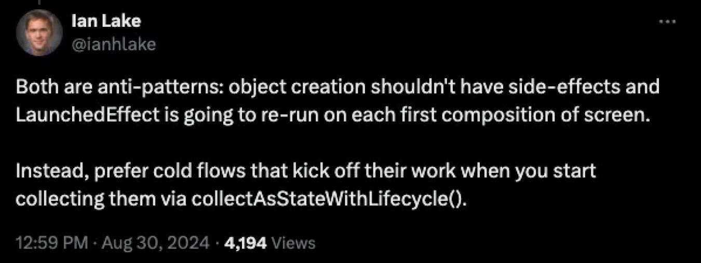

## Q) 66. 초기 데이터 로딩을 위한 작업을 Compose의 LaunchedEffect와 ViewModel.init() 중 어디에서 하는 것이 가장 이상적인 가요?

### 커뮤니티 관점
* 커뮤니티의 일반적 선호는 **ViewModel.init()에서 초기 데이터 로드**입니다. 구성 변경 시 상태 지속성과 생명주기 관리가 용이하다는 이유가 큽니다.
* 참고: [StateFlow & SharedFlow 문서](https://developer.android.com/kotlin/flow/stateflow-and-sharedflow#stateflow), [architecture-samples 예시](https://github.com/android/architecture-samples/blob/130f5dbebd0c7b5ba195cc08f25802ed9f0237e5/app/src/main/java/com/example/android/architecture/blueprints/todoapp/addedittask/AddEditTaskViewModel.kt#L64)

#### 안드로이드 개발자 A

* UI는 **상태의 시각적 표현**이어야 하며, UI가 앱 로직을 “지시”하도록 설계하는 것은 결함.
* 따라서 **관심사 분리** 차원에서 `ViewModel.init()` 선호(비즈니스 로직 vs. UI 분리).

#### 안드로이드 개발자 B

* `init()`만 의존하면 **트리거 시점 제어**와 **유닛 테스트**가 까다로움.
* **이벤트 기반 트리거 + 지연 초기화 함수**를 ViewModel에 두고, 필요 시 `LaunchedEffect`나 이벤트로 호출 → **유연성·재호출 제어** 용이.

### 둘 다 안티패턴. 지연 관찰(Lazy Observation) 사용하기



* **Ian Lake**가 지적했듯, **init()와 LaunchedEffect 모두 안티패턴이 될 수 있음**:

  * `init()`에서 로딩 → ViewModel 생성 시 부작용을 유발, 역할(상태 관리)과 생명주기 처리 복잡도 증가.
  * `LaunchedEffect`에서 로딩 → 컴포지션 재진입 때 **중복 트리거** 위험(Compose 수명주기가 ViewModel보다 짧음).
* **대안: 콜드 플로우 기반 지연 관찰(Lazy Observation)**
  구독이 시작될 때만 네트워크/DB 비즈니스 로직을 실행하고, `stateIn` 등으로 결과를 공유·캐시하여 **불필요한 실행**과 **중복 작업**을 방지.

### 지연 관찰 모범 사례

해당 접근은 [Pokedex-Compose](https://github.com/skydoves/pokedex-compose) 일부 패턴과 유사합니다.

```kotlin
val pokemon: StateFlow<Pokemon?> = savedStateHandle.getStateFlow("pokemon", null)

// pokemon Flow가 변경될 때마다 flatMapLatest를 사용하여 새로운 pokemonInfo Flow 생성
val pokemonInfo: StateFlow<PokemonInfo?> = pokemon.filterNotNull().flatMapLatest { pokemon ->
    // 실제 데이터 로딩 로직 (네트워크 요청 등)
    detailsRepository.fetchPokemonInfo(
        name = pokemon.name,
        onComplete = { isLoading = false }, // 로딩 상태 업데이트
        onError = { errorMessage = it } // 오류 메시지 업데이트
    )
}.stateIn(
    scope = viewModelScope, // ViewModel 스코프 사용
    // 구독자가 있을 때만 Flow 구독 시작, 구독자가 없다면 5초 후 데이터 발행 중지
    started = SharingStarted.WhileSubscribed(5_000),
    initialValue = null // 초기값 설정
)
```

* **업스트림 콜( `fetchPokemonInfo()` )은 첫 구독 시점에만** 트리거.
* `stateIn`으로 **핫 플로우(StateFlow)** 로 변환해 **가장 최근 값**을 캐시·공유(중복 실행 방지, 다중 구독자 대응).

### 요약

* **권장 흐름**: `init()`/`LaunchedEffect`에 직접 로딩 로직을 넣기보다, **콜드 플로우로 지연 관찰 → `stateIn`으로 공유/캐시**.
* 상황에 따라:

    * **간단한 1회 초기 로딩 + 구성 변경 내 내구성**이 중요 → `init()`도 실무에서 빈번히 사용.
    * **트리거 시점 제어/재호출/유닛 테스트 용이성**이 중요 → **이벤트 기반 + 지연 초기화 함수** 선호.
* 더 읽기: [Loading Initial Data in LaunchedEffect vs. ViewModel](https://proandroiddev.com/loading-initial-data-in-launchedeffect-vs-viewmodel-f1747c20ce62)

#### 참고 용어
* 콜드 플로우(cold flow) 는 수집될 때까지 비활성 상태로 유지되는 플로우입니다. 실행 로직은 수집기(collector)가 구독할 때만 시작되어 활성 구독자가 없는 경우 불필요한 작업이 수행되지 않도록 보장합니다.<br>
* 핫 플로우(hot flow) 는 활성 수집기가 있는지 여부에 관계없이 값을 적극적으로 방출하는 플로우입니다. 상태를 유지하고 데이터를 계속 생성하므로 StateFlow 및 SharedFlow와 같이 공유되고 지속적으로 실행되는 데이터 스트림에 적합합니다.