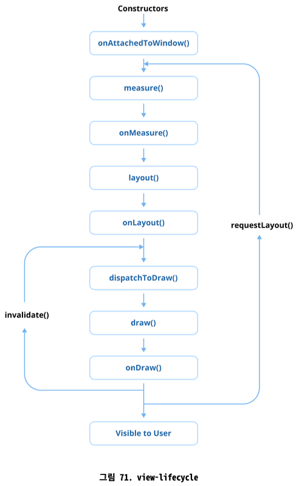

## Q) 33. View 생명주기를 설명해주세요

View 생명주기(Lifecycle): View(가령, TextView 또는 Button 등)가 생성되고, Activity나 Fragment에 연결되고, 화면에 표시되고, 최종적으로 소멸되거나 분리되는 동안 거치는
생명주기 이벤트



1. View 생성 (onAttachedToWindow)
    - View가 하드 코딩 방식으로 인스턴스화되거나 XML 레이아웃에서 인플레이션되는 단계
    - 리스너 설정 및 데이터 바인딩과 같은 초기 설정 작업이 여기서 수행된다.
    - onAttachedToWindow() 메서드는 View가 부모 뷰에 추가되고 화면 렌더링을 할 준비를 마쳤을 때 트리거된다.

2. Layout 단계 (onMeasure, onLayout)
    - 이 단계에서는 View의 크기와 위치를 측정한다.
    - onMeasure() 메서드는 레이아웃 매개변수와 부모 제약 조건에 따라 View의 너비와 높이를 결정한다.
    - 측정된 후 onLayout() 메서드는 View를 부모 내에 배치하여 화면에 표시될 위치를 최종 결정한다.

3. Drawing 단계 (onDraw)
    - 크기와 위치가 최종 결정된 후 onDraw() 메서드는 텍스트나 이미지와 같은 View의 내용을 Canvas에 렌더링
    - 해당 메서드를 재정의하여 커스텀 드로잉 로직을 구현할 수 있다 → 커스텀 View

4. Event 처리 (onTouchEvent, onClick)
    - 상호 작용하는 View는 이 단계에서 터치 이벤트, 클릭, 제스처와 같은 사용자 상호 작용을 처리한다.
    - onTouchEvent() 및 onClick()과 같은 메서드는 이러한 이벤트를 처리하고 사용자 입력에 대한 View의 응답을 정의하는 데 사용된다.

5. View 분리 (onDetachedFromWindow)
    - View가 화면과 부모 ViewGroup에서 제거될 때(가령, Activity 또는 Fragment가 소멸 중일 때), onDetachedFromWindow() 메서드가 호출된다.
    - 이 단계는 리소스를 정리하거나 리스너를 분리하는 데 이상적이다.

6. View 소멸
    - View가 더 이상 사용되지 않으면 가비지 컬렉션된다.
    - 개발자는 메모리 누수를 방지하고 성능을 최적화하기 위해 이벤트 리스너나 백그라운드 작업과 같은 모든 리소스가 적절하게 해제되었는지 확인해야 한다.

### 💡 Pro Tips for Mastery: View의 findViewTreeLifecycleOwner() 함수는 어떤 역할을 하나요?

- findViewTreeLifecycleOwner() 함수는 View 클래스의 확장 함수. View 트리 계층을 거슬러 올라가 View 트리에 연결된 가장 가까운 LifecycleOwner를 찾아 반환.
- LifecycleOwner는 일반적으로 Activity, Fragment 또는 LifecycleOwner를 구현하는 커스텀 컴포넌트와 같은 호스팅 컴포넌트의 생명주기 범위를 나타냅니다.
- LifecycleOwner를 찾지 못하면 함수는 null을 반환합니다.

#### findViewTreeLifecycleOwner()를 사용하는 이유

- 이 함수는 LiveData, ViewModel 또는 LifecycleObserver와 같은 생명주기 인식 요소와 상호 작용해야 하는 커스텀 View나 서드파티 컴포넌트로 작업할 때 특히 유용합니다.
- 이를 통해 View는 호스팅 Activity나 Fragment에 대한 명시적인 의존성 없이 연관된 생명주기에 접근할 수 있습니다.

findViewTreeLifecycleOwner()를 사용하면 다음을 보장할 수 있습니다.

- 생명주기를 인식하는 컴포넌트(LiveData 등)가 올바른 생명주기에 제대로 바인딩됩니다.
- 생명주기가 끝나면 관찰자가 정리되도록 하여 메모리 누수를 방지합니다.

LifecycleObserver 인스턴스를 바인딩해야 하는 커스텀 View를 떠올려 봅시다.
findViewTreeLifecycleOwner()를 사용하면 관찰을 올바른 생명주기에 시작할 수 있습니다.

```kotlin
class CustomLifecycleAwareView @JvmOverloads constructor(
    context: Context,
    attrs: AttributeSet? = null
) : LinearLayout(context, attrs) {

    private var lifecycleObserver: LifecycleObserver? = null

    fun bindObserver(observer: LifecycleObserver) {
        lifecycleObserver?.let { removeObserver(it) }

        val lifecycleOwner = findViewTreeLifecycleOwner()

        lifecycleOwner?.lifecycle?.addObserver(observer) ?: run {
            Log.e("CustomView", "No LifecycleOwner found for the View")
        }
        lifecycleObserver = observer
    }

    override fun onDetachedFromWindow() {
        super.onDetachedFromWindow()
        lifecycleObserver?.let { removeObserver(it) }
    }

    private fun removeObserver(observer: LifecycleObserver) {
        findViewTreeLifecycleOwner()?.lifecycle?.removeObserver(observer)
        lifecycleObserver = null
    }
}
```

여기서 커스텀 CustomLifecycleAwareView는 View 트리의 가장 가까운 LifecycleOwner에 동적으로 바인딩되어 LifecycleObserver 관찰이 적절한 생명주기에 연결되도록
보장합니다.

#### 주요 사용 사례

- 커스텀 뷰(Custom Views): 커스텀 View 내의 생명주기 인식(lifecycle-aware, 생명주기와 연결되어 생명주기의 변화에 따라 동작이 결정되는) 컴포넌트가 LifecycleObserver,
  LiveData와 같은 생명주기 관찰자를 관찰하거나 리소스를 관리할 수 있도록 합니다.
- 서드파티 라이브러리(Third-Party Libraries): 재사용 가능한 UI 컴포넌트가 명시적인 생명주기 관리 없이 생명주기 인식 리소스와 상호 작용할 수 있도록 합니다.
- 로직 결합도 분리(Decoupling Logic): View가 View 트리에서 자체 LifecycleOwner를 독립적으로 획득하도록 하여 부모 클래스와의 결합도를 줄이는 데 도움이 됩니다.

#### 한계

findViewTreeLifecycleOwner()는 유용한 기능을 제공하지만, View 트리에 LifecycleOwner가 존재해야 합니다.
LifecycleOwner를 제공하는 소유자가 없으면 함수는 null을 반환하므로 크래시나 예상치 않은 동작이 발생할 수 있기 때문에, 신중하게 사용해야 합니다.
