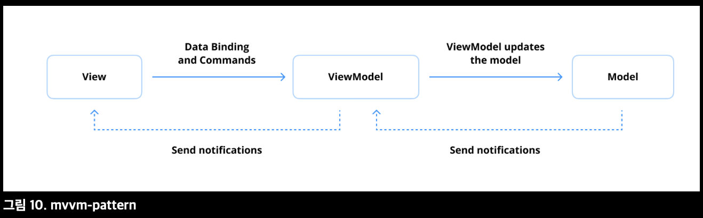

## Q) 54. Jetpack ViewModel에 대해 설명해 주세요.

* 안드로이드 아키텍처 컴포넌트 핵심 구성 요소
* 생명주기를 인식해 UI 관련 데이터 저장 및 관리
* 화면 회전 같은 구성 변경 시 데이터 유지 보장
* Activity/Fragment는 소멸·재생성되지만 ViewModel은 파괴되지 않음
* UI 로직과 비즈니스 로직 분리 → 견고하고 유지 관리 쉬운 앱 개발 지원
* 주요 목표: 구성 변경 중에도 UI 데이터 보존

```kotlin
data class DiceUiState(
    val firstDieValue: Int? = null,
    val secondDieValue: Int? = null,
    val numberOfRolls: Int = 0,
)

class DiceRollViewModel : ViewModel() {

    // 화면 UI 상태 노출
    private val _uiState = MutableStateFlow(DiceUiState())
    val uiState: StateFlow<DiceUiState> = _uiState.asStateFlow()

    // 비즈니스 로직 처리
    fun rollDice() {
        _uiState.update { currentState ->
            currentState.copy(
                firstDieValue = Random.nextInt(from = 1, until = 7),
                secondDieValue = Random.nextInt(from = 1, until = 7),
                numberOfRolls = currentState.numberOfRolls + 1,
            )
        }
    }
}
```

### ViewModel의 특징

1. 생명주기 인식(Lifecycle Awareness): Activity/Fragment의 생명주기에 맞춰 소멸 관리
2. 구성 변경 지속성(Persistence Across Configuration Changes): 화면 회전 등 구성 변경 시에도 데이터 유지
3. 관심사 분리: UI 로직과 비즈니스 로직 분리로 코드 유지보수성 향상. UI 레이어는 ViewModel에서 업데이트를 관찰하므로 반응형 프로그래밍 원칙을 구현하기가 더 쉬워짐

### ViewModel 생성 및 사용

[Jetpack activity-ktx 라이브러리](https://developer.android.com/jetpack/androidx/releases/activity)에서 제공하는 ComponentActivity의 확장함수인 viewModels() 델리게이트를 사용하여 ViewModel을 보다 쉽게 생성할 수 있다.

```kotlin
class DiceRollActivity : AppCompatActivity() {

    // activity-ktx 아티팩트의 'viewModels()' 델리게이트 함수 사용
    private val viewModel: DiceRollViewModel by viewModels()

    override fun onCreate(savedInstanceState: Bundle?) {
        super.onCreate(savedInstanceState) // super.onCreate 호출 추가

        // 시스템이 액티비티의 onCreate() 메서드를 처음 호출할 때 ViewModel 생성.
        // 다시 생성된 액티비티는 첫 번째 액티비티에서 생성된 동일한 DiceRollViewModel 인스턴스를 받습니다.

        lifecycleScope.launch {
            repeatOnLifecycle(Lifecycle.State.STARTED) {
                viewModel.uiState.collect { uiState -> // 수집된 상태 사용
                    // UI 요소 업데이트 (예: 텍스트뷰 업데이트)
                    // updateUi(uiState)
                }
            }
        }
    }
}
```

* ViewModel 인스턴스는 **ViewModelStoreOwner**에 스코프가 지정됨
* ViewModelStoreOwner 종류: Activity, Fragment, Navigation 그래프, Navigation 그래프 내 대상, 커스텀 ViewModelStoreOwner
* Jetpack은 다양한 사용 사례에 맞게 여러 스코프 옵션 제공
* 포괄적인 개요는 [ViewModel API 치트 시트](https://developer.android.com/topic/libraries/architecture/viewmodel/viewmodel-cheatsheet)를 참조


### 💡 Pro Tips for Mastery: ViewModel의 생명주기는 어떻게 되나요?

* **ViewModel은 ViewModelStoreOwner(Activity, Fragment, Navigation 등)에 스코프가 지정**
  → 소유자가 살아 있는 동안 동일한 ViewModel 인스턴스를 유지
  → 예를 들어, Activity의 경우, ViewModel은 Activity가 완전히 파괴되고 메모리에서 제거될 때까지 유지됩니다.

* **구성 변경 시에도 데이터 유지**
  → 화면 회전처럼 Activity/Fragment가 일시적으로 소멸·재생성되더라도 ViewModel은 파괴되지 않고 그대로 재사용
  → 불필요한 데이터 재로드를 방지하고 성능 및 사용자 경험 향상

* **생성 및 소멸 시점**
  → ViewModelStoreOwner가 처음 생성될 때 ViewModel 인스턴스도 초기화
  → 소유자가 완전히 메모리에서 제거될 때 onCleared() 호출
  → onCleared()에서 코루틴 취소, DB 연결 해제 등 리소스 정리 가능

* **핵심 역할**
  → UI 관련 데이터를 효율적으로 관리하고, 생명주기 이벤트 전반에서 데이터가 안전하게 보존되도록 보장

자세한 내용은 [공식 문서](https://developer.android.com/topic/libraries/architecture/viewmodel#lifecycle)를 참조


### 💡 Pro Tips for Mastery: 구성 변경 후에도 ViewModel이 어떻게 유지될 수 있나요?

* Jetpack ViewModel은 화면 회전·언어 변경 등 구성 변경 시에도 유지되도록 설계됨
* ViewModel은 UI 컴포넌트(Activity, Fragment)의 생명주기 소유자(lifecycle owner)에 연결됨
* Activity는 ComponentActivity, Fragment는 Fragment 클래스 안에 생명주기 포함
* 핵심 요소는 구성 변경 시 유지되어 ViewModel이 다시 생성되지 않고 데이터를 유지할 수 있도록 하는 ViewModelStore

* Jetpack 라이브러리의 내부 구현을 살펴보면 [androidx.activity.ComponentActivity](https://cs.android.com/androidx/platform/frameworks/support/+/androidx-main:activity/activity/src/main/java/androidx/activity/ComponentActivity.kt;l=111?q=ComponentActivity)와 [androidx.fragment.app.Fragment](https://cs.android.com/androidx/platform/frameworks/support/+/androidx-main:fragment/fragment/src/main/java/androidx/fragment/app/Fragment.java;l=126?q=androidx.fragment.app.Fragment)가 모두 [ViewModelStoreOwner](https://developer.android.com/reference/androidx/lifecycle/ViewModelStoreOwner) 인터페이스를 구현하여 각자 ViewModelStore를 가짐
* ViewModelStore는 String–ViewModel 1:1 Map 구조로 인스턴스를 관리해 구성 변경 시 ViewModel 재생성 방지 및 데이터 유지

```kotlin
public open class ViewModelStore {

    private val map = mutableMapOf<String, ViewModel>()

    @RestrictTo(RestrictTo.Scope.LIBRARY_GROUP)
    public fun put(key: String, viewModel: ViewModel) {
        val oldViewModel = map.put(key, viewModel)
        oldViewModel?.clear() // 이전 ViewModel 정리
    }

    @RestrictTo(RestrictTo.Scope.LIBRARY_GROUP)
    public operator fun get(key: String): ViewModel? {
        return map[key]
    }

    @RestrictTo(RestrictTo.Scope.LIBRARY_GROUP)
    public fun keys(): Set<String> {
        return HashSet(map.keys)
    }

    /**
     *  ViewModelStore에서 모든 ViewModel을 지웁니다.
     *  이후에 저장된 ViewModel은 clear()가 호출될 때까지 유지됩니다.
     */
    public fun clear() {
        for (vm in map.values) {
            vm.clear() // 각 ViewModel의 onCleared() 호출
        }
        map.clear()
    }
}
```

* ComponentActivity는 자체 생명주기 상태를 관찰할 수 있음
* onDestroy()가 구성 변경이 아닌 경우 호출되면 생명주기 상태가 ON\_DESTROY로 전환됨
* 이 시점에 유지된 ViewModel 인스턴스를 모두 제거하여 리소스를 정리함
* 구성 변경 시에는 ViewModel을 보존하고, 불필요할 때만 정리되도록 보장함

```java
getLifecycle().addObserver(new LifecycleEventObserver() {
    @Override
    public void onStateChanged(@NonNull LifecycleOwner source,
            @NonNull Lifecycle.Event event) {
        if (event == Lifecycle.Event.ON_DESTROY) {
            // 사용 가능한 컨텍스트 지우기
            mContextAwareHelper.clearAvailableContext();
            // 구성 변경 중이 아니라면 ViewModelStore 지우기
            if (!isChangingConfigurations()) {
                getViewModelStore().clear();
            }
            mReportFullyDrawnExecutor.activityDestroyed();
        }
    }
});
```

#### 요약

* ViewModel은 Activity, Fragment 등의 ViewModelStore에 저장되어 구성 변경 시에도 유지됨
* Compose Navigation에서는 ViewModelStore가 내비게이션 경로에 스코프가 지정되어 화면 단위로 ViewModel이 유지됨
* ViewModelStore를 수동으로 관리할 수도 있지만, 구성 변경 시 복구 구현이 까다로워 일반적으로 권장되지 않음

### 💡 Pro Tips for Mastery: Jetpack ViewModel과 Microsoft에서 제시한 MVVM 아키텍처 ViewModel의 차이점에 대해서 설명해 주세요.

* Jetpack ViewModel
   * [비즈니스 로직 또는 UI 상태 홀더 역할](https://developer.android.com/topic/architecture/ui-layer/stateholders)을 하도록 설계된 생명주기를 인식하는 컴포넌트
   * UI 상태를 관리하고 비즈니스 로직을 캡슐화
   * 화면 회전·Activity 재생성과 같은 구성 변경에도 상태 유지
   * 불필요한 데이터 재요청 방지 → 효율성과 응답성 향상

* Microsoft MVVM ViewModel
   * View와 Model 사이의 다리 역할
   * 속성·명령을 제공해 View에서 데이터 바인딩 가능
   * 상태 변경을 이벤트로 알려 View가 반응하도록 함
   * View와 Model 간의 상호 작용을 조정하고 UI에 필요한 비즈니스 로직을 추상화하거나 호출을 중개하는 역할
   * 데이터 바인딩을 통한 선언적·모듈화된 설계에 중점

* Jetpack ViewModel → 안드로이드 생명주기·상태 관리 최적화
* MVVM ViewModel → 바인딩 메커니즘 중심, UI와 Model 간 상호작용 조정



#### Jetpack ViewModel과 MVVM ViewModel의 차이점

* Jetpack ViewModel: 구성 변경 시 UI 상태 유지에 초점, 생명주기를 인식하는 UI 상태 관리용 컴포넌트
* MVVM ViewModel: View와 Model 간 중개자, 바인딩을 통해 UI가 데이터에 반응하도록 설계
* Jetpack ViewModel만 사용한다고 MVVM을 충족하는 것은 아님 → MVVM 원래 의도를 충족하려면 별도의 데이터 바인딩 메커니즘 필요
* Compose의 경우 ViewModel에서 직접 데이터를 관찰하면 구현이 단순화되지만, XML 기반 UI는 MVVM의 목표를 달성하기 위해 DataBinding이 필요
* MVVM은 관심사 분리와 테스트 용이성을 위해 견고한 바인딩 시스템 구축을 강조
