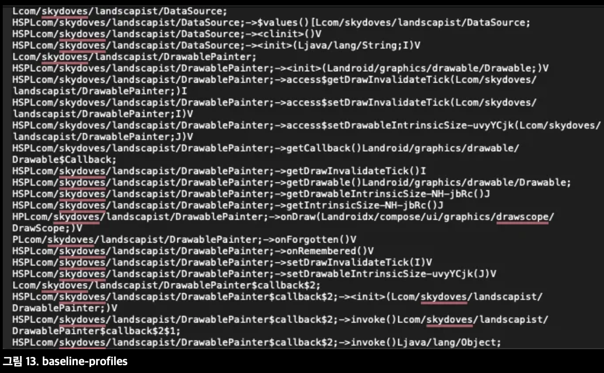

## Q) 58. Baseline Profile은 앱의 성능에 어떤 이점을 가져다주나요?

* **정의**: **Baseline Profiles**는 앱의 **중요한 코드 경로**를 미리 정의해 **ART**가 설치 시점에 **AOT**(Ahead-of-Time)로 **사전 컴파일**하도록 하는 성능 최적화 메커니즘.
* **효과**:

    * **앱 시작 시간 단축** 및 **런타임 응답성 개선**(첫 실행 기준 **약 20–30%** 향상 기대).
    * **인터프리터/JIT** 단계를 우회해 **콜드 스타트 지연** 감소, **부드러운 사용자 경험** 제공.
* **동작 원리 요약**:

    * 프로파일에 포함된 **클래스/메서드 목록**을 기반으로 **ART**가 **설치 중 최적화**를 수행(네이티브 코드로 미리 컴파일).
    * **라이브러리** 수준에서도 제공 가능하여, 해당 라이브러리를 사용하는 **애플리케이션 전체의 성능**에 긍정적 영향.
* **도구/생태계**:

    * **Jetpack Macrobenchmark**로 **프로파일 생성/검증**(유저 저니 기반 중요한 경로 식별).
    * **AGP 8.0+ Baseline Profile Gradle 플러그인**으로 생성/패키지 필터링/플레이버 컨트롤 등 **생성 파이프라인 간소화**.
    * 생성물은 각 모듈의 `/src/main/generated/baselineProfiles/baseline-prof.txt`에 위치.
* **참고 구현**:

    * Google의 **Now-in-Android** 예제는 **화면 단위** Baseline Profiles와 **유저 저니 기반** 최적화 전략을 제공.

### Baseline Profiles 작동 방식

1. **중요한 코드 경로 정의**: 앱 시작/주요 유저 플로우 기준으로 **성능에 중요한 메서드·클래스** 식별.
2. **프로파일 생성**: **Macrobenchmark** 등으로 기록·테스트하여 **Baseline Profile** 생성.
3. **프로파일 전파**: **APK/AAB**와 함께 번들링되어 사용자 기기로 **배포**.
4. **설치 중 최적화**: 기기 설치 시 **ART**가 프로파일을 사용해 지정된 항목을 **AOT 컴파일**.

> 참고)
> **JIT**: 실행 직전에 바이트코드를 기계어로 변환하는 **런타임 최적화**.
> **AOT**: **런타임 이전**에 기계어로 **사전 컴파일**해 **런타임 오버헤드**를 낮춤.

### 요약

* **Baseline Profiles = “중요 경로 사전 컴파일”**: 앱 시작 지연을 줄이고, **콜드/워밍 실행** 모두에서 **응답성**을 향상.
* **Macrobenchmark + Gradle 플러그인**으로 **생성·검증·배포** 파이프라인을 단순화.
* **앱·라이브러리 모두**에 적용 가능하여 **광범위한 성능 이점**을 제공.
